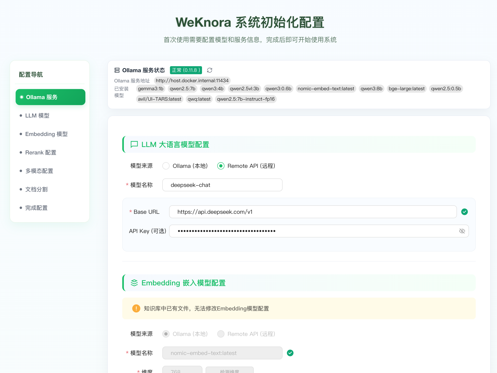

<p align="center">
  <picture>
    
  </picture>
</p>

<p align="center">
    <a href="https://weknora.weixin.qq.com" target="_blank">
        
    </a>
    <a href="https://chatbot.weixin.qq.com" target="_blank">
        
    </a>
    <a href="https://github.com/Tencent/WeKnora/blob/main/LICENSE">
        
    </a>
    <a href="./CHANGELOG.md">
        
    </a>
</p>

<p align="center">
| <a href="./README.md"><b>English</b></a> | <b>简体中文</b> | <a href="./README_JA.md"><b>日本語</b></a> |
</p>

<p align="center">
  <h4 align="center">

  [项目介绍](#-项目介绍) • [架构设计](#-架构设计) • [核心特性](#-核心特性) • [快速开始](#-快速开始) • [文档](#-文档) • [开发指南](#-开发指南)

  </h4>
</p>

# 💡 WeKnora - 基于大模型的文档理解检索框架

## 📌 项目介绍

[**WeKnora（维娜拉）**](https://weknora.weixin.qq.com) 是一款基于大语言模型（LLM）的文档理解与语义检索框架，专为结构复杂、内容异构的文档场景而打造。

框架采用模块化架构，融合多模态预处理、语义向量索引、智能召回与大模型生成推理，构建起高效、可控的文档问答流程。核心检索流程基于 **RAG（Retrieval-Augmented Generation）** 机制，将上下文相关片段与语言模型结合，实现更高质量的语义回答。

**官网：** https://weknora.weixin.qq.com

## 🏗️ 架构设计


WeKnora 采用现代化模块化设计，构建了一条完整的文档理解与检索流水线。系统主要包括文档解析、向量化处理、检索引擎和大模型推理等核心模块，每个组件均可灵活配置与扩展。

## 🎯 核心特性

- **🔍 精准理解**：支持 PDF、Word、图片等文档的结构化内容提取，统一构建语义视图
- **🧠 智能推理**：借助大语言模型理解文档上下文与用户意图，支持精准问答与多轮对话
- **🔧 灵活扩展**：从解析、嵌入、召回到生成全流程解耦，便于灵活集成与定制扩展
- **⚡ 高效检索**：混合多种检索策略：关键词、向量、知识图谱
- **🎯 简单易用**：直观的Web界面与标准API，零技术门槛快速上手
- **🔒 安全可控**：支持本地化与私有云部署，数据完全自主可控

## 📊 适用场景

| 应用场景 | 具体应用 | 核心价值 |
|---------|----------|----------|
| **企业知识管理** | 内部文档检索、规章制度问答、操作手册查询 | 提升知识查找效率，降低培训成本 |
| **科研文献分析** | 论文检索、研究报告分析、学术资料整理 | 加速文献调研，辅助研究决策 |
| **产品技术支持** | 产品手册问答、技术文档检索、故障排查 | 提升客户服务质量，减少技术支持负担 |
| **法律合规审查** | 合同条款检索、法规政策查询、案例分析 | 提高合规效率，降低法律风险 |
| **医疗知识辅助** | 医学文献检索、诊疗指南查询、病例分析 | 辅助临床决策，提升诊疗质量 |

## 🧩 功能模块能力

| 功能模块 | 支持情况 | 说明 |
|---------|---------|------|
| 文档格式支持 | ✅ PDF / Word / Txt / Markdown / 图片（含 OCR / Caption） | 支持多种结构化与非结构化文档内容解析，支持图文混排与图像文字提取 |
| 嵌入模型支持 | ✅ 本地模型、BGE / GTE API 等 | 支持自定义 embedding 模型，兼容本地部署与云端向量生成接口 |
| 向量数据库接入 | ✅ PostgreSQL（pgvector）、Elasticsearch | 支持主流向量索引后端，可灵活切换与扩展，适配不同检索场景 |
| 检索机制 | ✅ BM25 / Dense Retrieve / GraphRAG | 支持稠密/稀疏召回、知识图谱增强检索等多种策略，可自由组合召回-重排-生成流程 |
| 大模型集成 | ✅ 支持 Qwen、DeepSeek 等，思考/非思考模式切换 | 可接入本地大模型（如 Ollama 启动）或调用外部 API 服务，支持推理模式灵活配置 |
| 问答能力 | ✅ 上下文感知、多轮对话、提示词模板 | 支持复杂语义建模、指令控制与链式问答，可配置提示词与上下文窗口 |
| 端到端测试支持 | ✅ 检索+生成过程可视化与指标评估 | 提供一体化链路测试工具，支持评估召回命中率、回答覆盖度、BLEU / ROUGE 等主流指标 |
| 部署模式 | ✅ 支持本地部署 / Docker 镜像 | 满足私有化、离线部署与灵活运维的需求 |
| 用户界面 | ✅ Web UI + RESTful API | 提供交互式界面与标准 API 接口，适配开发者与业务用户使用习惯 |

## 🚀 快速开始

### 🛠 环境要求

确保本地已安装以下工具：

* [Docker](https://www.docker.com/)
* [Docker Compose](https://docs.docker.com/compose/)
* [Git](https://git-scm.com/)

### 📦 安装步骤

#### ① 克隆代码仓库

```bash
# 克隆主仓库
git clone https://github.com/Tencent/WeKnora.git
cd WeKnora
```

#### ② 配置环境变量

```bash
# 复制示例配置文件
cp .env.example .env

# 编辑 .env，填入对应配置信息
# 所有变量说明详见 .env.example 注释
```

#### ③ 启动服务

```bash
# 启动全部服务（含 Ollama 与后端容器）
./scripts/start_all.sh
# 或
make start-all
```

#### ③ 启动服务备选

```bash
# 启动 ollama 服务 (可选)
ollama serve > /dev/null 2>&1 &

# 启动服务
docker compose up -d
```

#### ④ 停止服务

```bash
./scripts/start_all.sh --stop
# 或
make stop-all
```

### 🌐 服务访问地址

启动成功后，可访问以下地址：

* Web UI：`http://localhost`
* 后端 API：`http://localhost:8080`
* 链路追踪（Jaeger）：`http://localhost:16686`

### 🔌 使用微信对话开放平台

WeKnora 作为[微信对话开放平台](https://chatbot.weixin.qq.com)的核心技术框架，提供更简便的使用方式：

- **零代码部署**：只需上传知识，即可在微信生态中快速部署智能问答服务，实现"即问即答"的体验
- **高效问题管理**：支持高频问题的独立分类管理，提供丰富的数据工具，确保回答精准可靠且易于维护
- **微信生态覆盖**：通过微信对话开放平台，WeKnora 的智能问答能力可无缝集成到公众号、小程序等微信场景中，提升用户交互体验
### 🔗MCP服务器访问已经部署好的WEKnora
#### 1️⃣克隆储存库
```
git clone https://github.com/Tencent/WeKnora
```
#### 2️⃣配置MCP服务器
mcp客户端配置服务器
```json
{
  "mcpServers": {
    "weknora": {
      "args": [
        "path/to/WeKnora/mcp-server/run_server.py"
      ],
      "command": "python",
      "env":{
        "WEKNORA_API_KEY":"进入你的weknora实例，打开开发者工具，查看请求头x-api-key，以sk开头",
        "WEKNORA_BASE_URL":"http(s)://你的weknora地址/api/v1"
      }
    }
  }
}
```
使用stdio命令直接运行
```
pip install weknora-mcp-server
python -m weknora-mcp-server
```

## 🔧 初始化配置引导

为了方便用户快速配置各类模型，降低试错成本，我们改进了原来的配置文件初始化方式，增加了Web UI界面进行各种模型的配置。在使用之前，请确保代码更新到最新版本。具体使用步骤如下：
如果是第一次使用本项目，可跳过①②步骤，直接进入③④步骤。

### ① 关闭服务

```bash
./scripts/start_all.sh --stop
```

### ② 清空原有数据表（建议在没有重要数据的情况下使用）

```bash
make clean-db
```

### ③ 编译并启动服务

```bash
./scripts/start_all.sh
```

### ④ 访问Web UI

http://localhost

首次访问会自动跳转到初始化配置页面，配置完成后会自动跳转到知识库页面。请按照页面提示信息完成模型的配置。




## 📱 功能展示

### Web UI 界面

<table>
  <tr>
    <td><b>知识上传</b><br/></td>
    <td><b>知识问答入口</b><br/></td>
  </tr>
  <tr>
    <td colspan="2"><b>图文结果回答</b><br/></td>
  </tr>
</table>

**知识库管理：** 支持拖拽上传各类文档，自动识别文档结构并提取核心知识，建立索引。系统清晰展示处理进度和文档状态，实现高效的知识库管理。

### 文档知识图谱

<table>
  <tr>
    <td></td>
    <td></td>
  </tr>
</table>

WeKnora 支持将文档转化为知识图谱，展示文档中不同段落之间的关联关系。开启知识图谱功能后，系统会分析并构建文档内部的语义关联网络，不仅帮助用户理解文档内容，还为索引和检索提供结构化支撑，提升检索结果的相关性和广度。
### 配套MCP服务器调用效果


## 📘 文档

常见问题排查：[常见问题排查](./docs/QA.md)

详细接口说明请参考：[API 文档](./docs/API.md)

## 🧭 开发指南

### 📁 项目目录结构

```
WeKnora/
├── cmd/         # 应用入口
├── internal/    # 核心业务逻辑
├── config/      # 配置文件
├── migrations/  # 数据库迁移脚本
├── scripts/     # 启动与工具脚本
├── services/    # 各子服务实现
├── frontend/    # 前端项目
└── docs/        # 项目文档
```

### 🔧 常用命令

```bash
# 清空数据库（慎用！）
make clean-db
```

## 🤝 贡献指南

我们欢迎社区用户参与贡献！如有建议、Bug 或新功能需求，请通过 [Issue](https://github.com/Tencent/WeKnora/issues) 提出，或直接提交 Pull Request。

### 🎯 贡献方式

- 🐛 **Bug修复**: 发现并修复系统缺陷
- ✨ **新功能**: 提出并实现新特性
- 📚 **文档改进**: 完善项目文档
- 🧪 **测试用例**: 编写单元测试和集成测试
- 🎨 **UI/UX优化**: 改进用户界面和体验

### 📋 贡献流程

1. **Fork项目** 到你的GitHub账户
2. **创建特性分支** `git checkout -b feature/amazing-feature`
3. **提交更改** `git commit -m 'Add amazing feature'`
4. **推送分支** `git push origin feature/amazing-feature`
5. **创建Pull Request** 并详细描述变更内容

### 🎨 代码规范

- 遵循 [Go Code Review Comments](https://github.com/golang/go/wiki/CodeReviewComments)
- 使用 `gofmt` 格式化代码
- 添加必要的单元测试
- 更新相关文档

### 📝 提交规范

使用 [Conventional Commits](https://www.conventionalcommits.org/) 规范：

```
feat: 添加文档批量上传功能
fix: 修复向量检索精度问题  
docs: 更新API文档
test: 添加检索引擎测试用例
refactor: 重构文档解析模块
```

## 📄 许可证

本项目基于 [MIT](./LICENSE) 协议发布。
你可以自由使用、修改和分发本项目代码，但需保留原始版权声明。
