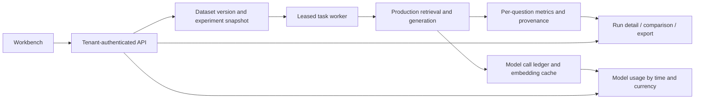

# Evaluation workbench and model observability

The evaluation workbench runs reproducible retrieval-augmented generation (RAG) experiments. Each task stores an immutable dataset version, model identities, retrieval and chunking settings, a metric plan, and per-question evidence. The model usage drawer groups recorded calls by model and time window, with separate usage completeness and currency totals.

## Quick verification

Use Linux or Windows Subsystem for Linux (WSL), Go 1.26, Python 3.11 or newer, Make, Git, and a C compiler for SQLite. The first Go invocation downloads pinned module dependencies. No model credentials or Docker services are required for this command:

```bash
make evaluation-verify
```

Run from a clean committed checkout. A fresh sibling `evaluation-evidence/acceptance.*` directory contains the source commit and tree, environment, canonical JavaScript Object Notation (JSON) reports, rendered Markdown, service logs, a verification summary, and a file digest manifest. Set `EVALUATION_EVIDENCE_ROOT=/path/to/evidence` to choose its parent. Keep these raw local artifacts private: they include a synthetic test database and disposable fixture authentication data.

The command verifies the golden metric contract, public dataset hashes, the real service over Hypertext Transfer Protocol (HTTP), persistent embedding cache reuse after service restart, cancellation and process-kill recovery, provider accounting, cumulative budget guards, and product version consistency. It fails immediately when a phase fails and records that phase in `exit-status.txt`. Test servers bind to loopback ports 18708/18710 and 18908/18910; these ports must be free. The scripts stop only the child processes they start.

The HTTP fixture uses a deterministic local model supplier. Its frozen retrieval thresholds exercise production indexing, search, ranking, and metric collection. Synthetic generation returns known fixture answers; its answer scores validate wiring and aggregation, not a real model's quality. The golden command alone, `make evaluation-reproduce`, checks metric arithmetic and the baseline contract. Both checks run in `.github/workflows/evaluation-regression.yml` on pull requests and weekly schedule events. A repository administrator must require the `Deterministic golden evaluation` check in branch protection. Scheduled execution starts when the workflow exists on the repository default branch.

## Workbench flow

Open **Evaluation experiments** in the navigation menu. **Datasets and import** registers versioned evaluation data; **New evaluation** selects a dataset version and configured models. The service validates corpus and question identities before execution. List filters cover status, dataset, dataset version, model, time bounds, and labels. Selecting a run exposes its frozen configuration, retrieval metrics, answer metrics, recorded cost, total elapsed time, and per-question reference and generated answers.

JSON and comma-separated values (CSV) exports carry source and metric identities. CSV spreadsheet formula prefixes are escaped. Comparisons require compatible dataset and metric identities; incompatible or absent measurements have an explicit reason and no fabricated delta. Human ratings are separately authenticated, versioned records; a run without a submitted rating retains a missing human score.

The following diagram shows persistence and tenant boundaries. Solid arrows follow the execution path; both detail and export read the same stored result records.



Task leases and heartbeats bind a worker's writes to its current ownership. Cancellation is durable and idempotent. Expired workers are recovered as interrupted runs; terminal records preserve completed questions and incomplete call accounting. Temporary document cleanup is pinned to the creating tenant, knowledge base, and knowledge identity. A moved or foreign resource cannot be deleted by an evaluation cleanup request.

## Accounting and cache identity

Model calls store start and terminal state, operation, model snapshot, duration, reported token usage, provider cache buckets, effective price version, and cost provenance. Missing provider usage or price remains missing. Currency totals remain separate. Application embedding cache hits are not provider calls. Provider cache read token fraction is distinct from request hit rate.

Embedding cache identities include tenant, model configuration and behavior revision, dimensions, normalized input, and format version. Sensitive custom-header values stay out of public snapshots; header behavior changes rotate an identity revision. Cache storage errors return available model results and emit bounded error categories. Call-ledger failures are propagated to strict experiment accounting. The Wiki prompt places stable instructions and shared context before page-specific content; actual provider cache benefit requires separately recorded provider evidence.

The optional controlled cache experiment plan uses version 3 and one `max_completion_tokens=256` output cap for DashScope. It rejects additional output-cap fields, unexpected payload fields, extra attempts, missing usage, and exhausted reservations. Its byte-level plan hash changes with request semantics. Provider credentials are read only after explicit execution and exact plan confirmation. Live execution requires a separately reconciled cumulative budget; keyless verification never enables it. The field follows the [Model Studio API change notice](https://www.alibabacloud.com/zh/notice/model_studio_notice_of_changes_to_certain_model_fields_724?_p_lc=1).

## Database compatibility

The official PostgreSQL migration chain reaches version 93 and SQLite reaches version 14. Evaluation tables use a separate `topic3` chain through version 16. `migration_bridge_runs` records the source schema, input digests, adoption, and committed phases. The embedded schema profiles include the upstream browser authorization objects and SQLite runtime search objects. Unknown, dirty, structurally partial, or modified migration sources fail readiness checks.

```bash
make migrate-build
./scripts/migrate.sh inspect
./scripts/migrate.sh plan
# For an existing database, first create and verify a backup and use its real identity:
./scripts/migrate.sh apply --backup-id YOUR_VERIFIED_BACKUP_ID
```

Configure the target explicitly with `MIGRATION_DSN`, `DB_URL`, or `--sqlite-path`. Inspect and plan are read-only. Applying migration writes the selected database. In-place rollback and forced version rewriting are rejected; recovery uses a verified backup and its corresponding application version. `AUTO_MIGRATE=false` requires an already-ready database. See the [database guide](../website-docs/06-development/02-database-schema.md) for startup, locking, schema profiles, and append-only migration rules.

The upstream Anthropic streaming tool-call state machine, shared access-token refresh coordinator, browser authorization routes, and license bundle packaging remain part of the application. The workbench shares token refresh with server-sent events (SSE); canceling one caller does not cancel another caller's shared refresh.

## Additional verification

```bash
go test -tags sqlite_fts5 ./...
go test -race -tags sqlite_fts5 ./internal/modelcache ./internal/modelobs
cd frontend
npm ci
npm test
npm run type-check
npm run build
```

PostgreSQL contracts require an explicitly isolated database: set `TEST_POSTGRES_DSN` and `TEST_POSTGRES_MIGRATION_DSN` to the same administrator database whose name starts with `weknora_x03_`, and set `REQUIRE_POSTGRES_TESTS=1`. The migration suite creates separate fixture databases. The continuous integration (CI) PostgreSQL job provisions its own service and rejects skipped required contracts. Optional environment tests in the full suite may skip when their external services are absent.

## Parser benchmark

`cmd/parser-benchmark` invokes eight production reader adapters against a shared, hashed sample manifest: builtin, MarkItDown, OpenDataLoader, WeKnoraCloud, MinerU, MinerU Cloud, PaddleOCR-VL, and PaddleOCR-VL Cloud. Successful text, empty output, and failure remain separate categories. Record and Markdown digests, binary digest, source identity, adapter configuration, and sample identity guard resume behavior.

```bash
go run ./cmd/parser-benchmark --help
python3 -B scripts/test_parser_benchmark.py
```

Dataset sources and licenses are under `dataset/parser-benchmark/`. Downloading benchmark inputs and executing adapters are separate operations; cloud adapters require provider credentials and may incur fees. Imported corpus and evaluator-lock bytes retain their source whitespace for digest reproducibility. The optional `VITE_PARSER_BENCHMARK_URL` build variable links the workbench to a separately published report. With no configured URL, this link is hidden.

## Evidence limits

Engineering checks identify the tested commit, tree, binary, dataset, metric versions, and denominator. A source update does not establish new Apple M4 measurements, live provider results, human ratings, or cloud invoices. Observed evaluation sets retain their observed status. Quality and cache comparisons must identify their actual sample cohort and provider accounting coverage.

The platform layout has an upstream minimum width of 600 CSS pixels. Desktop and tablet layouts are supported; narrow phone screens can scroll horizontally.
