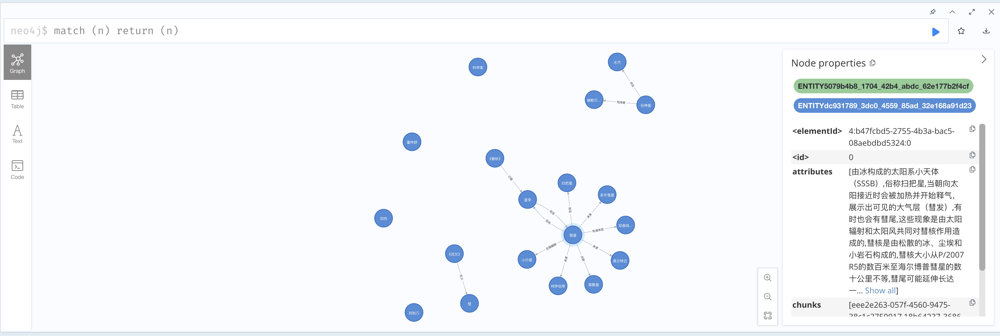

# WeKnora 知识图谱

## 快速开始

### 方式一：Apache AGE（推荐，无需额外服务）

AGE 复用已有的 PostgreSQL 数据库，无需单独部署图数据库服务。

- .env 配置：
    - 选择 AGE 驱动: `GRAPH_DRIVER=age`
    - 启用 AGE: `AGE_ENABLE=true`
    - 图名称（可选）: `AGE_GRAPH_NAME=weknora_kg`

- 初始化 AGE 扩展（仅首次）:
```bash
docker exec -i weknora-postgres psql -U postgres -d WeKnora < migrations/init-age.sql
```

### 方式二：Neo4j（向后兼容）

- .env 配置：
    - 启用 Neo4j: `NEO4J_ENABLE=true`
    - Neo4j URI: `NEO4J_URI=bolt://neo4j:7687`
    - Neo4j 用户名: `NEO4J_USERNAME=neo4j`
    - Neo4j 密码: `NEO4J_PASSWORD=password`

- 启动 Neo4j:
```bash
docker-compose --profile neo4j up -d
```

- 在知识库设置页面启用实体和关系提取，并根据提示配置相关内容

## 生成图谱

上传任意文档后，系统会自动提取实体和关系，并生成对应的知识图谱。



## 查看图谱

### AGE
连接 PostgreSQL 后执行：
```sql
SET search_path = ag_catalog, public;
SELECT * FROM cypher('weknora_kg', $$ MATCH (n) RETURN n LIMIT 50 $$) AS (n agtype);
```

### Neo4j
登陆 `http://localhost:7474`，执行 `match (n) return (n)` 即可查看生成的知识图谱。

在对话时，系统会自动查询知识图谱，并获取相关知识。
