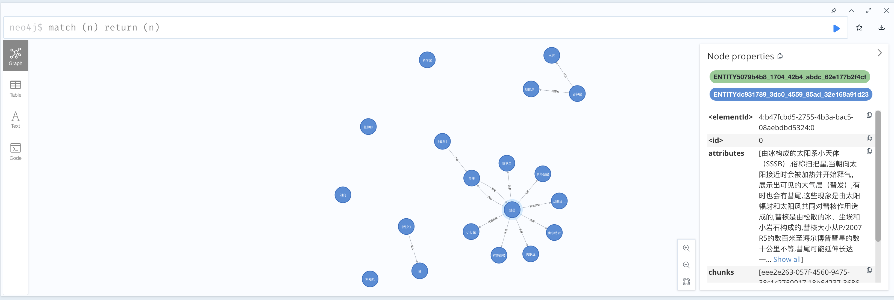

# WeKnora 知识图谱

## 快速开始

- .env 配置相关环境变量
    - 启用 Neo4j: `NEO4J_ENABLE=true`
    - Neo4j URI: `NEO4J_URI=bolt://neo4j:7687`
    - Neo4j 用户名: `NEO4J_USERNAME=neo4j`
    - Neo4j 密码: `NEO4J_PASSWORD=password`

- 启动 Neo4j
```bash
docker compose --profile neo4j up -d
```

### 可选：仅本机访问并限制内存

需要避免 Neo4j 端口对外暴露，或希望在资源有限的自托管主机上限制其内存时，可叠加仓库提供的独立配置：

```bash
docker compose -f docker-compose.yml -f docker-compose.neo4j-isolated.yml \
  --profile neo4j up -d
```

该配置默认只监听 `127.0.0.1:7474` 和 `127.0.0.1:7687`，并将容器内存限制为 2 GiB。端口、监听地址、堆内存和 page cache 均可通过 `.env.example` 中的 `NEO4J_*` 变量调整。`!override` 需要 Docker Compose 2.24.4 或更高版本。

- 在知识库设置页面启用实体和关系提取，并根据提示配置相关内容

## 生成图谱

上传任意文档后，系统会自动提取实体和关系，并生成对应的知识图谱。



## 查看图谱

登录 `http://localhost:7474`，执行 `match (n) return (n)` 即可查看生成的知识图谱。

在对话时，系统会自动查询知识图谱，并获取相关知识。
