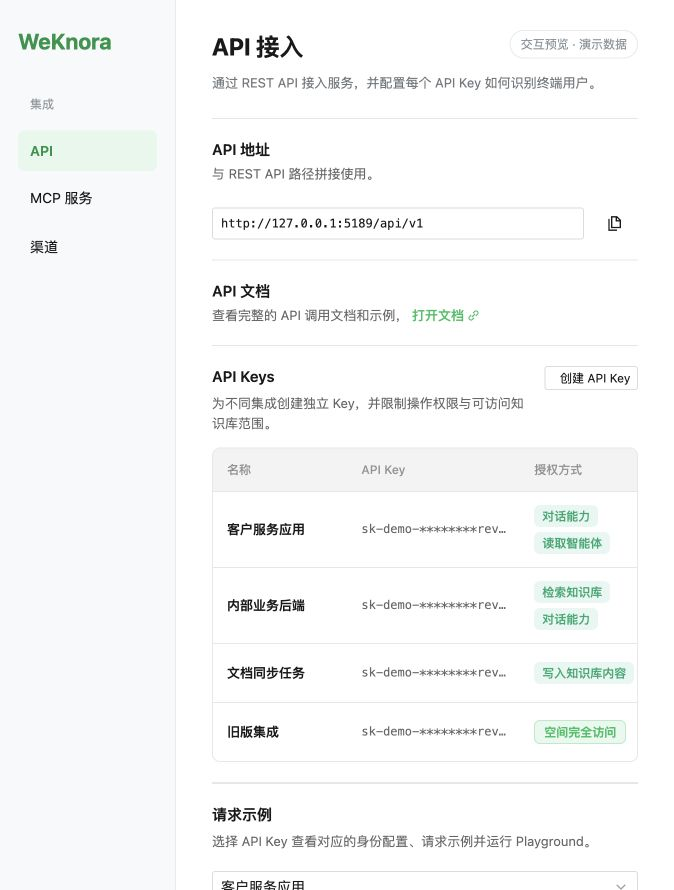
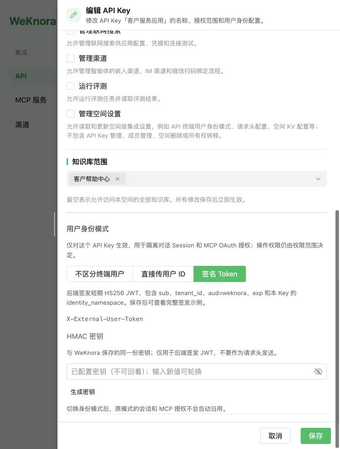

# 空间管理 API

[返回目录](./README.md)

包含两组接口：
- 空间 CRUD（`/tenants`、`/tenants/:id`）：当前认证用户对自己所属空间进行管理；跨空间访问需要管理员权限。
- 跨空间接口（`/tenants/all`、`/tenants/search`）：**需要服务端启用 `EnableCrossTenantAccess` 且当前用户具备 `CanAccessAllTenants` 权限**，否则返回 403。
- 空间 KV 配置（`/tenants/kv/:key`）：当前空间级别的通用配置项，**`tenant_id` 从认证上下文中获取，不在 URL 中传入**。

| 方法   | 路径                       | 描述                                              |
| ------ | -------------------------- | ------------------------------------------------- |
| GET    | `/tenants/all`             | 获取所有空间列表（需跨空间权限）                  |
| GET    | `/tenants/search`          | 分页搜索空间（需跨空间权限）                      |
| POST   | `/tenants`                 | 创建新空间                                        |
| GET    | `/tenants/:id`             | 获取指定空间信息                                  |
| PUT    | `/tenants/:id`             | 更新空间信息                                      |
| DELETE | `/tenants/:id`             | 删除空间                                          |
| GET    | `/tenants/:id/api-keys`    | 列出空间 API Key（Owner）                         |
| POST   | `/tenants/:id/api-keys`    | 创建带角色的 API Key（Owner）                  |
| DELETE | `/tenants/:id/api-keys/:key_id` | 吊销指定 API Key（Owner）                   |
| GET    | `/tenants/:id/api-principal-config` | 获取 API Key 用户身份配置（Owner）          |
| PUT    | `/tenants/:id/api-principal-config` | 更新 API Key 用户身份配置（Owner）          |
| GET    | `/tenants`                 | 获取当前用户可见的空间列表                        |
| GET    | `/tenants/kv/:key`         | 获取当前空间的 KV 配置（空间由认证上下文确定） |
| PUT    | `/tenants/kv/:key`         | 更新当前空间的 KV 配置（空间由认证上下文确定） |

## GET `/tenants/all` - 获取所有空间列表

获取系统中所有空间列表，需要跨空间权限。

**请求**:

```curl
curl --location 'http://localhost:8080/api/v1/tenants/all' \
--header 'Content-Type: application/json' \
--header 'X-API-Key: sk-An7_t_izCKFIJ4iht9Xjcjnj_MC48ILvwezEDki9ScfIa7KA'
```

**响应**:

```json
{
    "data": {
        "items": [
            {
                "id": 10001,
                "name": "weknora-1",
                "description": "weknora workspaces 1",
                "status": "active",
                "business": "wechat",
                "created_at": "2025-08-11T20:37:28.39698+08:00",
                "updated_at": "2025-08-11T20:37:28.405693+08:00"
            },
            {
                "id": 10002,
                "name": "weknora-2",
                "description": "weknora workspaces 2",
                "status": "active",
                "business": "wechat",
                "created_at": "2025-08-11T20:52:58.05679+08:00",
                "updated_at": "2025-08-11T20:52:58.060495+08:00"
            }
        ]
    },
    "success": true
}
```

## GET `/tenants/search` - 搜索空间

按关键词搜索空间，需要跨空间权限。

**查询参数**:
- `keyword`: 搜索关键词（可选）
- `tenant_id`: 按空间ID筛选（可选）
- `page`: 页码（默认 1）
- `page_size`: 每页条数（默认 20）

**请求**:

```curl
curl --location 'http://localhost:8080/api/v1/tenants/search?keyword=weknora&page=1&page_size=10' \
--header 'Content-Type: application/json' \
--header 'X-API-Key: sk-An7_t_izCKFIJ4iht9Xjcjnj_MC48ILvwezEDki9ScfIa7KA'
```

**响应**:

```json
{
    "data": {
        "items": [
            {
                "id": 10002,
                "name": "weknora",
                "description": "weknora workspaces",
                "status": "active",
                "business": "wechat",
                "created_at": "2025-08-11T20:52:58.05679+08:00",
                "updated_at": "2025-08-11T20:52:58.060495+08:00"
            }
        ],
        "total": 1,
        "page": 1,
        "page_size": 10
    },
    "success": true
}
```

## POST `/tenants` - 创建新空间

创建一个新的空间。**默认不会**自动发放 API Key；请在创建后通过 `POST /tenants/:id/api-keys` 创建密钥。从旧版本升级时，原有 `tenants.api_key` 会迁移到 `tenant_api_keys` 表并继续可用，直至被吊销。

> **兼容旧行为（可选）**：如需恢复旧版「创建空间即下发默认 API Key」的行为，可将系统设置 `tenant.auto_create_api_key` 置为 `true`（或设置环境变量 `WEKNORA_TENANT_AUTO_CREATE_API_KEY=true`）。开启后，创建空间会自动生成一个 `full_access` 权限的 API Key，并在响应体 `data.api_key` 中返回其明文 token（仅本次创建响应返回，请妥善保存）。默认 `false`。

**参数说明（请求体）**:

| 字段              | 类型   | 必填 | 说明                                                   |
| ----------------- | ------ | ---- | ------------------------------------------------------ |
| name              | string | 是   | 空间名称                                               |
| description       | string | 否   | 空间描述                                               |
| business          | string | 否   | 业务标识（如 `wechat`）                                |
| retriever_engines | object | 否   | 检索引擎组合配置（`engines` 数组：每项含 `retriever_type` 与 `retriever_engine_type`） |
| storage_quota     | int    | 否   | 存储配额（字节）                                       |

**请求**:

```curl
curl --location 'http://localhost:8080/api/v1/tenants' \
--header 'Content-Type: application/json' \
--data '{
    "name": "weknora",
    "description": "weknora workspaces",
    "business": "wechat",
    "retriever_engines": {
        "engines": [
            {
                "retriever_type": "keywords",
                "retriever_engine_type": "postgres"
            },
            {
                "retriever_type": "vector",
                "retriever_engine_type": "postgres"
            }
        ]
    }
}'
```

**响应**（默认，不含 API Key）:

```json
{
    "data": {
        "id": 10000,
        "name": "weknora",
        "description": "weknora workspaces",
        "status": "active",
        "retriever_engines": {
            "engines": [
                {
                    "retriever_engine_type": "postgres",
                    "retriever_type": "keywords"
                },
                {
                    "retriever_engine_type": "postgres",
                    "retriever_type": "vector"
                }
            ]
        },
        "business": "wechat",
        "storage_quota": 10737418240,
        "storage_used": 0,
        "created_at": "2025-08-11T20:37:28.396980093+08:00",
        "updated_at": "2025-08-11T20:37:28.396980301+08:00",
        "deleted_at": null
    },
    "success": true
}
```

当开启 `tenant.auto_create_api_key`（或 `WEKNORA_TENANT_AUTO_CREATE_API_KEY=true`）时，响应的 `data` 中会额外包含 `api_key` 字段（`full_access` 密钥的明文 token）：

```json
{
    "data": {
        "id": 10000,
        "name": "weknora",
        "description": "weknora workspaces",
        "api_key": "sk-aaLRAgvCRJcmtiL2vLMeB1FB5UV0Q-qB7DlTE1pJ9KA93XZG",
        "status": "active",
        "business": "wechat",
        "storage_quota": 10737418240,
        "storage_used": 0,
        "created_at": "2025-08-11T20:37:28.396980093+08:00",
        "updated_at": "2025-08-11T20:37:28.396980301+08:00",
        "deleted_at": null
    },
    "success": true
}
```

## GET `/tenants/:id` - 获取指定空间信息

获取指定 ID 的空间详情。只能访问自己所属空间；访问其他空间需要跨空间权限，否则返回 403。

**路径参数**:

| 字段 | 类型 | 说明    |
| ---- | ---- | ------- |
| id   | int  | 空间 ID |

**请求**:

```curl
curl --location 'http://localhost:8080/api/v1/tenants/10000' \
--header 'X-API-Key: sk-aaLRAgvCRJcmtiL2vLMeB1FB5UV0Q-qB7DlTE1pJ9KA93XZG' \
--header 'Content-Type: application/json'
```

**响应**:

```json
{
    "data": {
        "id": 10000,
        "name": "weknora",
        "description": "weknora workspaces",
        "api_key": "sk-aaLRAgvCRJcmtiL2vLMeB1FB5UV0Q-qB7DlTE1pJ9KA93XZG",
        "status": "active",
        "retriever_engines": {
            "engines": [
                {
                    "retriever_engine_type": "postgres",
                    "retriever_type": "keywords"
                },
                {
                    "retriever_engine_type": "postgres",
                    "retriever_type": "vector"
                }
            ]
        },
        "business": "wechat",
        "storage_quota": 10737418240,
        "storage_used": 0,
        "created_at": "2025-08-11T20:37:28.39698+08:00",
        "updated_at": "2025-08-11T20:37:28.405693+08:00",
        "deleted_at": null
    },
    "success": true
}
```

## PUT `/tenants/:id` - 更新空间信息

更新指定空间的基础信息。访问规则同 `GET /tenants/:id`。

**路径参数**:

| 字段 | 类型 | 说明    |
| ---- | ---- | ------- |
| id   | int  | 空间 ID |

**参数说明（请求体）**: 与 `POST /tenants` 相同字段；未传字段保持原值。

**请求**:

```curl
curl --location --request PUT 'http://localhost:8080/api/v1/tenants/10000' \
--header 'X-API-Key: sk-aaLRAgvCRJcmtiL2vLMeB1FB5UV0Q-qB7DlTE1pJ9KA93XZG' \
--header 'Content-Type: application/json' \
--data '{
    "name": "weknora new",
    "description": "weknora workspaces new",
    "status": "active",
    "retriever_engines": {
        "engines": [
            {
                "retriever_engine_type": "postgres",
                "retriever_type": "keywords"
            },
            {
                "retriever_engine_type": "postgres",
                "retriever_type": "vector"
            }
        ]
    },
    "business": "wechat",
    "storage_quota": 10737418240
}'
```

**响应**:

```json
{
    "data": {
        "id": 10000,
        "name": "weknora new",
        "description": "weknora workspaces new",
        "api_key": "sk-aaLRAgvCRJcmtiL2vLMeB1FB5UV0Q-qB7DlTE1pJ9KA93XZG",
        "status": "active",
        "retriever_engines": {
            "engines": [
                {
                    "retriever_engine_type": "postgres",
                    "retriever_type": "keywords"
                },
                {
                    "retriever_engine_type": "postgres",
                    "retriever_type": "vector"
                }
            ]
        },
        "business": "wechat",
        "storage_quota": 10737418240,
        "storage_used": 0,
        "created_at": "2025-08-11T20:37:28.39698+08:00",
        "updated_at": "2025-08-11T20:49:02.13421034+08:00",
        "deleted_at": null
    },
    "success": true
}
```

## DELETE `/tenants/:id` - 删除空间

删除指定空间。访问规则同 `GET /tenants/:id`。

**路径参数**:

| 字段 | 类型 | 说明    |
| ---- | ---- | ------- |
| id   | int  | 空间 ID |

**请求**:

```curl
curl --location --request DELETE 'http://localhost:8080/api/v1/tenants/10000' \
--header 'X-API-Key: sk-aaLRAgvCRJcmtiL2vLMeB1FB5UV0Q-qB7DlTE1pJ9KA93XZG' \
--header 'Content-Type: application/json'
```

**响应**:

```json
{
    "message": "Workspace deleted successfully",
    "success": true
}
```

## API Key 管理（`tenant_api_keys`）

自 scoped API Key 改造后，密钥以独立记录存储，支持：

- **full_access / capabilities**：全部空间操作或指定操作能力；API Key 管理始终要求登录的 Owner 会话。
- **knowledge_base_ids**：可选，将 Key 限制在指定知识库
- **吊销**：`DELETE /tenants/:id/api-keys/:key_id`
- **过期**：创建时可选 `expires_at_unix`

空间 Key 固定绑定创建时的空间。路由级 capability 鉴权与 KB 访问守卫会在 `X-API-Key` 认证后继续强制执行。

### 平台 API Key

系统管理员可在“系统管理 → 平台 API Key”创建不绑定单一空间的 Key。平台 Key 默认可以选择任意存在的空间，但每项操作仍必须具备对应 capability；平台 Key 不支持 `full_access`。

- 管理接口：`GET/POST /system/admin/api-keys`、`DELETE /system/admin/api-keys/:key_id`，仅人类 SystemAdmin 会话可调用，平台 Key 不能创建或吊销其他平台 Key。
- 调用普通空间 API 时必须同时传 `X-Tenant-ID: <空间 ID>`；服务端解析目标空间后继续复用原有空间 Context、路由 capability 和知识库范围检查。
- 调用明确开放的 `/system/admin/*` 控制面接口时不需要 `X-Tenant-ID`，需要 `system_*` capability。
- 平台 Key 明文仅在创建响应的 `data.token` 返回一次；列表仅返回脱敏值。

```bash
curl 'http://localhost:8080/api/v1/knowledge-bases' \
  -H 'X-API-Key: <platform-api-key>' \
  -H 'X-Tenant-ID: 10000'
```

平台 capability：

| capability | 权限 |
| --- | --- |
| `system_tenants_read` | 列出、搜索、查看全部空间 |
| `system_tenants_manage` | 创建、更新、删除空间以及应用全局空间配置 |
| `system_settings_read` | 读取系统设置 |
| `system_settings_manage` | 更新、重置系统设置 |
| `system_runtime_read` | 查看运行时队列和任务 |
| `system_runtime_manage` | 重试、立即执行、取消、删除运行时任务 |
| `system_audit_read` | 读取平台审计日志 |

平台 Key 也可以携带现有空间 capability，例如 `retrieve`、`ingest`、`manage_kbs`；这些能力作用于请求中 `X-Tenant-ID` 指定的空间。

## API Key Principal：隔离边界与安全说明

每个空间 API Key 的 `api_principal_config` 控制 `X-API-Key` 请求如何映射为终端 **Principal**。在创建、编辑 Key 时配置；平台 Key 继续使用机器身份。

管理界面中，每个 Key 显示自己的用户身份模式；编辑表单在知识库范围下方配置身份。以下截图使用演示数据：





创建示例（`POST /tenants/:id/api-keys`，登录的 Owner）：

```json
{
  "name": "customer-app",
  "capabilities": ["chat", "read_agents"],
  "api_principal_config": {
    "mode": "signed_token",
    "hmac_secret": "<业务后端保存的随机签名密钥>"
  }
}
```

返回数据中的 `identity_namespace` 是服务端生成的稳定应用身份域；响应仅返回 `has_hmac_secret`，不会返回签名密钥。新建时省略身份配置，默认为独立应用的 `tenant` 模式。

`PUT /tenants/:id/api-keys/:key_id` 可修改名称、权限、过期时间和 `api_principal_config`。省略整个身份配置会保留原值；省略 `hmac_secret` 会保留已保存的签名密钥。签名模式必须有密钥，身份配置并发变更返回 409，需重新加载再编辑。身份模式改变后，不自动沿用旧模式的会话和 MCP 授权。

同一应用轮换 Key 时，创建请求可传 `identity_source_key_id`，复制同空间内已有、未吊销 Key 的应用身份域和身份配置；不能同时传 `api_principal_config`。操作权限仍由新 Key 的请求字段指定。复制后的配置独立保存，原 Key 可正常吊销。

新应用的 JWT 必须额外包含 `identity_namespace`，值为对应 Key 返回的应用身份域；即使两个应用误用了相同签名密钥，JWT 也不能跨应用使用。同一应用域中的直接用户 ID 和签名 Token 模式也使用不同身份。

```json
{
  "sub": "user_123",
  "tenant_id": "10000",
  "identity_namespace": "<创建 Key 时返回的应用身份域>",
  "aud": "weknora",
  "exp": 1893456000
}
```

`exp` 请由业务后端动态生成，有效期不得超过 24 小时。Playground 的 `POST /tenants/:id/api-principal-test-token` 请求增加 `api_key_id`，使用该 Key 保存的签名密钥签发短期测试 JWT；仅登录 Owner 可调用。

升级时将空间身份配置复制到既有 Key，保留原有 Session 和 MCP OAuth 身份；旧 JWT 无需增加应用身份域。旧 Key 的外部用户仍可能共享历史身份。改变旧 Key 的身份模式时，会为其建立独立应用身份域。原空间级 `api-principal-config` 接口仅保留给旧版兼容路径，修改它不会覆盖已经迁移或新建 Key 的身份配置。

### Principal 隔离范围（当前实现）

Principal **仅**用于按终端用户隔离以下能力：

- **对话 Session**（新应用按应用身份域和外部用户隔离；`tenant` 模式按应用身份隔离）
- **MCP OAuth** 访问令牌（同一空间下不同外部用户各自授权，token 互不共用）
- 对话内 MCP OAuth 提示、MCP 工具审批等与终端用户绑定的流程

Principal 用于确定会话与 MCP 授权归属。HTTP 路由权限由 Key 的 `full_access` 和 `capabilities` 控制，知识库访问另外受 `knowledge_base_ids` 约束；外部用户身份不赋予空间 RBAC 权限。

### 模式与安全假设

| mode | 适用场景 | 安全假设 |
| ---- | -------- | -------- |
| `tenant` | 无 per-user MCP 需求 | 同一应用身份共用一个 MCP OAuth 身份（旧 Key 保留历史空间身份） |
| `direct_header` | 仅可信服务端到服务端 | 用户 ID 来自调用方请求头，**可被持有 API Key 的任意调用方伪造**（冒充其他外部用户并共用/劫持其 MCP OAuth 授权）。面向终端用户或不可信客户端时**禁止**使用；若必须使用，请开启 `require_direct_header` 并确保 API Key 仅保存在可信后端 |
| `signed_token` | 面向终端用户的集成（**推荐**） | 由业务后端使用 `hmac_secret` 为外部用户签发短期 HS256 JWT；无效或缺失 token 返回 401，**不回退**为空间级 Principal |

`direct_header` 模式下，若未携带用户 ID 请求头：`require_direct_header=false` 时回退为该应用的无用户 Principal（旧 Key 保留空间级回退）；`require_direct_header=true` 时返回 401。

## GET `/tenants/:id/api-principal-config` - 获取 API Key 用户身份配置

兼容接口：返回历史空间级 Principal 配置。新建和迁移后的 Key 使用各自保存的配置。**需要 Owner 权限**。

**响应字段**:

| 字段 | 类型 | 说明 |
| ---- | ---- | ---- |
| mode | string | `tenant` / `direct_header` / `signed_token` |
| direct_header_name | string | 直接传用户 ID 时的请求头名，默认 `X-External-User-ID` |
| signed_token_header_name | string | 签名 token 模式请求头名，默认 `X-External-User-Token` |
| require_direct_header | bool | `direct_header` 模式下是否强制要求用户 ID 请求头 |
| has_hmac_secret | bool | 是否已配置 HMAC secret（不返回明文） |

**请求**:

```curl
curl --location 'http://localhost:8080/api/v1/tenants/10000/api-principal-config' \
--header 'Authorization: Bearer <token>'
```

**响应**:

```json
{
  "success": true,
  "data": {
    "mode": "signed_token",
    "direct_header_name": "X-External-User-ID",
    "signed_token_header_name": "X-External-User-Token",
    "require_direct_header": false,
    "has_hmac_secret": true
  }
}
```

## PUT `/tenants/:id/api-principal-config` - 更新 API Key 用户身份配置

兼容接口：更新历史空间级配置，不覆盖新建或迁移后的 Key。**需要 Owner 权限**。

**请求体**:

| 字段 | 类型 | 说明 |
| ---- | ---- | ---- |
| mode | string | 必填，`tenant` / `direct_header` / `signed_token` |
| direct_header_name | string | 可选 |
| signed_token_header_name | string | 可选 |
| require_direct_header | bool | 可选，`direct_header` 模式下缺 header 是否 401 |
| hmac_secret | string | 可选，`signed_token` 模式 HMAC 密钥；省略则保留现有值 |

`signed_token` 模式首次启用时必须提供 `hmac_secret`。

外部用户 JWT 要求：HS256 签名、`aud=weknora`、包含 `sub` 与 `tenant_id`、有效期不超过 24 小时。

**请求**:

```curl
curl --location --request PUT 'http://localhost:8080/api/v1/tenants/10000/api-principal-config' \
--header 'Authorization: Bearer <token>' \
--header 'Content-Type: application/json' \
--data '{
  "mode": "direct_header",
  "direct_header_name": "X-External-User-ID",
  "require_direct_header": true
}'
```

## GET `/tenants` - 获取空间列表

返回当前认证上下文对应的空间（普通用户为单条；管理员仍只返回自身空间）。

**请求**:

```curl
curl --location 'http://localhost:8080/api/v1/tenants' \
--header 'X-API-Key: sk-xxxxx' \
--header 'Content-Type: application/json'
```

**响应**:

```json
{
    "data": {
        "items": [
            {
                "id": 10002,
                "name": "weknora",
                "description": "weknora workspaces",
                "api_key": "sk-An7_t_izCKFIJ4iht9Xjcjnj_MC48ILvwezEDki9ScfIa7KA",
                "status": "active",
                "retriever_engines": {
                    "engines": [
                        {
                            "retriever_engine_type": "postgres",
                            "retriever_type": "keywords"
                        },
                        {
                            "retriever_engine_type": "postgres",
                            "retriever_type": "vector"
                        }
                    ]
                },
                "business": "wechat",
                "storage_quota": 10737418240,
                "storage_used": 0,
                "created_at": "2025-08-11T20:52:58.05679+08:00",
                "updated_at": "2025-08-11T20:52:58.060495+08:00",
                "deleted_at": null
            }
        ]
    },
    "success": true
}
```

## GET `/tenants/kv/:key` - 获取空间 KV 配置

获取当前空间的 KV 配置项。**空间 ID 从认证上下文中获取**（即由 `X-API-Key` / Bearer Token 对应的空间决定），URL 中不需要也不接受 tenant_id。

**路径参数**:

| 字段 | 类型   | 说明                                           |
| ---- | ------ | ---------------------------------------------- |
| key  | string | 配置键名（见下方支持的 key 列表，不支持的键返回 400） |

**支持的 key 值**:

| key                    | 说明                          |
| ---------------------- | ----------------------------- |
| `agent-config`         | Agent 配置（最大迭代次数、温度、System Prompt、可用工具等） |
| `web-search-config`    | 网页搜索配置                 |
| `conversation-config`  | 普通模式会话/对话配置        |
| `prompt-templates`     | 系统提示词模板（只读，按用户语言本地化） |
| `parser-engine-config` | 解析引擎配置（如 MinerU）    |
| `storage-engine-config`| 存储引擎配置（Local/MinIO/COS） |
| `chat-history-config`  | 聊天历史索引配置             |
| `retrieval-config`     | 全局检索配置                 |

**请求**:

```curl
curl --location 'http://localhost:8080/api/v1/tenants/kv/agent-config' \
--header 'X-API-Key: sk-xxxxx' \
--header 'Content-Type: application/json'
```

**响应（以 `agent-config` 为例）**:

```json
{
    "data": {
        "max_iterations": 10,
        "allowed_tools": ["knowledge_search", "web_search"],
        "temperature": 0.3,
        "system_prompt": "...",
        "use_custom_system_prompt": false,
        "available_tools": [
            { "name": "knowledge_search", "label": "知识库检索", "description": "..." }
        ],
        "available_placeholders": [
            { "name": "web_search_status", "label": "联网搜索状态", "description": "..." }
        ]
    },
    "success": true
}
```

失败时（不支持的键）：

```json
{ "success": false, "error": "unsupported key" }
```

## PUT `/tenants/kv/:key` - 更新空间 KV 配置

更新当前空间的 KV 配置项。**空间 ID 从认证上下文中获取**，请求体结构按 `key` 不同而异。`prompt-templates` 为只读，不支持 PUT。

**路径参数**:

| 字段 | 类型   | 说明                          |
| ---- | ------ | ----------------------------- |
| key  | string | 配置键名（见 GET 接口的支持列表，`prompt-templates` 除外） |

**请求（以 `agent-config` 为例）**:

```curl
curl --location --request PUT 'http://localhost:8080/api/v1/tenants/kv/agent-config' \
--header 'X-API-Key: sk-xxxxx' \
--header 'Content-Type: application/json' \
--data '{
    "max_iterations": 20,
    "temperature": 0.3,
    "system_prompt": ""
}'
```

**响应**:

```json
{
    "data": {
        "max_iterations": 20,
        "allowed_tools": ["knowledge_search", "web_search"],
        "temperature": 0.3,
        "system_prompt": "",
        "use_custom_system_prompt": false
    },
    "message": "Agent configuration updated successfully",
    "success": true
}
```

**约束**:

- `agent-config`: `max_iterations` 为正整数时上限 100，`-1` 表示不限制；`temperature` 取值范围 `[0, 2]`。
- `web-search-config`: `max_results` 取值范围 `[1, 50]`。
- `conversation-config`: 包含多项阈值校验（如 `keyword_threshold` / `vector_threshold` ∈ `[0, 1]`，`rerank_threshold` ∈ `[-10, 10]`，`temperature` ∈ `[0, 2]`，`max_completion_tokens` ∈ `[1, 100000]` 等）。
- `retrieval-config`: `embedding_top_k` / `rerank_top_k` ∈ `[0, 200]`；阈值范围同上。
- `storage-engine-config`: `default_provider` 必须在 `STORAGE_ALLOW_LIST` 允许的列表内。
- `chat-history-config`: 启用且设置了 `embedding_model_id` 而尚未关联知识库时，会自动创建一个隐藏知识库并将其 ID 写入配置。

## 空间邀请（邮箱邀请已注册用户）

`POST /tenants/:id/invitations` 通过邮箱邀请**已注册**用户。全局开关 `tenant.auto_accept_invitation`（环境变量 `WEKNORA_TENANT_AUTO_ACCEPT_INVITATION`，默认 `false`）控制行为：

| 开关 | 行为 | 成功响应 `data` 形状 |
| ---- | ---- | -------------------- |
| `false` | 创建 pending 邀请，受邀人须在 `/me/invitations` 接受 | `TenantInvitation`（含 `id`、`status: pending`） |
| `true` | 直接写入 `tenant_members`，并 reconcile 已有 pending 行 | `TenantMember`（含 `user_id`、`status: active`） |

开启 auto-accept 时，无默认空间的受邀人会将该空间设为 home tenant（与手动接受邀请一致）。SPA 通过 `GET /auth/me` 的 `capabilities.auto_accept_invitation` 感知开关，无需读取系统设置 API。
