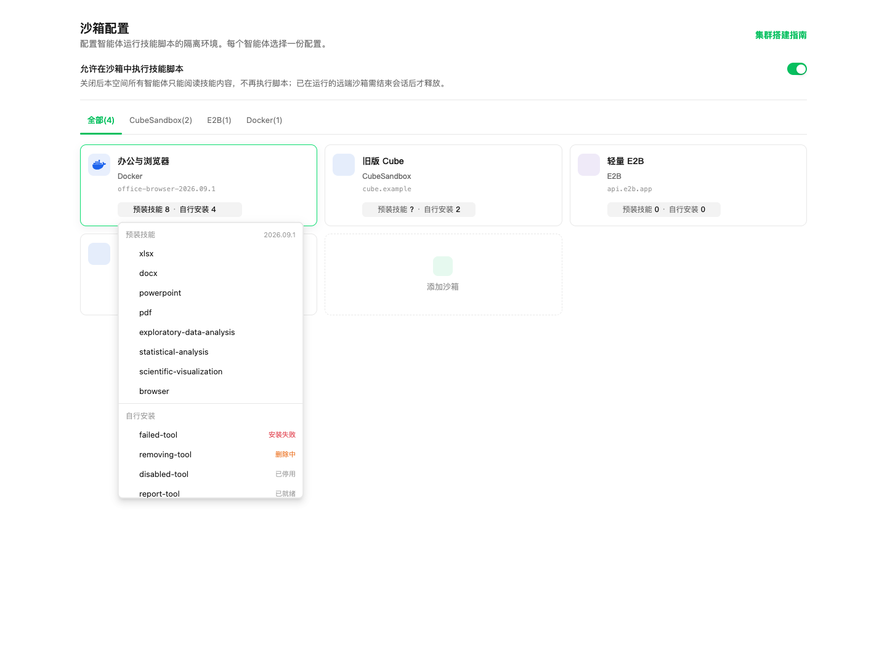
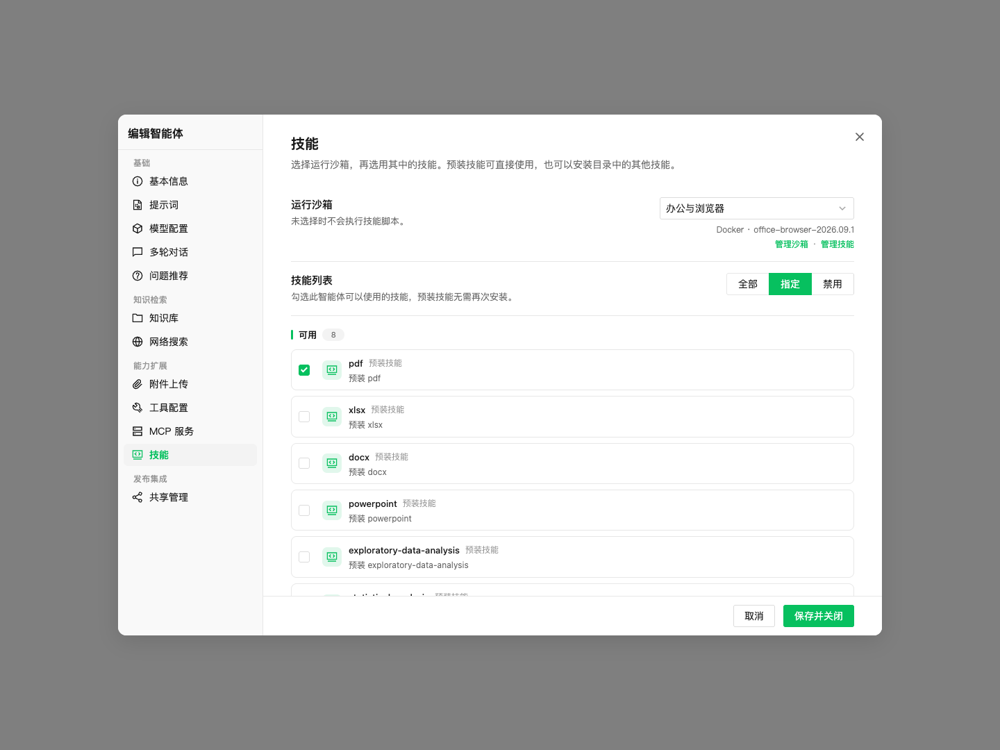
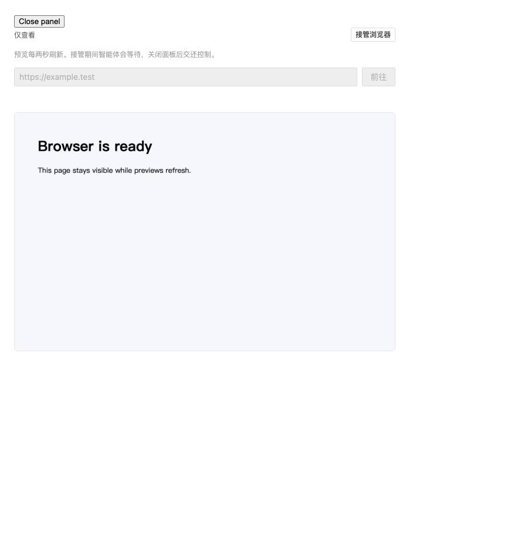

# 内置技能、技能发现与沙箱升级

## 当前提供的能力

在「设置 → 技能管理」切换到「技能发现」：

- 内置 8 个技能包：xlsx、docx、powerpoint、pdf、exploratory-data-analysis、statistical-analysis、scientific-visualization、browser。
- Anthropic 的 docx/pdf/pptx/xlsx 和腾讯 BrowserSkill 是精选推荐，只提供来源、许可与使用文档链接，不包含它们的技能代码，不会注入模型指令或在后台安装。
- 内置卡片说明用途、来源和许可；「安装到沙箱」直接打开目标选择，不跳转沙箱列表。已预装的目标标为可直接使用，无法重复勾选；其他目标可手动安装。只有确认安装时才注册技能目录并提交安装，不因浏览或取消创建记录。
- 沙箱列表采用紧凑摘要，点击浮层分别查看预装和自行安装的技能及状态；未知信息不会显示为零。
- 「我的技能」的沙箱下拉与安装抽屉共用预装判断：预装目标显示可直接使用，其他目标才显示安装加号。
- 智能体选择器使用实际可用技能与目录的合并结果，无安装记录的预装技能也可勾选；查询失败不清空保存的选择。对话 `@` 查询携带会话 ID，经归属校验后读取该会话绑定沙箱的预装元数据，遵循下一轮的镜像更新策略；模型中的技能说明来自同一运行时技能列表。
- 沙箱设置就地展示对应镜像/模板的自带技能。智能体选择该沙箱后，可直接按「全部 / 指定技能 / 不使用」使用，无需额外注册、安装、快照或安装模型。
- 卡片、抽屉、间距使用现有设置页组件及主题变量，以不同颜色的图标、标签和细边线区分用途，支持搜索和分类。

内置包的来源、完整 commit 和逐文件 SHA-256 位于
`internal/builtin/skills/sources.lock.json`。每个包保留 LICENSE、UPSTREAM.md 和原始说明，
WeKnora 的 SKILL.md 负责适配工具名称、沙箱路径与依赖范围。Python 依赖同时提供直接依赖列表
和含校验值的完整锁文件。上游资源是经过选择的子集；PDF 变换由额外的 WeKnora helper 补充。

## 构建 office-browser 镜像

保持原有轻量镜像不变，另行构建：

```bash
# Docker 后端，以及 E2B 模板的基础镜像
bash scripts/build_sandbox_office.sh sandbox weknora-sandbox:office-browser-2026.09.2

# Cube 模板（包含 envd，linux/amd64）
bash scripts/build_sandbox_office.sh cube your-registry/weknora-sandbox:office-browser-cube-2026.09.2
```

构建脚本先构建现有 runtime，再安装 Python 3.12、每个技能独立的虚拟环境、
LibreOffice、Poppler、中文字体、Playwright 和与其版本匹配的 Chromium。
需要将镜像推送到部署可访问的镜像仓库，并按各提供商的流程注册模板。
应用不会自动发布镜像或修改现有配置的模板 ID。

构建过程中，每个包必须通过 `scripts/weknora_smoke.py`：真正生成文件、读取结果，
验证公式缓存、文档转换、幻灯片图片、图表导出和浏览器启动。只检查命令退出码不算通过。
全部成功后生成 `/opt/weknora/runtime-manifest.json` 和各包的 `.bundle-digest`。
构建脚本同时把完整清单写入 `org.weknora.skills.manifest` 镜像 Label，
并输出 `dist/skills/<镜像名>.skills.json`，用于云端模板发布。
模型、OCR 大模型下载和完整 Linux 桌面不属于这个镜像。

为兼容旧版 ARM 虚拟机可能错误报告的 CPU 扩展，镜像使用 `OPENSSL_armcap=0`
禁用 OpenSSL 的 ARM 汇编加速；保留锁定的 cryptography 版本，不通过降级依赖解决崩溃。
该设置对非 ARM 构建无效。背景见 [上游问题](https://github.com/pyca/cryptography/issues/14764)
和 [OpenSSL 能力说明](https://docs.openssl.org/master/man3/OPENSSL_armcap/)。

## 识别预装技能：只读取元数据

| 后端 | 识别来源 | 操作位置 |
|---|---|---|
| Docker | Docker Engine 的 ImageInspect / ImageList 返回的完整 Label | 镜像输入框下自动展示，保留原有两步配置流程 |
| Cube | 发布者清单 + 控制面返回的模板 ID、Version | 模板页导入清单后就地展示 |
| E2B | 发布者清单 + 控制面返回的模板 ID、BuildID | 模板页导入清单后就地展示 |

当前引入的 Cube 和 E2B SDK 不返回模板的自定义 OCI Labels，不能假定远程模板列表会透传它们。
云端在发布模板时，管理员可在对应配置的模板页导入构建输出的 JSON；保存的只有声明，
绑定提供商、服务地址、模板 ID 和构建版本，不上传代码、不启动沙箱、不运行安装代理。
也可以通过已有的沙箱配置 API 在 `template_skills` 中提交相同声明。
同一配置当前只保存一份模板声明；换模板或重建版本后需用对应发布清单更新。
云端应发布独立、固定版本的模板，不在活动模板上重建覆盖；声明匹配的是控制面报告的版本，
不代替镜像发布时的功能检查。未报告版本的模板无法进行可靠匹配，因此显示未知。

完整声明格式：

```json
{
  "provider": "cube",
  "endpoint": "https://cube.example.com",
  "template_id": "tpl-office-2026-09-2",
  "revision": "<控制面返回的 Version；E2B 使用 BuildID>",
  "manifest": {
    "schema_version": 1,
    "profile": "office-browser",
    "version": "2026.09.2",
    "skills": [{"name": "pdf", "digest": "<发布清单中的完整 SHA-256>", "verified": true}]
  }
}
```

清单只能开放与服务端内嵌资源摘要一致、已声明通过构建检查的技能。
资源版本不匹配的项目会提示暂不可用，不会用当前版本的说明去调用旧脚本。
内置说明及资源由服务端提供，执行直接使用 `/opt/weknora/builtin/skills/<name>` 和其中的 `.venv`；
不会写入租户技能目录或数据库安装表。同名且已就绪、已启用的自定义技能优先。

旧镜像只有 `org.weknora.skills.version` 或 profile Label 时，不能证明其中的包内容一致，显示「预装信息未知」。
不会为查询信息进入容器、自动安装依赖或创建快照。也可在技能卡片中手动选择这个沙箱安装，沿用已有安装与快照流程。Docker 可用新构建脚本补齐 Label；
源文件不变时，依赖层会命中缓存。直接运行 Dockerfile 的发布者需要传入 `BUILTIN_SKILLS_MANIFEST`
构建参数（由 `go run ./cmd/builtin-skills-manifest` 生成），否则按未知镜像处理。

老会话不会因为标签或模板变化而被描述成拥有新技能：Docker 查询实际容器的 Image ID；
Cube/E2B 查询沙箱创建时保存的清单。暂停的沙箱不会被唤醒。旧云端沙箱没有这份创建时元数据，
保守显示未知，新会话才使用新的声明。自定义技能安装生成的快照会保留原构建沙箱的预装清单。

自定义技能仍使用原有安装、验证、快照和回滚流程；历史已注册的内置包也保留兼容接口。
这条安装流程和模板自带技能的直接使用互相独立。

## 升级已有沙箱配置

推荐通过新配置迁移：

1. 在沙箱设置中新建使用新版镜像/模板的配置，填写连接信息并测试连接。
2. 模板自带的技能无需迁移；如有自行安装的技能，在「技能发现 → 升级旧沙箱」检查迁移内容。
3. 预览显示每个源技能的版本、SHA 和阻塞原因。缺少原始包、缺少摘要、未就绪、已停用和目标重名的项目不会自动迁移。
4. 提交预览中可用的项目。服务端再次验证选择的 ID 和 SHA，按原始包重新安装，复用现有进度和重试界面。
5. 验证安装结果及新配置的环境变量后，在智能体设置中选择新配置，并开启新会话验证。

源配置、现有会话和当前工作区目录均不迁移。不会用当前目录里的最新版替代历史包，
也不会为了迁移历史版本而降级空间技能目录。目标的同名技能始终保留。
服务端为迁移安装保存独立的原始包引用，后续读取资源仍对应那个版本。

## 浏览器预览与人工接管

内置 `browser` 使用 Playwright 驱动无头 Chromium。同一沙箱中的模型 CLI 和聊天侧栏
「浏览器」页共用一个控制器。无需额外桌面、VNC 或开放 CDP 端口。

- 模型可通过 browser 技能打开网页；用户也可直接点击「启动浏览器 / 恢复浏览器」，无需先进入终端。首次启动按当前智能体解析沙箱配置，已有会话继续使用绑定配置。
- 预览通过已鉴权的会话接口每两秒拉取截图；这是轮询预览，不是视频流。后台刷新不切换 loading 状态，失败保留上一帧；新截图解码完成后再替换，避免闪烁。
- 接管后支持点击、拖动、滚动、按键、文本输入和导航。拖动使用真实的鼠标按下、移动、松开事件；等待中的移动合并为最新位置，取消、失焦或交还控制会释放按键。中文及较长文本可以使用预览下方的输入框。
- 接管租约阻止模型和另一个面板同时操作浏览器。关闭面板会释放；断线或页面进入后台后，租约最多 35 秒过期。
- 打开预览不会创建、唤醒或更换沙箱。仅用户主动点击启动或恢复时才允许创建或恢复，暂停和未启动状态使用就地提示。
- 浏览器控制器只监听沙箱内部 Unix socket。接口不接受任意 shell、脚本或远程浏览器地址，每次调用检查会话归属和空间权限。
- 截图和下载写入 `/workspace/output`，复用现有产物收集。登录状态仅在该会话中使用；15 分钟无请求后控制器关闭，销毁沙箱也会销毁浏览器。

拖动要求浏览器控制器声明 `pointer` 能力，包含在 `office-browser-2026.09.2` 中。
`2026.09.1` 的已发布资源作为兼容包保留：旧镜像仍能识别并使用原有技能，
不会把新版脚本说明混入旧会话。旧控制器支持原有点击操作，拖动时明确提示升级；
选择新版镜像（Cube/E2B 则发布新版模板并更新声明）后开启新会话即可使用拖动。

## 腾讯 BrowserSkill 后续接入

[BrowserSkill](https://github.com/Tencent/BrowserSkill) 当前采用本机 `bsk` CLI/daemon +
浏览器扩展的架构，使用用户已登录的 Chrome/Edge，并有独立的 Agent Window 与接管流程。
这是 `local_browser` 运行环境，与本次 `sandbox` 浏览器分别标注。

本次已加入推荐目录，尚未把 BrowserSkill 的代码、CLI 或扩展打入沙箱。
后续正式接入应在现有浏览器命令/预览接口后新增适配器，并补齐：

- 用户设备配对与撤销；不要把用户设备当作整个空间共享的沙箱。
- 服务端到本机 daemon 的鉴权通道、会话绑定和连接状态检测。
- BrowserSkill 原生 tab 借用、归还和人工接管状态到统一 UI 的映射。
- 扩展、CLI、协议版本检测，只有实际连接成功才声明能力可用。

技能目录里的 `runtime` 字段已区分 sandbox、local_browser 和 publisher。
前端浏览器面板只依赖会话命令及截图协议，不直接依赖 Playwright、CDP 或提供商地址。

## 开发验证

```bash
python3 scripts/vendor_builtin_skills.py
go test ./internal/builtin/skills ./internal/application/service ./internal/handler/... ./internal/router ./internal/sandbox
PYTHONDONTWRITEBYTECODE=1 python3 scripts/test_builtin_browser.py
# Python 环境须安装 browser/requirements.lock 和匹配的 Chromium
PYTHONDONTWRITEBYTECODE=1 WEKNORA_TEST_BROWSER=1 python3 scripts/test_builtin_browser.py
cd frontend
npm run type-check
npm run build
npm run check-i18n
```

`vendor_builtin_skills.py` 默认仅离线校验。`--fetch` 或 `--archive REPOSITORY=PATH`
只恢复锁文件列出的上游资源，并校验其 SHA；不会覆盖 WeKnora 自己维护的适配文件。

## 界面示例

以下为真实前端组件配合模拟接口数据的验证截图；示例配置显示旧版镜像，用于检查预装技能兼容展示。

沙箱列表分别展示预装和自行安装的技能：



智能体可直接选择预装技能：



浏览器组件的隔离验证页面（演示页面预览）：


