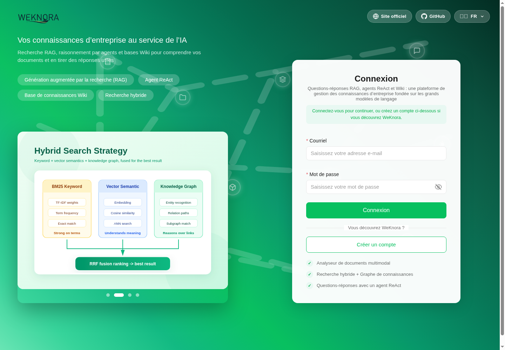

# Maintaining interface translations

The main Vue application supports `zh-CN`, `en-US`, `ru-RU`, `ko-KR`,
`ja-JP`, and `fr-FR`. Choose **Français** on the login screen or in
**Settings → General** to use French.



For a deployment default, set `DEFAULT_LOCALE=fr-FR` in Docker Compose's
environment. For a source build, use `VITE_DEFAULT_LOCALE=fr-FR`. The main
application's saved `localStorage.locale` preference takes precedence over
the deployment default. The project's built-in default remains `zh-CN`;
missing French messages fall back to English.

## Translation surfaces

| Surface | Source |
| --- | --- |
| Main interface | `frontend/src/i18n/locales/<locale>.ts` |
| Embedded chat | `frontend/src/i18n/embed.ts` and `frontend/src/i18n/locales/embed/` |
| TDesign components | `frontend/src/i18n/tdesign/` |
| Built-in agent names and descriptions | `config/builtin_agents.yaml` |
| Agent type labels and descriptions | `config/agent_type_presets.yaml` |
| Prompt template names and descriptions | `config/prompt_templates/*.yaml` |

The embedded application has an independent dictionary and saves its language
under `weknora-embed-locale`. An explicit `?locale=fr-FR` takes precedence over
that saved preference and browser detection. French browser variants such as
`fr`, `fr-CA`, and `fr-BE` map to `fr-FR`. A channel can also set its
`default_locale` to `fr-FR`; host widgets retain their existing `setLocale()` API.

TDesign 1.19.2 does not provide a French bundle. The local French dictionary
supplies component labels and the Day.js French locale, including a calendar
starting on Monday. Components with an explicit date format keep that format.
When upgrading TDesign, compare its English bundle against the local French
dictionary for newly introduced component labels.

Backend requests already carry `Accept-Language`; `fr-FR` maps to `French` in
prompt language substitution. Leave `WEKNORA_LANGUAGE` unset to follow each
request's language. Setting it forces the response language for the deployment.
Translations of YAML metadata must preserve template IDs and the actual
`content`, `user`, and agent configuration fields.

Shared illustration assets, externally supplied content, model output, and
backend errors without an existing translation key are separate from the
interface dictionaries. This change does not translate the WeChat mini program
or the documentation website.

## Checks after editing or updating

From `frontend/`:

```sh
npm ci
npm run check-i18n
npm test
npm run type-check
npm run build
```

The audits check key parity, dynamically referenced keys, message compilation,
and French interpolation parameters. Embedded dictionaries are checked as they
are used at runtime, including locale overlays. Preserve `{name}`, `{count}`,
escaped literals such as `{'@'}`, prompt parameters such as `{{query}}`, HTML,
model IDs, URLs, and literal import column names when translating.

Key parity cannot detect an English sentence that changed under the same key.
Record the previous source commit before merging an upstream update, then run:

```sh
npm run review-i18n-changes -- <previous-source-commit>
```

This read-only command reports added, removed, and changed English message
paths compared with the working tree. Review the corresponding translations,
and inspect changes to `embed.ts`, TDesign, and YAML metadata separately.
`npm run scan-i18n-gaps` can also highlight untranslated strings; product names,
technical identifiers, and examples can legitimately match English.

`npm run regenerate-i18n-locales` aligns dictionary keys but uses English for
missing translations. Review its diff and translate new text before publishing.

For changes to server localization, run from the repository root:

```sh
go test ./internal/types ./internal/config
go test ./internal/application/service -run '^TestDuplicateKnowledgeBase_' -count=1
```

## Keeping a translation fork up to date

Keep translations committed on a dedicated branch in your fork, with the
Tencent repository as `origin` and your fork as `fork`. Before an update, commit
or set aside unrelated work and create a backup branch. Merge the upstream
branch into the translation branch, resolve conflicts, review the translation
changes, and run the checks above before pushing or deploying.

```sh
git switch feat/french-localization
git branch backup/french-before-update
git fetch origin
git merge origin/main
# Review and translate changes, then run the checks above.
git push fork feat/french-localization
```

Use a distinct backup branch name for each update. This workflow preserves the
translation commits whether or not the upstream pull request is accepted.
For Docker deployments, build both frontend and app from the same source commit,
tag them under your own image names, and select those images in a local Compose
override. Updating official `wechatopenai/*` images alone does not include
changes that have not been merged upstream.
