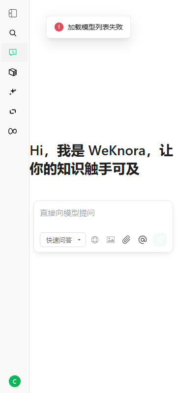
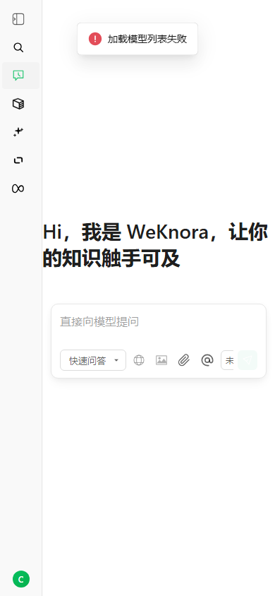
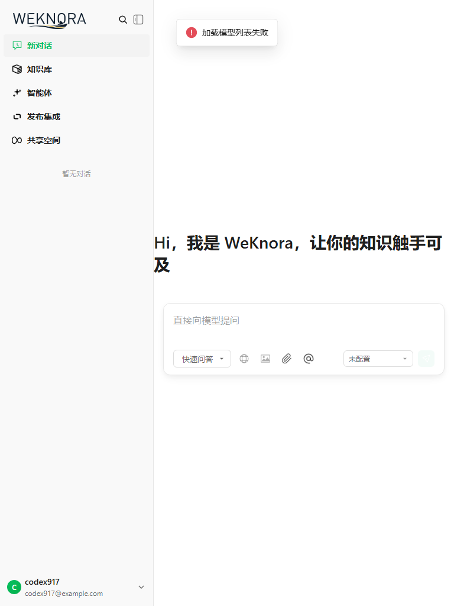
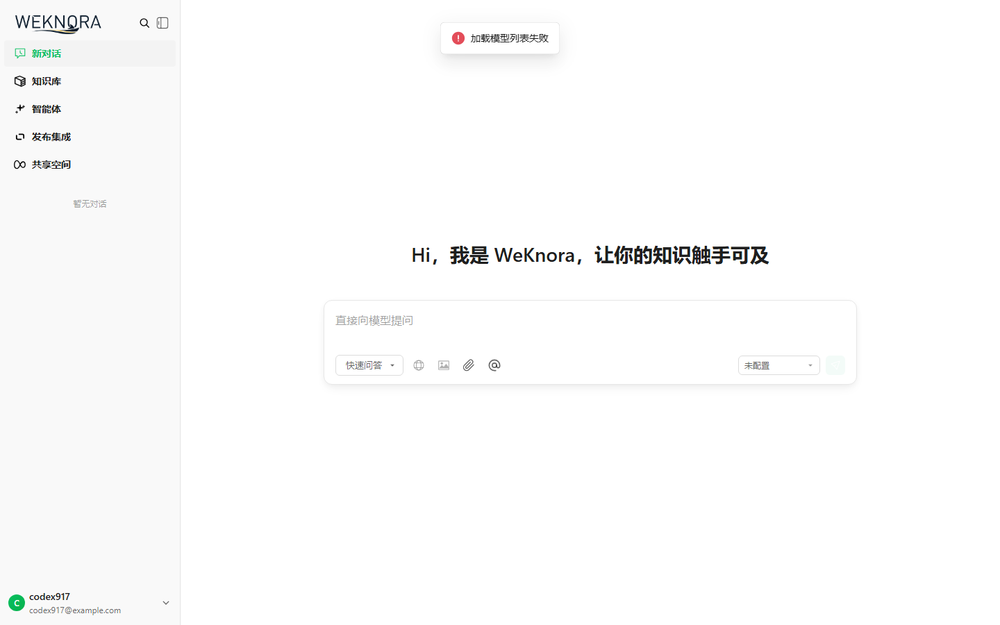

# Issue 917: Responsive Chat Input Verification

This document summarizes the responsive chat input fix for Tencent/WeKnora issue #917.

## Root Cause

The chat input looked oversized or shifted on Android-sized viewports because several desktop constraints were active at the same time:

- `Input-field.vue` did not fully own its responsive width and spacing.
- `creatChat.vue` and `KnowledgeBase.vue` had parent-level fixed textarea widths and manual `translateX(...)` offsets.
- `chat/index.vue` kept a desktop `min-width: 400px` on phone-sized viewports.
- `platform/index.vue` kept `.main { min-width: 600px; }`, which caused horizontal overflow on 360px and 390px screens.
- The platform sidebar defaulted to expanded width unless the user had already saved a collapsed preference.

## Fix

- Make `InputField` use container-driven sizing with `width: 100%`, `max-width: 800px`, and `box-sizing: border-box`.
- Add mobile-specific input spacing and control-bar constraints for `max-width: 600px` and `max-width: 380px`.
- Remove old parent fixed textarea widths from `creatChat.vue` and `KnowledgeBase.vue`.
- Release chat page desktop minimum width on phone-sized screens.
- Release platform shell desktop minimum width on phone-sized screens.
- Default the sidebar to collapsed on phone-sized first visits while preserving explicit user sidebar preferences.

## Verification

Commands:

```powershell
cd frontend
npm test
npm run build
```

Results:

- `npm test`: 140 tests passed.
- `npm run build`: successful. Existing Vite chunk-size and dynamic-import warnings remain.

Additional browser layout checks used a simulated authenticated frontend state because the local auth API returned `500` for registration and login during verification. The layout check confirmed there is no horizontal overflow on 360px and 390px viewports.

## Screenshots

### Phone 360px



### Phone 390px



### Tablet 768px



### Desktop 1440px


