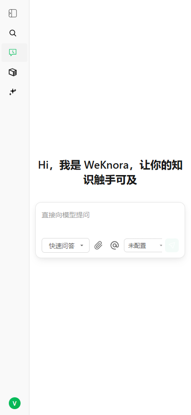
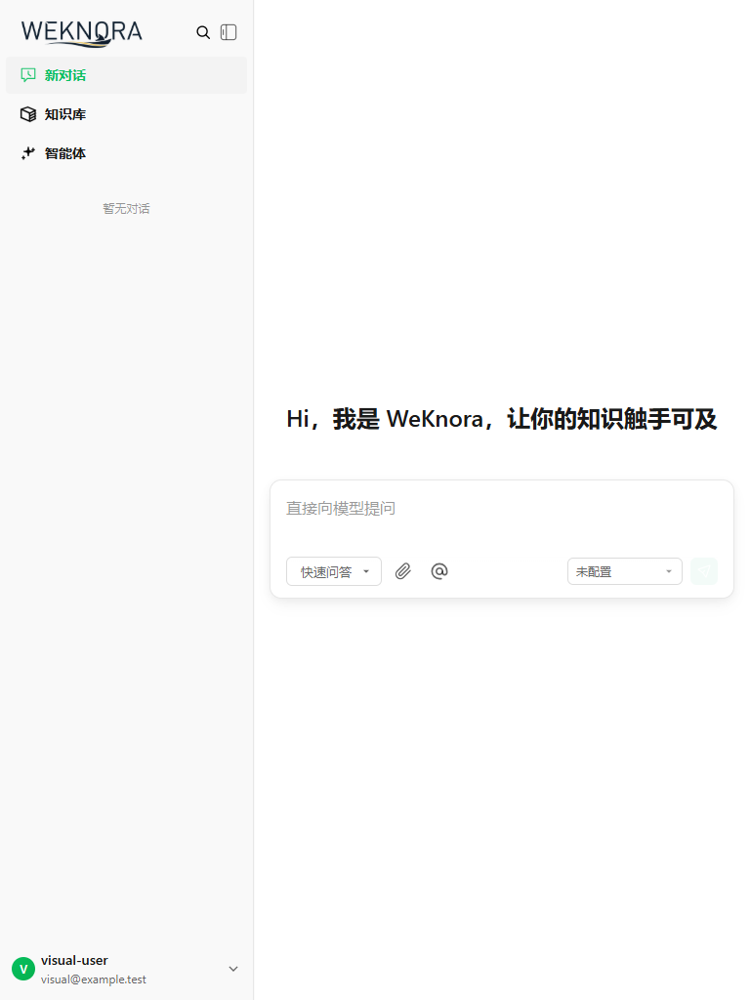
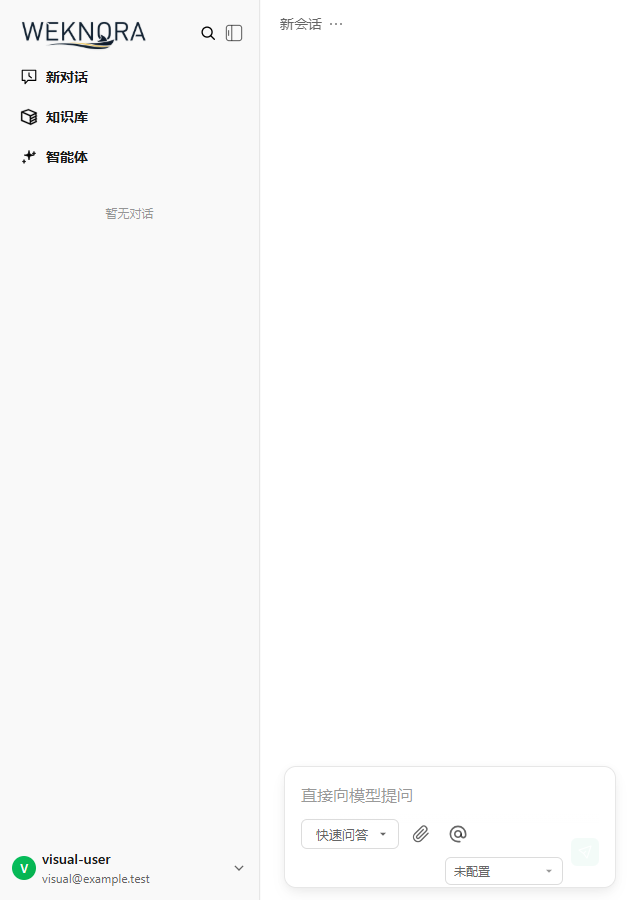
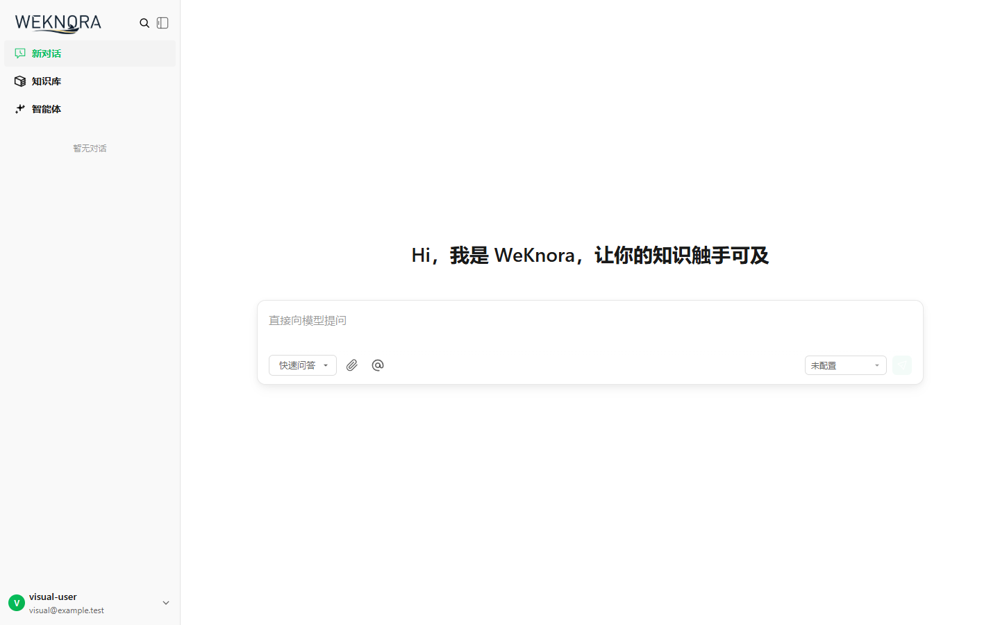

# Issue #917 responsive chat layout

## Root cause

The chat composer was sized twice: the component declared `width: 100%`, while
its host pages replaced that width at several breakpoints and shifted the result
with fixed `translateX(...)` values. The platform and conversation shells also
kept desktop minimum widths. On narrow Android viewports, those independent
constraints produced horizontal overflow and cropped the title, composer, and
send action.

## Resolution

- Let the composer size from its parent container and apply bounded phone/tablet
  gutters.
- Remove the fixed textarea widths and translated host-page offsets.
- Release desktop shell minimum widths through the 768 px compact-tablet
  breakpoint.
- Keep the send action fixed while optional controls remain horizontally
  accessible on narrow phones.
- Collapse the sidebar on a first phone visit without overriding a saved user
  preference.

## Verification

The production preview was exercised with Playwright on the new-chat and
existing-chat routes. The API was stubbed with deterministic empty data so the
check isolated responsive layout behavior.

| Route | Viewport | Document client/scroll width | Composer bounds | Send bounds |
|---|---:|---:|---:|---:|
| New chat | 360 px | 360 / 360 px | 72–348 px | 307–335 px |
| New chat | 390 px | 390 / 390 px | 72–378 px | 337–365 px |
| New chat | 768 px | 768 / 768 px | 276–752 px | 707–735 px |
| New chat | 1440 px | 1440 / 1440 px | 370–1330 px | 1285–1313 px |
| Existing chat | 390 px | 390 / 390 px | 80–370 px | 329–357 px |
| Existing chat | 640 px | 640 / 640 px | 284–616 px | 571–599 px |

The equal client and scroll widths demonstrate that none of the tested routes
introduces horizontal document overflow.

## Screenshots

### Phone, 390 px

### Tablet, 768 px

### Existing chat, 640 px

### Desktop regression check, 1440 px

