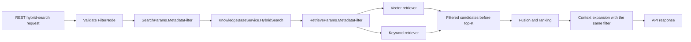

# API-first chunk metadata filter

Status: Proposed for review
Date: 2026-08-07
Related upstream discussions: [#2024](https://github.com/Tencent/WeKnora/issues/2024), [#2090](https://github.com/Tencent/WeKnora/issues/2090)

## 1. Summary

WeKnora should accept a boolean `metadata_filter` on the existing REST hybrid-search API and enforce it at chunk/record retrieval time. The target data model is a single file containing multiple independently searchable rows or chunks, where each row may carry different attributes such as employee nature or department.

The first contribution is API-first, but not API-only: accepting a field without propagating it into retrieval would be a no-op. The first implementation slice should carry the typed filter through the common search pipeline and implement one reference retriever backend. Other backends must reject a request that contains an unsupported filter instead of silently returning unfiltered results.

This capability is a retrieval filter. It becomes an authorization control only when a trusted server-side caller derives the filter from the authenticated user and does not let an end user omit or broaden it.

## 2. Current context

- `knowledges.custom_metadata` is knowledge/document-level context and currently does not affect retrieval.
- `Chunk.Metadata` is persisted at chunk level, but the current index contract and retriever records do not carry a general filterable chunk metadata payload.
- `SearchParams -> HybridSearch -> RetrieveParams` is the existing common path for REST hybrid search and is the right propagation boundary.
- The current REST endpoint is `/knowledge-bases/{id}/hybrid-search`; its request body is `types.SearchParams`.
- `knowledge_search`, `grep_chunks`, session QA, and MCP/Agent entry points are not part of the first API-only scope.

## 3. Goals

1. Add a documented `metadata_filter` request field to REST hybrid search.
2. Support nested `AND`/`OR` expressions so correlated permission combinations are representable.
3. Apply the filter to both vector and keyword candidate selection before top-K results are finalized.
4. Preserve current behavior when no filter is supplied.
5. Fail closed when a requested filter cannot be supported by the selected retriever backend.
6. Ensure parent, nearby, and relation-chunk context expansion does not reintroduce a filtered-out chunk.
7. Add contract, propagation, validation, and retrieval tests that cover cross-field permission combinations.

## 4. Non-goals for the first PR

- Resolving user identity, groups, departments, or employee attributes inside WeKnora.
- Allowing an untrusted client to use an optional request field as a complete authorization boundary.
- Adding a public API for writing or editing chunk access metadata.
- Supporting every configured vector/keyword backend in the first PR.
- Adding `NOT`, range predicates, full-text predicates, arbitrary JSONPath, or raw SQL expressions.
- Adding the same field to Agent tools, MCP, session QA, or web search.

The first PR assumes that an ingestion or upstream data path can populate the filterable metadata for each chunk. The write-path contract should be handled in a follow-up if the current deployment does not already populate it.

## 5. API contract

The existing endpoint remains unchanged:

```http
POST /knowledge-bases/{id}/hybrid-search
```

Example request:

```json
{
  "query_text": "员工报销规定",
  "match_count": 10,
  "metadata_filter": {
    "or": [
      {
        "and": [
          {"field": "employee_nature", "op": "eq", "value": "正式员工"},
          {"field": "department", "op": "eq", "value": "研发部"}
        ]
      },
      {
        "and": [
          {"field": "employee_nature", "op": "eq", "value": "外包员工"},
          {"field": "department", "op": "eq", "value": "财务部"}
        ]
      }
    ]
  }
}
```

The filter grammar is:

```text
FilterNode =
  { "and": [FilterNode, ...] }
  | { "or":  [FilterNode, ...] }
  | { "field": string, "op": "eq", "value": scalar }
  | { "field": string, "op": "in", "values": [scalar, ...] }
```

Validation rules:

- A node must be exactly one group or one predicate.
- `and` and `or` must contain at least one child.
- Maximum expression depth: 8.
- Maximum expression nodes: 64.
- Field names are non-empty, bounded in length, and validated as safe metadata keys. The key is bound as a JSON key by the backend translator; callers cannot provide SQL, JSONPath, or backend-specific fragments.
- A key that is not present in a row is a non-match, so a typo cannot broaden access.
- `eq` accepts one string, number, or boolean scalar; `in` accepts a non-empty list of those scalars.
- `not` and range operators are intentionally deferred.

## 6. Filter semantics

- `and` matches only when every child matches.
- `or` matches when at least one child matches.
- For a scalar stored value, `eq` is exact equality and `in` matches when the value is in the requested set.
- For a stored array value, `eq` matches when any element equals the requested value and `in` matches when the stored and requested sets intersect.
- A missing field is a non-match. It must not be treated as an unrestricted wildcard.
- `metadata_filter: null` or an omitted field means no additional filter and preserves current behavior.
- An invalid or empty filter returns a validation error before retrieval.

The expression tree is required for security correctness. A flat map such as `field -> values` only expresses `AND` across fields and `OR` within a field. It would incorrectly broaden a policy such as `(formal AND R&D) OR (contractor AND Finance)`.

## 7. Architecture and data flow



The filter must remain typed as it crosses the application boundary. It must not be smuggled through an untyped `AdditionalParams` map, because that would make validation, backend support detection, and security review inconsistent.

## 8. Index and backend strategy

The backend invariant is: the retriever must be able to evaluate the filter while selecting candidates. Post-filtering an already limited top-K result is not acceptable because it loses recall and can make authorization behavior depend on ranking luck.

For the first implementation slice:

1. Add a filterable access-metadata payload to the indexing contract separately from internal/generated chunk metadata.
2. Use PostgreSQL as the reference backend and materialize the payload as a JSONB field in the index record so vector and keyword queries can apply the same predicate.
3. Implement the reference backend for both retrieval modes.
4. If a multi-KB request spans a backend without filter support, reject the whole request with a typed `metadata_filter_unsupported` error. Never return a partial, unfiltered result set.
5. Add a support matrix to the API documentation.

Existing indexed records without the access-metadata payload remain searchable when no filter is supplied. When a filter is supplied, a missing protected field does not match; deployment documentation must call out the need to reindex or backfill protected records before enabling the feature for authorization use.

## 9. Context and response safety

Retrieval can enrich a hit with parent, nearby, or relation chunks. Every such expansion path must use the same filter and drop records that do not match. Otherwise an allowed row could act as a bridge to a restricted neighboring row.

The response must not expose internal filter evaluation details or backend query fragments. Validation errors may identify the invalid field/operator, but not emit generated SQL or sensitive metadata values in logs.

## 10. Error handling and security

- Missing filter: preserve existing search behavior.
- Malformed filter: return a client validation error.
- Unsupported backend: return a typed capability error and fail the request closed.
- Backend evaluation failure: return the existing search error path; do not retry without the filter.
- Caller-supplied filters are treated as narrowing input only. A trusted gateway or service must derive the effective allowed expression from the authenticated principal if the field is used for authorization.
- The implementation must reject raw SQL, backend-specific operators, unbounded nesting, and unbounded value lists.

## 11. Testing strategy

Unit tests:

- Decode and validate leaf, `and`, `or`, malformed, empty, over-depth, and over-node filters.
- Verify flat common cases and correlated `OR`-of-`AND` policies.
- Verify missing fields fail closed and omitted filters preserve behavior.
- Verify the filter is propagated from the handler to `SearchParams` and then to every `RetrieveParams` generated for vector and keyword retrieval.

Reference-backend tests:

- Scalar equality and set membership.
- Stored-array intersection.
- Vector and keyword queries exclude disallowed rows before the final limit.
- A selective filter still returns an allowed low-ranked candidate when enough candidates exist.
- Unsupported backends reject rather than ignore the filter.

Integration/regression tests:

- Parent/nearby/relation expansion cannot return a filtered-out chunk.
- Multi-KB requests fail closed when any store group lacks filter support.
- Requests without `metadata_filter` have unchanged result behavior.

## 12. Alternatives and trade-offs

### Flat `map[string][]string`

Simple to expose and implement, but cannot represent correlated permission combinations and can over-grant access. Rejected for ACL-shaped use cases.

### Post-filter after top-K

Small code change, but loses recall and is unsafe as an access boundary. Rejected.

### Resolve allowed chunk IDs before retrieval

Can reuse existing ID filters, but requires a separate authorization index, large ID lists, and synchronization when row metadata changes. It is a possible future optimization, not the first contract.

### Boolean expression tree

Slightly more complex validation and backend translation, but it accurately represents the required policy combinations and gives the API a stable extension point. Recommended.

## 13. Proposed PR split

1. **PR 1 — API and reference backend:** filter contract, validation, common propagation, reference backend, fail-closed capability handling, tests, and API docs.
2. **Follow-up PRs — backend coverage:** add equivalent pre-retrieval translation and tests per vector/keyword backend.
3. **Follow-up PR — write path:** expose or document how ingestion updates chunk access metadata and trigger reindexing.
4. **Follow-up PR — trusted identity integration:** derive the effective filter from the authenticated principal for session, Agent, MCP, and other entry points.
