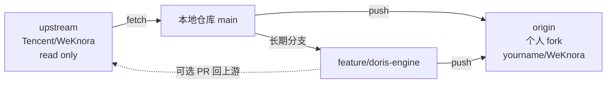
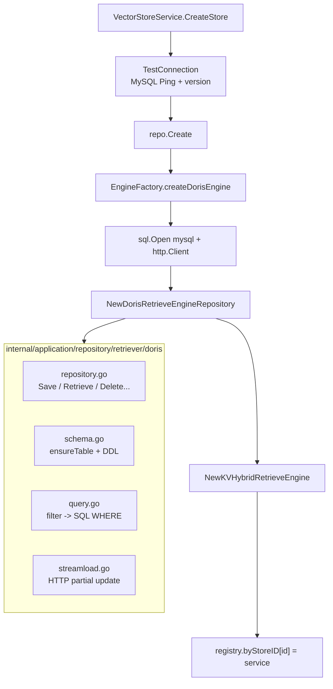

# Apache Doris 4.1 集成改动与上游同步策略

本文记录在 WeKnora 中**新增 Apache Doris 4.1 作为第 6 种检索引擎**这一改动的完整细节，并给出与上游 [Tencent/WeKnora](https://github.com/Tencent/WeKnora) 长期保持同步的工作流建议。

> 相关文档：
>
> - [集成向量数据库](../集成扩展/集成向量数据库.md) —— 通用集成指南，含 Doris 章节
> - 上层版本：[使用其他向量数据库](../../使用其他向量数据库.md)

## 一、背景

当前仓库的 git 配置（**改动前**）：

- `origin` -> `https://github.com/Tencent/WeKnora.git`（直接指向上游）
- 当前分支 `main` 跟踪 `origin/main`
- Doris 改动以本地工作区形式存在

如果继续在 `main` 上累积本地修改、再 `git pull` 拉上游，长期会演变成「几百次 rebase 冲突 + 没法发 PR + 找不到自己改了什么」的死路。需要切到 fork 工作流。

## 二、推荐的上游同步工作流

### 2.1 仓库角色拆分



### 2.2 一次性配置

> 在 GitHub 上把 `Tencent/WeKnora` fork 到自己账号（例如 `yourname/WeKnora`）后执行：

```bash
# 把现在的 origin 改名为 upstream（只读引用上游）
git remote rename origin upstream

# 把自己的 fork 设为 origin（push 目标）
git remote add origin https://github.com/<你的用户名>/WeKnora.git
git push -u origin main

# 把 Doris 改动放到长期 feature 分支
git checkout -b feature/doris-engine
git add .
git commit -m "feat(retriever): integrate Apache Doris 4.1"
git push -u origin feature/doris-engine
```

完成后 remote 应该是这样：

```bash
$ git remote -v
origin    https://github.com/<你的用户名>/WeKnora.git  (fetch)
origin    https://github.com/<你的用户名>/WeKnora.git  (push)
upstream  https://github.com/Tencent/WeKnora.git       (fetch)
upstream  https://github.com/Tencent/WeKnora.git       (push)
```

### 2.3 长期同步节奏（建议每周 / 每次大版本拉新）

```bash
# 1) 拉上游
git fetch upstream

# 2) main 直接 fast-forward
git checkout main
git merge --ff-only upstream/main
git push origin main

# 3) feature 分支 rebase 到最新 main
git checkout feature/doris-engine
git rebase main

# 4) 解决冲突 -> 跑测试 -> 强推 fork
go build ./...
go test ./internal/types/... \
        ./internal/application/repository/retriever/doris/... \
        ./internal/application/service/...
git push --force-with-lease origin feature/doris-engine
```

**rebase 优于 merge** 的理由：feature 分支保持线性历史，未来想发 PR 给上游会容易很多；merge 会让 commit 图谱变成一团乱麻，也难以 cherry-pick 单条改动。

### 2.4 冲突高发文件（每次 rebase 必看）

下面这些位置都是 WeKnora 的「检索引擎扩展点」，上游每加一个新引擎都会改一次，几乎一定会和我们的 Doris 分支撞：

| 文件 | 撞点 |
| --- | --- |
| [internal/types/retriever.go](../../../internal/types/retriever.go) | `RetrieverEngineType` 枚举 |
| [internal/types/tenant.go](../../../internal/types/tenant.go) | `retrieverEngineMapping` map |
| [internal/types/vectorstore.go](../../../internal/types/vectorstore.go) | `ConnectionConfig` / `IndexConfig` 结构、`GetVectorStoreTypes` / `BuildEnvVectorStores` / `ValidateIndexConfig` 三个函数 |
| [internal/application/service/vectorstore.go](../../../internal/application/service/vectorstore.go) | `validateConnectionConfig` switch |
| [internal/application/service/vectorstore_healthcheck.go](../../../internal/application/service/vectorstore_healthcheck.go) | `TestConnection` switch |
| [internal/container/engine_factory.go](../../../internal/container/engine_factory.go) | `createEngineServiceFromStore` switch |
| [internal/container/container.go](../../../internal/container/container.go) | `initRetrieveEngineRegistry` 中的 driver if 链 |
| [docker-compose.yml](../../../docker-compose.yml) | app 服务 `environment:` 段、`volumes:` 段 |

### 2.5 接口契约盯防

最容易踩坑的是 `interfaces.RetrieveEngineRepository`（[internal/types/interfaces/retriever.go](../../../internal/types/interfaces/retriever.go)）：上游一旦增加方法，所有实现包（包括 Doris）必须同步实现，否则编译失败。

每次 rebase 后**必须**跑：

```bash
go build ./...
go vet ./...
go test ./internal/types/... \
        ./internal/application/repository/retriever/doris/... \
        ./internal/application/service/...
```

### 2.6 依赖 / 镜像维护

- **Go 依赖**：本次 Doris 集成新增 `github.com/go-sql-driver/mysql`（主依赖）和 `github.com/DATA-DOG/go-sqlmock`（测试依赖），它们被 `internal/application/repository/retriever/doris/` 直接引用，上游 `go mod tidy` 不会丢弃它们。
- **Doris 镜像版本**：`docker-compose.yml` 中的 `apache/doris:fe-2.1.0` / `apache/doris:be-2.1.0` 需要随官方 4.x 镜像发布跟进升级。建议每个季度核对一次 [Apache Doris 镜像列表](https://hub.docker.com/r/apache/doris/tags)。

## 三、本次改动完整清单

### 3.1 改动统计

- 修改：15 个现有文件，约 +566 / -6 行
- 新增：7 个文件，约 +2057 行
- 总计：22 个文件，约 +2617 行

### 3.2 新增文件（7 个）

| 文件 | 行数 | 主要内容 |
| --- | ---: | --- |
| [internal/application/repository/retriever/doris/structs.go](../../../internal/application/repository/retriever/doris/structs.go) | 63 | `dorisRepository` 结构体（`*sql.DB` / `*http.Client` / 凭据 / 表配置 / `initializedTables sync.Map`）+ `DorisVectorEmbedding(WithScore)` 领域模型 |
| [internal/application/repository/retriever/doris/schema.go](../../../internal/application/repository/retriever/doris/schema.go) | 280 | `ensureTable` + `tableExists` + `createTable` + DDL 模板（UNIQUE KEY MoW + INVERTED + ANN HNSW + chinese parser）+ `waitANNReady` 异步索引就绪轮询 + `listEmbeddingTables` |
| [internal/application/repository/retriever/doris/query.go](../../../internal/application/repository/retriever/doris/query.go) | 202 | `whereBuilder`（`addEqual` / `addIn` / `addNotIn`）+ `buildBaseFilter` + `embeddingLiteral` / `parseEmbeddingLiteral`（locale 安全的浮点序列化） |
| [internal/application/repository/retriever/doris/repository.go](../../../internal/application/repository/retriever/doris/repository.go) | 584 | `NewDorisRetrieveEngineRepository` 构造 + `interfaces.RetrieveEngineRepository` 12 个方法实现（`Save` / `BatchSave` / `Retrieve` 分发 / `VectorRetrieve` / `KeywordsRetrieve` / `Delete*` 三件套 / `CopyIndices` / `EstimateStorageSize` / `EngineType` / `Support`）+ `scanRetrieveRows` / `scanCopyRows` / `translateSourceID` / `calculateStorageSize` |
| [internal/application/repository/retriever/doris/streamload.go](../../../internal/application/repository/retriever/doris/streamload.go) | 345 | `partialUpdateRows` + `streamLoadOnce`（HTTP PUT、Basic auth、`partial_columns` / `strip_outer_array` / `merge_type=APPEND` headers、`req.GetBody` 防 307 失体）+ `chunkRows`（1 MiB 自动拆批）+ `BatchUpdateChunkEnabledStatus` / `BatchUpdateChunkTagID` 真实实现 + `lookupChunkRowKeys` |
| [internal/application/repository/retriever/doris/repository_test.go](../../../internal/application/repository/retriever/doris/repository_test.go) | 510 | 基于 `go-sqlmock` + `httptest.Server` 的单测：whereBuilder / embeddingLiteral / chunkRows / partialUpdateRows / DeleteByChunkIDList / VectorRetrieve / KeywordsRetrieve / BatchSave / ensureTable DDL / BatchUpdateChunkEnabledStatus / EngineType+Support / translateSourceID / EstimateStorageSize |
| [scripts/e2e-doris.sh](../../../scripts/e2e-doris.sh) | 73 | 端到端联调 checklist 脚本（`docker compose --profile doris up` 后逐步验证 store 创建 / 写入 / 检索 / 状态批改） |

### 3.3 修改的现有文件（15 个）

#### 类型 / 常量层（5 个）

- **[internal/types/retriever.go](../../../internal/types/retriever.go)**（+1 行）：枚举增加 `DorisRetrieverEngineType RetrieverEngineType = "doris"`
- **[internal/types/tenant.go](../../../internal/types/tenant.go)**（+4 行）：`retrieverEngineMapping["doris"]` -> `{Keywords, Vector}`
- **[internal/types/vectorstore.go](../../../internal/types/vectorstore.go)**（+80 行）：
  - `import` 新增 `strconv`
  - `validEngineTypes` 收录 `DorisRetrieverEngineType`
  - `ConnectionConfig` 新增 `HTTPPort int` / `Database string`
  - `IndexConfig` 新增 `BucketsNum int` / `ReplicationNum int`
  - `GetIndexNameOrDefault` switch 增加 `case DorisRetrieverEngineType`
  - 新增 `(*IndexConfig).GetBucketsNum(def)` / `GetReplicationNum(def)` helper
  - `GetVectorStoreTypes()` 追加 doris 项（5 个连接字段 + 3 个索引字段）
  - `buildEnvStoreForDriver` 增加 `case "doris"`，读取 `DORIS_ADDR / DORIS_HTTP_PORT / DORIS_DATABASE / DORIS_USERNAME / DORIS_PASSWORD / DORIS_TABLE_PREFIX` 共 6 个环境变量
  - `ValidateIndexConfig` 给 `BucketsNum` / `ReplicationNum` 加 `0..maxShards` / `0..maxReplicas` 边界
- **[internal/application/service/vectorstore.go](../../../internal/application/service/vectorstore.go)**（+7 行）：`validateConnectionConfig` switch 新增 doris 分支（addr / database 必填）
- **[internal/application/service/vectorstore_healthcheck.go](../../../internal/application/service/vectorstore_healthcheck.go)**（+45 行）：
  - blank import `_ "github.com/go-sql-driver/mysql"`
  - `TestConnection` switch 增加 `case types.DorisRetrieverEngineType`
  - 新增 `testDorisConnection`（PingContext + `SELECT @@version`，超时 10s）

#### 装配层（2 个）

- **[internal/container/engine_factory.go](../../../internal/container/engine_factory.go)**（+52 行）：
  - import 增加 `database/sql` / `strconv` / `_ "github.com/go-sql-driver/mysql"` / `dorisRepo`
  - `createEngineServiceFromStore` switch 增加 `case types.DorisRetrieverEngineType`
  - 新增 `createDorisEngine`（拼 DSN + `sql.Open` + 池参数 + `NewDorisRetrieveEngineRepository`）+ `hostFromAddr` 辅助
- **[internal/container/container.go](../../../internal/container/container.go)**（+49 行）：
  - import 增加 `_ "github.com/go-sql-driver/mysql"` / `dorisRepo`
  - `initRetrieveEngineRegistry` 在 milvus 分支后追加 `slices.Contains(retrieveDriver, "doris")` 分支：读 6 个 `DORIS_*` env -> 构造 `*sql.DB` -> `NewDorisRetrieveEngineRepository(..., nil)` -> `registry.Register`

#### 测试（2 个）

- **[internal/types/vectorstore_test.go](../../../internal/types/vectorstore_test.go)**（+90 行）：
  - `TestBuildEnvVectorStores` 的 envMap 加 6 个 `DORIS_*` 项
  - `all supported drivers` 用例期望从 7 改 8、加 `__env_doris__` 断言
  - 新增 `doris env store` / `doris env store handles invalid http port gracefully` 子测试
  - `TestGetVectorStoreTypes` 期望从 4 改 5、加 `Contains "doris"`、新增 `doris has connection and index fields` 子测试
  - `TestValidateIndexConfig` 加 4 个 doris 子用例（buckets_num 边界 / replication_num 边界 / GetIndexNameOrDefault 默认 / 自定义）
- **[internal/application/service/vectorstore_test.go](../../../internal/application/service/vectorstore_test.go)**（+44 行）：
  - import 新增 `time`
  - `TestValidateConnectionConfig` 表加 3 个 doris 用例（valid / missing addr / missing database）
  - 新增 `TestTestConnection_DorisInvalidAddr` / `TestTestConnection_DorisMissingAddr`

#### 依赖、配置、文档（5 个）

- **[go.mod](../../../go.mod) / [go.sum](../../../go.sum)**：
  - 新增主依赖 `github.com/go-sql-driver/mysql v1.10.0`（间接：`filippo.io/edwards25519`）
  - 新增测试依赖 `github.com/DATA-DOG/go-sqlmock v1.5.2`
- **[.env.example](../../../.env.example)**（+21 行）：`RETRIEVE_DRIVER` 注释加 `doris`，新增 7 行 `DORIS_*` 环境变量段
- **[docker-compose.yml](../../../docker-compose.yml)**（+62 行）：
  - app 服务 `environment:` 段加 6 行 `DORIS_*` 注入
  - 新增 `doris-fe` 服务（`apache/doris:fe-2.1.0`，端口 8030 + 9030，profile: doris）
  - 新增 `doris-be` 服务（`apache/doris:be-2.1.0`，端口 8040，profile: doris，depends_on doris-fe）
  - `volumes:` 段加 `doris_fe_meta` / `doris_fe_log` / `doris_be_storage` / `doris_be_log`
- **[docs/使用其他向量数据库.md](../../使用其他向量数据库.md)**（+89 行）：参考实现列表加 doris 路径；新增 "Apache Doris 4.1 集成说明" 章节（协议 / 表结构 / 索引 / 分数语义 / 关键词检索 / Stream Load / env / 启动方式）
- **[docs/wiki/集成扩展/集成向量数据库.md](../集成扩展/集成向量数据库.md)**（+26 行）：参考实现列表加 doris 路径；新增 "Apache Doris 4.1 集成要点" 简版章节

### 3.4 整体调用链（rebase 后回归对照图）



## 四、回归 / 验证清单

### 4.1 单元测试

```bash
# Doris 包专属单测（go-sqlmock + httptest）
go test ./internal/application/repository/retriever/doris/... -count=1

# 类型层测试（含 BuildEnvVectorStores / GetVectorStoreTypes / ValidateIndexConfig 等扩展点）
go test ./internal/types/... -count=1

# 服务层 Doris 用例
go test ./internal/application/service/ -run "Doris|TestConnection|ValidateConnectionConfig" -count=1
```

> 注：`go test ./internal/application/service/...` 中存在若干 `TestCreateStore_*` 是会主动 dial `http://es:9200` 的预先存在用例，无网络环境会失败，与 Doris 改动无关。

### 4.2 docker compose 配置自检

```bash
docker compose --profile doris config -o /tmp/compose.out
echo $?   # 期望 0
```

### 4.3 端到端联调

```bash
docker compose --profile doris up -d
docker exec -it WeKnora-doris-fe \
    mysql -h 127.0.0.1 -P 9030 -uroot \
    -e "CREATE DATABASE IF NOT EXISTS weknora;"

RETRIEVE_DRIVER=doris make run
bash scripts/e2e-doris.sh
```

## 五、未来上游若新增引擎，模板化 checklist

如果上游某次合入了一个新引擎（例如 `chroma`），rebase 时按下面的 checklist 检查每个扩展点是否同时容纳上游 + Doris：

- [ ] [internal/types/retriever.go](../../../internal/types/retriever.go) 的 `RetrieverEngineType` 枚举：保留 `DorisRetrieverEngineType`
- [ ] [internal/types/tenant.go](../../../internal/types/tenant.go) 的 `retrieverEngineMapping`：保留 `"doris"` key
- [ ] [internal/types/vectorstore.go](../../../internal/types/vectorstore.go) 的 `validEngineTypes`、`GetIndexNameOrDefault` switch、`GetVectorStoreTypes()`、`buildEnvStoreForDriver` switch、`ValidateIndexConfig` 五处：保留 doris 分支
- [ ] [internal/application/service/vectorstore.go](../../../internal/application/service/vectorstore.go) 的 `validateConnectionConfig` switch：保留 doris 分支
- [ ] [internal/application/service/vectorstore_healthcheck.go](../../../internal/application/service/vectorstore_healthcheck.go) 的 `TestConnection` switch：保留 `testDorisConnection` 分支
- [ ] [internal/container/engine_factory.go](../../../internal/container/engine_factory.go) 的 `createEngineServiceFromStore` switch：保留 `createDorisEngine` 分支
- [ ] [internal/container/container.go](../../../internal/container/container.go) 的 `initRetrieveEngineRegistry`：保留 doris 的 `if slices.Contains(retrieveDriver, "doris")` 块
- [ ] [docker-compose.yml](../../../docker-compose.yml) 的 app 服务 `environment:` 段保留 6 个 `DORIS_*`；`volumes:` 段保留 `doris_fe_meta` 等；新增的服务定义保留
- [ ] [.env.example](../../../.env.example) 的 `RETRIEVE_DRIVER` 注释保留 `doris`、`DORIS_*` 段保留
- [ ] [internal/types/vectorstore_test.go](../../../internal/types/vectorstore_test.go) 中以维度计数的断言（如 `len == 5`、`all supported drivers` 用例）：如上游引擎数量也变了，要把数字调整到位，**保留 doris 断言**

如果 `interfaces.RetrieveEngineRepository`（[internal/types/interfaces/retriever.go](../../../internal/types/interfaces/retriever.go)）增加方法：

- [ ] 在 [internal/application/repository/retriever/doris/repository.go](../../../internal/application/repository/retriever/doris/repository.go) 同步实现新方法
- [ ] 添加对应单测到 [internal/application/repository/retriever/doris/repository_test.go](../../../internal/application/repository/retriever/doris/repository_test.go)

## 六、不在本次改动范围

- TLS 加密连接：先按非加密实现，TLS 走 DSN `tls=skip-verify` 选项后续再加
- 多租户隔离改造：仍由 `vector_stores` 表的 `tenant_id` 列承担，repository 层无需感知
- pgvector 风格的 SQL 函数自动注册脚本（Doris 不需要插件）
- 提交 PR 给 Tencent/WeKnora 上游（看是否打算贡献回去再决定）

## 反向链接

- [Home](../Home.md) —— Wiki 首页导航
- [集成向量数据库](../集成扩展/集成向量数据库.md) —— 通用集成指南
- [使用其他向量数据库](../../使用其他向量数据库.md) —— 上层版本（含 Doris 完整说明）
