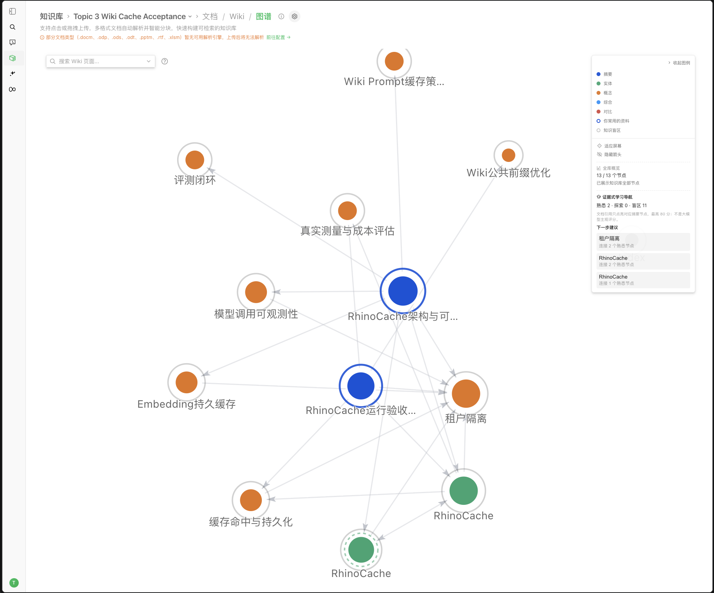
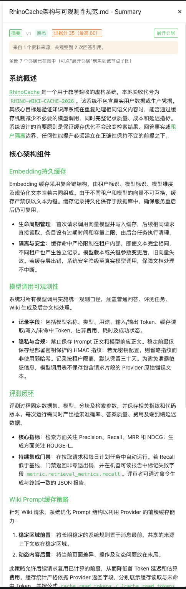

# 知识网络与引导式学习

本原型把个人长期记忆中的“回答引用来源”映射到 Wiki 图，在同一张图中展示熟悉节点、探索节点和知识盲区，并推荐下一步阅读内容。

## 定义与边界

- 知识节点采用 Wiki 页面；页面已有稳定 slug、来源文档和图连接。
- 原型衡量“有证据支持的熟悉程度”，不是考试成绩。
- 分数和推荐完全由可观察数据与确定性算法产生，不让大模型主观打分。
- 本阶段不生成测验、不新增学习事件表，也不修改 Wiki 页面。

## 数据与关联

`memory_doc_affinity` 在回答真实引用文档时，为当前空间、当前用户记录文档 ID、次数和最后使用时间。Wiki 页面通过 `source_refs` 保存来源文档 ID。由于回答引用只精确到文档而不是文档内概念，文档级证据只映射到该文档的 Summary 节点；同源的实体和概念不会被批量点亮。

```text
当前用户的回答来源计数
  -> knowledge_id
  -> WikiPage.source_refs
  -> 对应文档 Summary 页面的学习状态
  -> Wiki 图中的个人覆盖层
```

API 不接受用户 ID；身份来自登录上下文。底层查询同时限定 `tenant_id` 和 `subject_id`。

## 掌握度代理指标

对 Summary 页面所有不重复来源的引用次数求和为 `h`。非 Summary 节点在没有测验等概念级证据时保持“未接触”：

| 条件 | 状态 | 证据分 |
| --- | --- | ---: |
| `h = 0` | 未接触/盲区 | 0 |
| `h = 1` | 探索中 | 20 |
| `h >= 2` | 熟悉 | `min(80, 20 + 15 × (h - 1))` |

80 分上限是刻意的：来源复用能证明持续接触，但不能证明独立回忆或应用。节点同时返回证据类型、次数、来源数量和最后证据时间。

## 引导策略

候选页面必须尚未熟悉，并与至少一个熟悉页面相邻。排序依次比较：

1. 相邻的熟悉节点数量（降序）；
2. Wiki 图连接数（降序）；
3. 页面 slug（升序，保证并列时可重复）。

界面显示推荐原因，例如“连接 2 个熟悉节点”。孤立页面不会伪装成“下一步”，但仍作为盲区显示。

## 展示与隐私

Wiki 图使用实线环表示熟悉、虚线环表示探索、灰色环表示未接触，并展示三个状态的数量、推荐列表和节点证据明细。个人长期记忆页面可以逐项删除达到“常用资料”阈值的来源；“清空记忆”会删除包括一次引用在内的全部来源证据。导出 JSON 保留原有记忆数组，并增加 `learning_profile`，其中包含算法版本、证据定义、全部文档计数和截断标志。

学习覆盖层只存在于响应中，不写回共享 Wiki 页面。其他用户和其他空间不会继承当前用户的状态；用户关闭长期记忆后，Wiki 图不再加载个人覆盖层，但仍可导出或清除已有个人数据。

## 有效性验证

离线固定图覆盖以下断言：

- 已知来源只映射到对应文档的 Summary 页面，不能误点亮同源概念；
- 一次引用为“探索中”，达到阈值后为“熟悉”，分数最高不超过 80；
- 推荐只来自熟悉节点的一跳邻居，并按公开规则稳定排序；
- 不相连的盲区不会进入下一步推荐；
- 同一空间内不同用户的来源计数互不泄漏；
- 未启用个人证据提供器时，普通 Wiki 图结构保持兼容。

运行：

```bash
go test ./internal/application/service -run '^TestComputeGraphSubset' -count=1
go test ./internal/application/service/memory -run 'TestLearningDocuments|TestListDocuments' -count=1
```

上线前的小规模体验验证应固定同一个 Wiki 知识库，让两名测试用户分别完成不同主题的问答，再检查图上覆盖层和导出内容是否不同。该验证只证明关联、隔离和引导可用，不把点击或引用等同于真实学习效果。

## 本地验收记录（2026-09-11）

验收使用已有的 `Topic 3 Wiki Cache Acceptance` Wiki 知识库，不清理知识库、页面、问答记录或个人证据。测试者在同一会话中连续两次发送完全相同的问题，两次回答均正确并引用知识库文档。



图中蓝色实线环标记两个有重复引用证据的 Summary 节点；右侧面板同时展示完整的 `2 / 0 / 11` 状态计数、证据边界和基于熟悉邻居产生的下一步建议。截图已收起账号侧栏，仅保留本地测试知识库名称，不包含真实账号或凭据。

<p align="center">
  
</p>

节点下钻页直接展示“熟悉”、证据分 35、1 个资料来源和 2 次回答引用；分数旁保留最高 80 的证据边界，正文仍可继续阅读和沿链接探索。

| 阶段 | 熟悉 | 探索中 | 盲区 | 可观察结果 |
| --- | ---: | ---: | ---: | --- |
| 提问前 | 0 | 0 | 13 | 所有节点均无个人引用证据 |
| 第一次引用后 | 0 | 2 | 11 | 两份来源各有一次引用，只点亮对应 Summary 节点 |
| 第二次引用后 | 2 | 0 | 11 | 两个 Summary 节点达到熟悉阈值，证据分均为 35 |

界面验证了以下行为：

- 熟悉节点详情显示“来自 1 个资料来源，共观察到 2 次回答引用”，证据分为 35（最高 80）；
- 点击推荐的“租户隔离”能够打开对应概念页，其证据分为 0，来源与引用次数均为 0；
- 推荐原因显示该盲区与 2 个熟悉节点相连；
- 图例在内容超过可视高度时可独立滚动，并可收起，不再遮挡或裁切推荐项；
- 节点详情直接展示“熟悉 / 探索中 / 知识盲区”状态，无需用户根据分数推断；
- 关闭个人长期记忆后，学习统计和推荐立即消失，但 13 个 Wiki 节点仍可浏览；重新开启后，原有 `2 / 0 / 11` 状态和推荐恢复。

记忆导出结果包含原有 `data` 数组和 `learning_profile`。本次样本为 2 份资料、累计 4 次回答引用，`evidence_kind` 为 `answer_source_use`，`max_score_without_assessment` 为 80，两个截断标志均为 `false`。空的原有记忆集合导出为 `[]`，而不是 `null`。结构扫描未发现 Prompt、回答正文、API Key、密码或凭据字段。

自动化隔离测试还固定验证两类边界：同一租户的不同用户不能互读学习证据；相同用户标识在不同租户下也不能互读。手工开关验证与自动化隔离断言共同覆盖了个人选择、用户隔离和租户隔离，但不声称本次单账号手工流程替代了双账号端到端测试。

## 后续增强

后续可加入带标准答案的练习、间隔复习和前后测。新增证据必须保留来源、时间和评分规则，并与当前 `answer_source_use` 分开，避免弱信号被包装成高置信度掌握。
