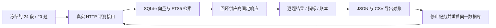

# Lite 评测 HTTP 回归

`evaluation-rag-http-smoke.py` 通过超文本传输协议（Hypertext Transfer Protocol，HTTP）运行完整评测服务。检索增强生成（Retrieval-Augmented Generation，RAG）流程包含数据集注册、24 段语料入库、SQLite 向量与全文检索、20 题回答、逐题指标及模型调用账本落库。供应商为进程内回环地址上的固定响应夹具，运行模式为 `offline-fixture`。

在具备 Python 3、Go 1.26、C 编译器、已启用的 Go/C 互操作（CGO，`CGO_ENABLED=1`）与预缓存 Go 依赖的 Linux 环境中，从候选仓库执行一条命令：

```sh
python3 scripts/evaluation-rag-http-smoke.py --output /tmp/x07-rag-reproduction
```

该命令编译带 SQLite 全文检索版本 5（Full Text Search 5，FTS5）支持的服务，创建新输出目录和 SQLite 数据库。输出目录必须尚不存在，其父目录必须存在。默认服务端口为 `18708`，供应商端口为 `18710`；可用 `--port` 与 `--supplier-port` 指定其他空闲端口。已有同一源码的可审计服务二进制时，可用 `--server-binary /path/to/weknora-server`，二进制散列值会写入证据。

下面的流程说明两轮评测及其对账关系。



两轮共用不可变数据集版本、模型身份、32 维向量、每段一个分块、生成温度 `0`、输出上限 `256` 和随机种子 `0`。第二轮重新创建评测临时知识库，并通过持久 Embedding 缓存复用相同段落与问题的向量。脚本断言第二轮没有供应商向量请求，同时逐题检索结果、引用、回答及质量指标与首轮完全相等。

固定语料还绑定两个检索下限：召回率为 `0.7416666666666666`，前三名归一化折损累计增益（Normalized Discounted Cumulative Gain at 3，NDCG@3）为 `0.5310068874168308`。每轮分别校验这两个下限，浮点比较容差为 `1e-12`；低于下限时错误信息包含轮次、指标名、实际值与下限。该门禁可识别两轮同时退化，基准数值属于本固定夹具。

| 结果类别 | 持久化与核验内容 |
| --- | --- |
| 质量 | 逐题检索排名、生成回答、指标实例观测、汇总指标；跨轮逐值相等 |
| 时间 | 逐题检索、生成和总时长；任务阶段时长；数据库、接口和导出一致 |
| 可靠性 | 两轮各 20 题成功，失败分子为 0；服务重启后读取持久结果 |
| 费用 | 每个物理请求对应完整终态账本；用量与夹具计数一致；逐请求按冻结测试价格复算 |

上述四类结果通过 JavaScript 对象表示法（JavaScript Object Notation，JSON）和逗号分隔值（Comma-Separated Values，CSV）两种导出格式核对。`manifest.json` 记录数据集、脚本、服务二进制的散列值和逐轮统计；`supplier.jsonl` 记录实际回环请求的用途、输入散列及夹具用量；`round-*.json`、`round-*.csv`、`round-*-ledger.json` 和 `x07-rag.sqlite` 保留核验依据。

供应商的向量使用固定字符二元组散列，回答使用题目的固定参考答案。用量和人民币价格均为测试定义。生成指标验证计算与存储链路，检索指标描述此固定向量夹具的结果；这些数值不构成真实供应商质量、性能或费用结论。全部模型请求均发送到回环地址，API 密钥为代码内的占位字符串。服务进程使用新生成的认证密钥和显式环境配置，输出记录遮蔽登录凭据。

SQLite 索引清理在同一事务内删除向量、全文索引和元数据。全文索引为空时执行 `delete-all`，使相同语料完整重建具有相同的 BM25（Best Matching 25，最佳匹配 25）统计。存在其他知识库全文记录时保留全部剩余记录；部分删除时的累计统计遵循 SQLite 的 contentless-delete 语义。本回归核验独立数据库中的完整语料重建。

The default build requires a clean committed checkout and explicitly embeds its full commit and product version. Each persisted experiment must report that same commit. An explicitly supplied `--server-binary` must embed a full source commit; unidentifiable binaries fail the regression. Controlled mutation evidence must separately preserve the exact patch and source hashes.
