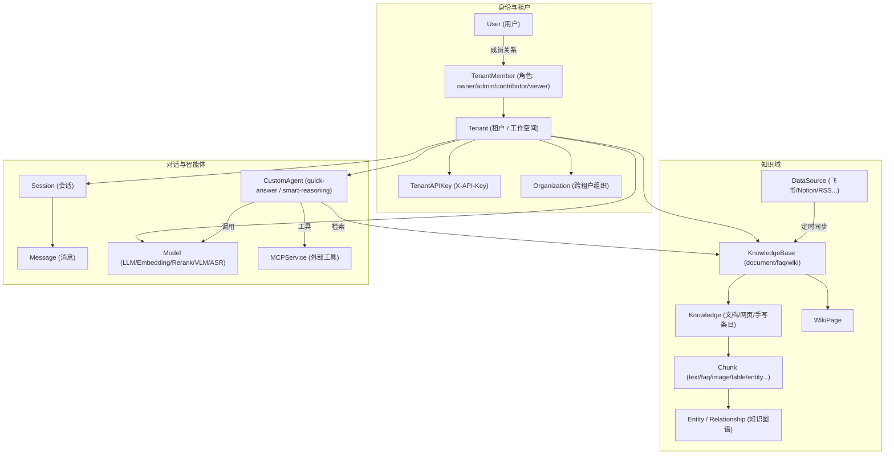
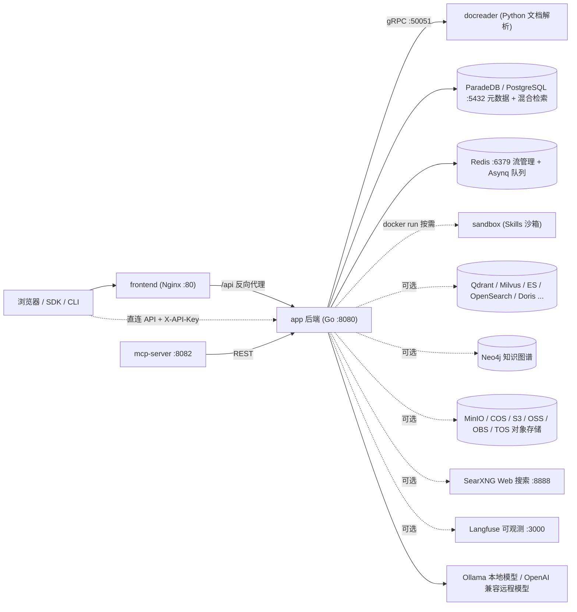

# WeKnora 产品介绍

WeKnora（维娜拉）是腾讯开源的一站式知识库与检索增强生成（RAG, Retrieval-Augmented Generation）系统。它以「文档理解 → 知识索引 → 混合检索 → 大模型问答 / Agent 推理」为主链路，帮助个人与团队把散落在 PDF、Word、网页、飞书、Notion 等各处的非结构化内容，变成可检索、可问答、可推理的私有知识资产。

后端使用 Go（Gin）实现，前端为 Vue 3 单页应用，文档解析服务 docreader 使用 Python（gRPC），三者可通过 Docker Compose、Helm、单二进制 Lite 模式或 macOS 桌面应用等多种形态部署。

## WeKnora 解决什么问题

| 痛点 | WeKnora 的做法 |
| --- | --- |
| 文档格式繁杂，PDF/扫描件/表格难以结构化 | 独立的 docreader 解析服务：PDF 版式分析、扫描件 OCR、LibreOffice 转换、Playwright 网页抓取、多模态图片描述（VLM），可选 OpenDataLoader/Docling 混合解析 |
| 单一向量检索召回不稳 | 向量 + 关键词（BM25）混合检索，RRF 融合，Rerank 重排，可选知识图谱（GraphRAG）与 Wiki 导航 |
| 模型绑定单一厂商 | 模型抽象层：Ollama 本地模型与 OpenAI 兼容远程接口均可，LLM / Embedding / Rerank / VLM / ASR 分类管理（见 `internal/types/model.go`） |
| 数据安全与私有化 | 全栈可私有部署；敏感凭证（API Key 等）以 AES-256 落盘加密（`SYSTEM_AES_KEY`）；多租户隔离 + RBAC 角色鉴权 |
| 只有问答不够用 | 内置 Agent（ReAct 多步推理）、MCP 工具接入、Agent Skills 沙箱执行、Web 搜索（SearXNG 等）、数据分析（对 CSV/Excel 执行 SQL） |
| 团队协作 | 租户（工作空间）+ 成员角色 + 组织（Organization）跨租户知识库共享 + 邀请机制 |

## 核心概念

以下概念全部对应 `internal/types/` 下的 Go 结构体，是理解 WeKnora 数据模型的基础。

### 租户与身份

| 概念 | 结构体（源码） | 说明 |
| --- | --- | --- |
| 租户 Tenant | `internal/types/tenant.go` | 即「工作空间」。持有存储配额（`StorageQuota`，默认 10GB）、全局检索参数（`RetrievalConfig`）、上下文配置（`ContextConfig`）、解析引擎配置（`ParserEngineConfig`）、存储引擎配置（`StorageEngineConfig`）与检索引擎列表（`RetrieverEngines`）。所有知识库、模型、Agent、会话都归属某个租户 |
| 用户 User | `internal/types/user.go` | 全局唯一的 `Username`/`Email`，`TenantID` 指向其「主租户」；`IsSystemAdmin` 标记平台级管理员，`CanAccessAllTenants` 标记跨租户超管 |
| 成员 TenantMember | `internal/types/tenant_member.go` | 用户与租户的多对多关系，携带角色 `Role` 与状态（`active` / `invited` / `suspended`） |
| 角色 TenantRole | `internal/types/tenant.go` | 四级：`owner`（40，完全控制）> `admin`（30，管理成员/模型/集成）> `contributor`（20，创建知识库与 Agent）> `viewer`（10，只读） |
| API Key（TenantAPIKey） | `internal/types/tenant_api_key.go` | 机器访问凭证，请求头 `X-API-Key` 携带。分 `tenant` / `platform` 两种作用域；支持 `FullAccess` 或细粒度能力（`retrieve`、`chat`、`ingest`、`manage_kbs`、`manage_models` 等），并可用 `KnowledgeBaseIDs` 限定可访问的知识库 |
| 组织 Organization | `internal/types/organization.go` | 跨租户协作单元：邀请码加入、`admin`/`editor`/`viewer` 三级组织角色，实现知识库跨租户共享 |

### 知识域

| 概念 | 结构体（源码） | 说明 |
| --- | --- | --- |
| 知识库 KnowledgeBase | `internal/types/knowledgebase.go` | 知识容器，`Type` 支持 `document`（默认）/ `faq` / `wiki`。核心配置：`ChunkingConfig`（分块大小/重叠/父子分块/自适应策略 `auto`/`heading`/`heuristic` 等）、`EmbeddingModelID`、`IndexingStrategy`（向量 / 关键词 / Wiki / 图谱四路索引开关）、`VectorStoreID`（可绑定独立向量库） |
| 知识 Knowledge | `internal/types/knowledge.go` | 一份文档 / 网页 / 手写条目。记录文件元数据（`FileName`/`FileType`/`FileHash`）、导入渠道 `Channel`（web / api / wechat / feishu 等）与解析状态机 `ParseStatus`：`pending → processing → finalizing → completed`（可 `failed` / `cancelled`） |
| 分块 Chunk | `internal/types/chunk.go` | 检索的最小单元。`ChunkType` 十余种：`text`、`parent_text`（父子分块）、`image_ocr`、`image_caption`、`faq`、`entity` / `relationship`（图谱）、`table_summary` / `table_column`（表格）、`wiki_page`、`web_search` 等；状态 `Stored`（已存）→ `Indexed`（已入索引） |
| FAQ | `internal/types/faq.go` | FAQ 型知识库中的问答对，存于 Chunk 的 Metadata：标准问 `StandardQuestion`、相似问、反例问、多答案与答案策略 |
| Wiki 页面 WikiPage | `internal/types/wiki_page.go` | Wiki 型索引产物：由 LLM 从文档生成的结构化百科页面，最多三级分类路径，可被 Agent 以 `wiki_search` / `wiki_read_page` 工具导航 |
| 知识图谱 Entity / Relationship | `internal/types/graph.go` | 从分块中抽取的实体与关系（强度 1-10），存储在 Neo4j（`NEO4J_ENABLE=true` 时），用于 GraphRAG 增强检索 |
| 数据源 DataSource | `internal/types/datasource.go` | 外部内容连接器：`feishu`、`notion`、`confluence`、`yuque`、`github`、`google_drive`、`onedrive`、`dingtalk`、`web_crawler`、`slack`、`imap`、`rss` 等，支持 Cron 定时同步（增量/全量）与冲突策略 |
| 检索配置 RetrievalConfig | `internal/types/retrieval_config.go` | 租户级检索参数：`EmbeddingTopK`（默认 50）、`VectorThreshold`（0.15）、`KeywordThreshold`（0.3）、`RerankTopK`（10）、`RerankThreshold`（0.2）、RRF 融合参数（`RRFK`=60，向量权重 0.7 / 关键词权重 0.3） |

### 对话与智能体

| 概念 | 结构体（源码） | 说明 |
| --- | --- | --- |
| 会话 Session | `internal/types/session.go` | 一次多轮对话。记录 `LastRequestState`（上次提问时选中的 Agent、模型、知识库范围、Web 搜索、MCP 服务），重开会话时恢复；上下文压缩策略（`sliding_window` / `smart` LLM 摘要）来自 `ContextConfig` |
| 消息 Message | `internal/types/message.go` | `user` / `assistant` 角色消息，支持图片、附件、@提及（知识库/文档/标签/MCP/Skill），并统计 `TokenUsage`（含 prompt cache 命中情况） |
| 模型 Model | `internal/types/model.go` | 模型注册项。`Type`：`KnowledgeQA`（对话 LLM）/ `Embedding` / `Rerank` / `VLLM`（视觉）/ `ASR`（语音）；`Source`：`local`（Ollama）、`remote` 及 `openai`、`azure_openai`、`gemini`、`deepseek`、`aliyun`、`zhipu`、`volcengine`、`hunyuan`、`siliconflow`、`openrouter`、`jina` 等厂商；`ManagedBy: "yaml"` 表示由 `config/builtin_models.yaml` 声明式管理 |
| Agent（自定义智能体） CustomAgent | `internal/types/custom_agent.go` | 两种模式：`quick-answer`（经典 RAG 管线）与 `smart-reasoning`（ReAct 多步推理 + 工具调用）。smart-reasoning 下有类型预设 `AgentType`：`rag-qa` / `wiki-qa` / `hybrid-rag-wiki` / `data-analysis` / `custom`（定义见 `config/agent_type_presets.yaml`） |
| 内置 Agent | `internal/types/builtin_agent_config.go` + `config/builtin_agents.yaml` | 开箱可用：`builtin-quick-answer`（快速问答）、`builtin-smart-reasoning`（智能推理）、`builtin-data-analyst`（数据分析）、`builtin-wiki-researcher`（Wiki 研究员）、`builtin-wiki-fixer`（Wiki 修复员）等 |
| MCP 服务 MCPService | `internal/types/mcp.go` | Model Context Protocol 工具接入：`sse` / `http-streamable` / `stdio` 三种传输；认证支持 API Key / Bearer / OAuth2；Agent 可按 `all` / `selected` / `none` 选用其工具 |

### 概念关系图

## 功能清单

- **文档接入**：文件上传（PDF/Word/PPT/Excel/Markdown/图片等）、URL 抓取、手写 Markdown、批量导入、12+ 种外部数据源定时同步。
- **文档理解**：版式分析、扫描件 OCR、表格抽取、图片多模态描述（VLM）、音频转写（ASR）、按文件类型选择解析引擎（`ParserEngineRules`，可接 MinerU / OpenDataLoader）。
- **索引管道**：可配置分块（含父子分块与自适应策略）、向量索引、关键词全文索引、FAQ 索引、Wiki 生成、知识图谱抽取、预生成问题（question generation）。
- **检索**：向量 + BM25 混合检索、RRF 融合、Rerank 重排、查询改写与扩展、意图识别（greeting/chitchat/web_search 等，见 `config/prompt_templates/intent_prompts.yaml`）。
- **问答与 Agent**：流式 SSE 问答、多轮上下文压缩、引用溯源；ReAct Agent（工具：`knowledge_search`、`grep_chunks`、`wiki_search`、`data_analysis` 等）、MCP 外部工具、Agent Skills（Docker 沙箱执行脚本）、Web 搜索。
- **多租户与安全**：RBAC 角色鉴权（默认开启，`WEKNORA_TENANT_ENABLE_RBAC`）、审计日志（默认保留 90 天）、邀请制注册（`DISABLE_REGISTRATION`）、OIDC 单点登录、SSRF 防护、敏感字段 AES-256 加密。
- **可观测性**：Langfuse 全链路追踪（LLM/Embedding/Rerank/VLM/ASR 调用与 token 统计）、健康检查、Swagger API 文档（`GIN_MODE=debug` 时）。
- **生态**：REST API（`/api/v1`）+ API Key、独立 MCP Server（把 WeKnora 作为工具暴露给其他 Agent）、CLI（`cli/`）、微信小程序（`miniprogram/`）、浏览器插件渠道。

## 系统组件一览

| 组件 | 技术栈 | 源码位置 | 默认端口 | 职责 |
| --- | --- | --- | --- | --- |
| app（后端） | Go / Gin | `cmd/server`、`internal/` | 8080 | REST API、检索问答、Agent 引擎、异步任务（Asynq） |
| frontend（前端） | Vue 3 + Nginx | `frontend/` | 80 | Web 控制台，Nginx 反代 `/api` 到 app |
| docreader | Python / gRPC | `docreader/` | 50051（仅容器网络内） | 文档解析、OCR、网页抓取、图片提取 |
| postgres | ParadeDB（PostgreSQL 17 + BM25/向量扩展） | 镜像 `paradedb/paradedb` | 5432 | 主数据库 + 默认混合检索引擎（`RETRIEVE_DRIVER=postgres`） |
| redis | Redis 7 | — | 6379 | 流管理（SSE 恢复）、Asynq 任务队列 |
| sandbox | Python 3.11 + Node 20 | `docker/Dockerfile.sandbox` | — | Agent Skills 脚本的一次性沙箱容器 |
| 可选：qdrant / milvus / weaviate / opensearch / elasticsearch / doris / tencent_vectordb | — | compose profiles | 6334 / 19530 / 9035 / 9200 / — / 9030 | 替代或叠加的向量检索引擎（`RETRIEVE_DRIVER`） |
| 可选：neo4j | Neo4j | profile `neo4j` | 7474 / 7687 | 知识图谱存储（GraphRAG） |
| 可选：minio | MinIO | profile `minio` | 9000 / 9001 | S3 兼容对象存储（`STORAGE_TYPE=minio`） |
| 可选：searxng | SearXNG | profile `searxng` | 8888 | 自建 Web 搜索引擎 |
| 可选：langfuse 栈 | Langfuse 3 + ClickHouse + MinIO | profile `langfuse` | 3000 | LLM 可观测性 |
| 可选：mcp | Python | `mcp-server/`，profile `full` | 8082 | 将 WeKnora API 封装为 MCP Server |
| 可选：odl-hybrid | Docling | profile `odl-hybrid` | 5002 | OpenDataLoader PDF 混合解析后端 |

## 下一步

- 部署安装：见 [02-installation.md](./02-installation.md)
- 快速上手：见 [03-quickstart.md](./03-quickstart.md)
- 配置详解：见 [04-configuration.md](./04-configuration.md)
