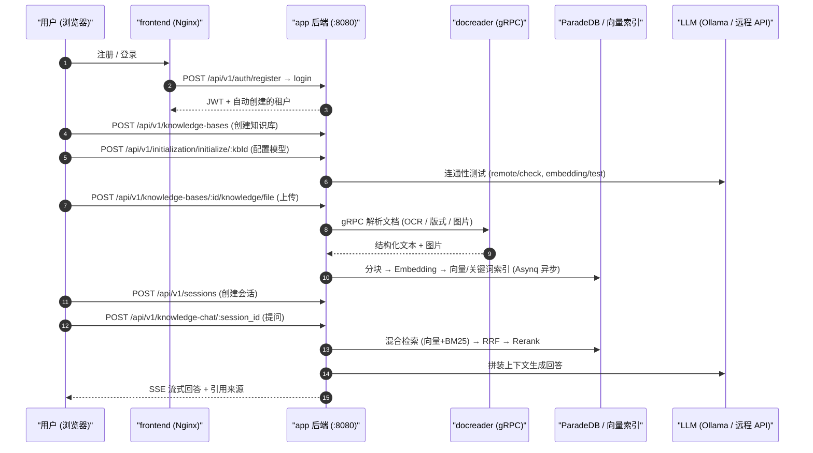

# 快速上手

本文以标准 Docker Compose 部署为例，带你从首次启动走到第一次检索问答与 Agent 对话。所有 API 路径均核对自 `internal/router/router.go`（统一前缀 `/api/v1`），初始化逻辑核对自 `internal/handler/initialization.go` 与前端 `frontend/src/api/initialization/index.ts`。

## 0. 前置条件

- 已按 [02-installation.md](./02-installation.md) 启动服务：前端 `http://localhost`，后端 `http://localhost:8080`；
- 已准备好模型：本地 Ollama（默认 `http://host.docker.internal:11434`）或任意 OpenAI 兼容 API 的 `base_url` + `api_key`；
- 验证后端存活：`curl http://localhost:8080/health`。

## 1. 注册与登录

首次打开前端会进入注册页。默认注册模式为 `self_serve`（`internal/config/config.go` 中 `auth.registration_mode` 默认值）：**任何人注册后会自动创建一个属于自己的租户（工作空间）并成为其 Owner**（`auth.default_tenant_mode` 默认 `create_personal`）。生产环境建议开放首个管理员注册后设置 `DISABLE_REGISTRATION=true` 转为邀请制。

- 系统没有内置默认账号；第一个注册的用户就是第一个 Owner。可用 `WEKNORA_BOOTSTRAP_SYSTEM_ADMIN_EMAIL` 指定某邮箱注册后自动成为系统管理员。
- Lite/桌面版额外提供 `POST /api/v1/auth/auto-setup`（仅 lite edition 生效，见 `internal/handler/auth.go`）自动生成本地账号，桌面应用免注册即用。

认证方式（`internal/middleware/auth.go`）：

| 方式 | 请求头 | 适用 |
| --- | --- | --- |
| JWT | `Authorization: Bearer <token>` | 浏览器 / 交互式调用，登录接口签发 |
| API Key | `X-API-Key: <key>` | 服务端集成；在「空间设置」或 `POST /api/v1/tenants/:id/api-keys` 创建，支持细粒度能力（`retrieve`/`chat`/`ingest`/`manage_kbs` 等） |
| 指定空间 | `X-Tenant-ID: <id>` | 多空间用户切换当前工作空间 |

## 2. 初始化向导：配置模型与知识库参数

WeKnora 的「初始化」是**知识库级**的：创建知识库后，前端引导你为它配置模型与处理管线；没有全局初始化开关。向导对应的后端端点（`internal/router/router.go` 的 `RegisterInitializationRoutes`）：

| 步骤 | 端点 | 说明 |
| --- | --- | --- |
| 读取当前配置 | `GET /api/v1/initialization/config/:kbId` | 返回 llm / embedding / rerank / multimodal / documentSplitting / nodeExtract / questionGeneration 各段及 `hasFiles`（已有文件时限制修改 embedding） |
| 检测 Ollama | `GET /api/v1/initialization/ollama/status`、`GET /api/v1/initialization/ollama/models` | 检查 Ollama 可用性与已装模型 |
| 下载 Ollama 模型 | `POST /api/v1/initialization/ollama/models/download` → `GET /api/v1/initialization/ollama/download/progress/:taskId` | 异步下载并轮询进度 |
| 测试远程模型 | `POST /api/v1/initialization/remote/check`、`/initialization/embedding/test`、`/initialization/rerank/check`、`/initialization/asr/check`、`/initialization/multimodal/test` | 保存前连通性验证 |
| 知识图谱试抽取 | `POST /api/v1/initialization/extract/text-relation`（配 `fabri-text` / `fabri-tag` 生成示例） | 预览实体/关系抽取效果 |
| 保存配置 | `POST /api/v1/initialization/initialize/:kbId`（首次）/ `PUT /api/v1/initialization/config/:kbId`（更新） | 落库：创建/更新 Model 记录并写入 KnowledgeBase 配置 |

初始化请求体核心结构（`internal/handler/initialization.go` 的 `InitializationRequest`）：

```json
{
  "llm":       { "source": "local", "modelName": "qwen3:8b", "baseUrl": "", "apiKey": "" },
  "embedding": { "source": "local", "modelName": "bge-m3", "baseUrl": "", "apiKey": "", "dimension": 1024 },
  "rerank":    { "enabled": false, "modelName": "", "baseUrl": "", "apiKey": "" },
  "multimodal": { "enabled": false },
  "documentSplitting": { "chunkSize": 512, "chunkOverlap": 50, "separators": ["\n\n", "\n", "。"] },
  "nodeExtract": { "enabled": false },
  "questionGeneration": { "enabled": false }
}
```

`source` 取 `local`（Ollama）或远程厂商标识（`openai`、`deepseek`、`aliyun`、`zhipu`、`siliconflow` 等，见 `internal/types/model.go` 的 ModelSource）。`chunkSize` 合法范围 100–10000。

## 3. 完整操作路径（Web 界面）

1. **注册 / 登录** → 自动进入个人工作空间；
2. **创建知识库**（类型 `document` / `faq`，可开启 Wiki / 图谱索引）；
3. **初始化向导**：选择 LLM、Embedding（可选 Rerank、VLM 多模态、图谱抽取、问题预生成），保存；
4. **上传文档**：拖拽文件或粘贴 URL，观察解析状态 `pending → processing → finalizing → completed`（`internal/types/knowledge.go`）；
5. **检索问答**：进入对话页，选择知识库范围，直接提问（默认 `builtin-quick-answer` 快速问答 Agent）；
6. **Agent 对话**：切换到 `builtin-smart-reasoning` 等内置 Agent，或在「智能体」页创建自定义 Agent（`quick-answer` / `smart-reasoning` 模式，类型预设 `rag-qa` / `wiki-qa` / `hybrid-rag-wiki` / `data-analysis`），可挂载 MCP 工具与 Web 搜索。



## 4. 用 curl 走通最小 API 链路

以下路径全部来自 `internal/router/router.go`。假设后端在 `http://localhost:8080`。

```bash
BASE=http://localhost:8080/api/v1

# 1) 注册（首次部署时；username>=2 字符，password>=6 字符）
curl -s -X POST $BASE/auth/register -H "Content-Type: application/json" \
  -d '{"username":"admin","email":"admin@example.com","password":"pass123456"}'

# 2) 登录，取 JWT
TOKEN=$(curl -s -X POST $BASE/auth/login -H "Content-Type: application/json" \
  -d '{"email":"admin@example.com","password":"pass123456"}' | jq -r '.data.token')
AUTH="Authorization: Bearer $TOKEN"

# 3) 创建知识库
KB_ID=$(curl -s -X POST $BASE/knowledge-bases -H "$AUTH" -H "Content-Type: application/json" \
  -d '{"name":"我的知识库","description":"demo","type":"document"}' | jq -r '.data.id')

# 4) 初始化知识库（以本地 Ollama 为例；远程模型改 source/baseUrl/apiKey）
curl -s -X POST $BASE/initialization/initialize/$KB_ID -H "$AUTH" -H "Content-Type: application/json" -d '{
  "llm":       {"source":"local","modelName":"qwen3:8b"},
  "embedding": {"source":"local","modelName":"bge-m3","dimension":1024},
  "rerank":    {"enabled":false},
  "multimodal":{"enabled":false},
  "documentSplitting":{"chunkSize":512,"chunkOverlap":50,"separators":["\n\n","\n","。"]},
  "nodeExtract":{"enabled":false},
  "questionGeneration":{"enabled":false}}'

# 5) 上传文档（multipart，字段名 file）
curl -s -X POST $BASE/knowledge-bases/$KB_ID/knowledge/file -H "$AUTH" \
  -F "file=@./demo.pdf"
# 轮询解析状态：GET /knowledge-bases/$KB_ID/knowledge 直到 parse_status=completed

# 6) 创建会话
SESSION_ID=$(curl -s -X POST $BASE/sessions -H "$AUTH" -H "Content-Type: application/json" \
  -d '{"title":"第一次对话"}' | jq -r '.data.id')

# 7) 知识问答（SSE 流式输出）
curl -N -X POST $BASE/knowledge-chat/$SESSION_ID -H "$AUTH" -H "Content-Type: application/json" \
  -d '{"query":"这份文档讲了什么？","knowledge_base_ids":["'$KB_ID'"]}'

# 7b) Agent 对话（同为 SSE；agent_id 可取内置 builtin-smart-reasoning）
curl -N -X POST $BASE/agent-chat/$SESSION_ID -H "$AUTH" -H "Content-Type: application/json" \
  -d '{"query":"总结文档要点并列出依据","agent_enabled":true,"agent_id":"builtin-smart-reasoning","knowledge_base_ids":["'$KB_ID'"]}'

# 8) 仅检索不生成（结构化 JSON 结果）
curl -s -X POST $BASE/knowledge-search -H "$AUTH" -H "Content-Type: application/json" \
  -d '{"query":"关键字","knowledge_base_ids":["'$KB_ID'"]}'
```

问答请求体（`CreateKnowledgeQARequest`，`internal/handler/session/types.go`）还支持：`knowledge_ids`（限定单文档）、`web_search_enabled`、`summary_model_id`、`mcp_service_ids`、`skill_names`、`images` / `attachment_uploads`（多模态附件）等字段。

### 使用 API Key 替代 JWT

```bash
# 以 Owner 身份创建 API Key（TENANT_ID 来自登录响应）
curl -s -X POST $BASE/tenants/$TENANT_ID/api-keys -H "$AUTH" -H "Content-Type: application/json" \
  -d '{"name":"ci-bot","full_access":true}'
# 之后所有请求改用：
curl -s $BASE/knowledge-bases -H "X-API-Key: <创建时返回的 key>"
```

## 5. 常见问题排查

| 现象 | 检查点 |
| --- | --- |
| 上传后一直 `processing` | `docker logs WeKnora-docreader`；大文件受 `MAX_FILE_SIZE_MB`（默认 50）与 `WEKNORA_DOCUMENT_PROCESS_TIMEOUT`（默认 2h）约束 |
| 初始化时 Ollama 检测失败 | 容器内默认地址 `http://host.docker.internal:11434`（`OLLAMA_BASE_URL`）；Linux 需确认 `extra_hosts: host.docker.internal:host-gateway` 生效 |
| 问答无引用 / 召回为空 | 确认知识解析 `completed`；调低 `vector_threshold`；检查 embedding 模型与建库时一致 |
| 注册按钮消失 | `DISABLE_REGISTRATION=true` 已把 `auth.registration_mode` 强制为 `invite_only` |
| API Key 请求 403 | Key 的 capabilities 不含所需能力，或 `knowledge_base_ids` 白名单未包含目标库 |

下一步：深入 [04-configuration.md](./04-configuration.md) 了解全部配置项。
