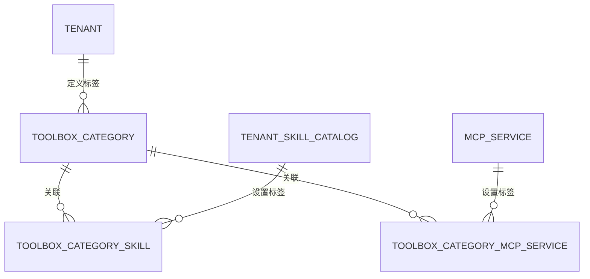

# Skills/MCP 工具箱标签设计

本设计为工具箱中的 Skills 与 MCP 服务增加一套工作区级标签。标签用于整理和筛选资源，不改变资源的启停状态、沙箱安装状态、Agent 授权范围或运行时工具注册行为。

该功能延续 [Issue #3698](https://github.com/Tencent/WeKnora/issues/3698) 的资源分类需求。标签可以命名为「合同管理」「客户关系」等，同一资源可以设置多个标签，Skills 与 MCP 共用同一套标签。

## 使用示例

管理员创建两个标签，并把资源关联到对应标签：

| 标签 | Skills | MCP 服务 |
| --- | --- | --- |
| 合同管理 | Skill A、Skill B | MCP A |
| 客户关系 | Skill A | MCP A |

Skill A 和 MCP A 同时出现在两个标签中。用户在 Skills 或 MCP 页面选择“合同管理”时，只看到关联到该标签的当前页面资源；搜索词与标签筛选同时生效。

## 当前数据边界

Skills 页面读取工作区技能目录。一个目录项表示一份技能定义，安装到不同沙箱后的记录位于该目录项的 `installations` 中，参见 [`SkillCatalogView`](../../internal/application/service/tenant_skill_catalog.go)。因此，标签关联到 `tenant_skill_catalog`，不会为同一 Skill 的每个沙箱安装重复保存标签。

MCP 页面读取当前工作区可见的 MCP 服务，参见 [`ListMCPServices`](../../internal/handler/mcp_service.go)。内置 MCP 服务对多个工作区可见，但每个工作区独立维护它与本工作区标签的关联。

知识库标签由单个知识库管理，不能复用为工具箱标签。工具箱标签属于整个工作区，且同时关联两种资源。

## 数据模型

标签名称和资源关系分别存储，避免在 Skill 与 MCP 记录中复制标签名称。



| 表 | 字段 | 约束 |
| --- | --- | --- |
| `toolbox_categories` | `id`、`tenant_id`、`name`、时间字段 | 同一工作区内名称唯一；名称去除首尾空白后不能为空 |
| `toolbox_category_skills` | `category_id`、`skill_catalog_id`、`created_at` | 复合主键；删除标签或 Skill 目录项时级联删除关系 |
| `toolbox_category_mcp_services` | `category_id`、`mcp_service_id`、`created_at` | 复合主键；删除标签或 MCP 服务时级联删除关系 |

关系表不重复保存 `tenant_id`。写入关系前，服务层验证标签与资源对当前工作区都可见；读取时从标签表限定工作区。

## API 契约

界面名称为「标签 / Tags」；接口路径、字段和数据表沿用 `categories`、`category_ids` 与 `toolbox_categories` 命名。

读取接口允许工作区 Viewer 使用。创建、重命名、删除标签以及修改资源关联要求 Admin；这与现有 Skill 目录写入和 MCP 服务配置权限一致。

| 方法与路径 | 行为 |
| --- | --- |
| `GET /api/v1/toolbox-categories` | 按名称返回当前工作区标签 |
| `POST /api/v1/toolbox-categories` | 创建标签，请求为 `{ "name": "合同管理" }` |
| `PUT /api/v1/toolbox-categories/:id` | 重命名标签，请求为 `{ "name": "合同与法务" }` |
| `DELETE /api/v1/toolbox-categories/:id` | 删除标签及其全部资源关系，不删除 Skill 或 MCP 服务 |
| `PUT /api/v1/skills/catalog/:id/categories` | 用 `category_ids` 原子替换一个 Skill 的全部标签关系 |
| `PUT /api/v1/mcp-services/:id/categories` | 用 `category_ids` 原子替换一个 MCP 服务的全部标签关系 |

Skill 目录列表和 MCP 服务列表在每个资源上返回 `categories`：

```json
{
  "id": "resource-id",
  "name": "Skill A",
  "categories": [
    { "id": "category-id", "name": "合同管理" }
  ]
}
```

`category_ids: []` 表示清空标签。请求中的标签 ID 必须唯一，并且全部属于当前工作区；任一 ID 无效时整次更新失败，原关系保持不变。

名称去除首尾空白后限 64 个 Unicode 字符，必须包含可见内容，不允许控制字符或内部换行。正常文字中的组合重音、连接符及 emoji 保留。数据库唯一约束捕获的创建、重命名竞争同样返回 409。

## 前端交互

Skills 与 MCP 页面共用标签接口和交互组件：

1. 列表顶部同时显示标签筛选与现有搜索框。
2. 标签筛选默认显示全部资源；选择一个标签后，与搜索词取交集。
3. 卡片显示资源当前关联的前两个标签，超过时显示 `…`，点击浮层查看全部标签。
4. Admin 可以从任一卡片打开多选框，修改该资源关联的标签。
5. Admin 可以打开标签管理窗口，创建、重命名或删除标签。
6. 在 Skills 与 MCP 标签页之间切换时保留当前标签；切换工作区时清空该筛选。
   两个页签的数量同步显示当前标签下各自的资源数，无匹配时显示 0；全部标签显示总数。关键词仅筛选当前列表，不改变页签数量。标签保存和资源列表更新后重新统计；工作区切换时清空旧计数，丢弃旧请求结果。
7. 按标签筛选时新增资源，表单预选该标签，允许修改或清空。保存后清空搜索词；若资源未设置当前筛选标签，则切回全部资源，确保新资源可见。
8. 标签编辑窗口和新增资源表单支持直接创建标签，创建成功后自动选中，已有选择保持不变。创建的是工作区共享标签，即使随后取消为资源设置标签，该标签仍然保留。

已选标签超过三个时在选择框中折叠，完整选择仍可从下拉列表查看和编辑。卡片使用 `…` 按钮打开全部标签浮层，浮层限制高度并允许滚动，展开时不改变卡片高度；MCP 标签编辑按钮独立保留。列表读取按响应版本更新；标签保存成功后，此前发出的列表读取不能再覆盖新关联，较慢的安装轮询仍可持续更新状态。

工具箱的 Skills/MCP 页面沿用现有 Admin 管理权限；Viewer 读取 API 的权限不代表可以访问这两个管理页面。页面权限由 [`canAccessToolboxSection`](../../frontend/src/config/toolbox.ts) 和 [`SETTINGS_SECTION_MIN_ROLE`](../../frontend/src/config/settingsAccess.ts) 决定。

管理窗口和标签选择器说明标签由当前工作区的 Skills/MCP 共用。删除确认明确说明：会移除两类资源与该标签的全部关联，资源本身保留。

资源创建与设置标签是两次独立请求。创建成功但标签保存失败时，表单停留在当前步骤，保留已创建资源的 ID，并显示失败原因。在当前表单中重试使用同一资源，不重复创建或导入；成功后再进入下一步。新增流程重复导入已有 Skill 时，保留其已有标签并合并本次选择。标签创建及保存期间禁用提交和取消操作，避免重复写入或丢失重试状态。

## 一致性与安全边界

- 所有标签查询按认证上下文中的 `tenant_id` 限定；请求体不能指定工作区。
- 关联写入先验证资源可见性，再验证全部标签归属，最后在单个事务中替换关系。
- PostgreSQL 用事务级 advisory lock 按工作区、资源类型和资源 ID 串行化替换，即使原关联为空也不会将并发提交意外合并。不同工作区对同一内置 MCP 的关联可独立写入；SQLite 沿用写事务串行化。
- 内置 MCP 服务只共享服务定义。标签关系从当前工作区的标签出发，因此不会泄露或复用其他工作区的标签。
- 标签仅用于工具箱展示。Agent 配置、聊天中的 `@Skill`/`@MCP` 列表以及运行时工具注册继续使用现有授权逻辑。
- 删除标签时由外键级联清理关系；Skill 目录项和 MCP 服务采用软删除，因此仓储层在同一事务中先清理当前工作区关系，再软删除资源。

## 迁移与兼容性

PostgreSQL `000116_toolbox_categories` 与 SQLite `000036_toolbox_categories` 提供同构迁移。现有 Skill 和 MCP 服务默认没有标签；迁移不改写现有资源，也不创建预设标签。

旧客户端会忽略列表响应新增的 `categories` 字段。现有搜索、排序和卡片操作保持原语义；新客户端的工具箱页签数量按所选标签统计，全部标签时仍显示总数。

## 验证结果

实现已通过以下宿主机验证：

- SQLite 实际迁移测试覆盖版本 36 及三张新增表，PostgreSQL 与 SQLite 迁移文件保持同构；
- SQLite v34 升级测试验证已有 MCP 使用说明和工具元数据保持不变，并检查重复启动后标签关联仍然存在；
- Repository/Service 测试覆盖名称唯一、Skill/MCP 共用标签、多对多关联、跨工作区 ID 原子拒绝、内置 MCP 标签隔离和软删除关系清理；
- 使用实际 PostgreSQL 标签迁移验证空/非空原关联与相同/不同目标标签的并发替换，覆盖 Skills/MCP 共八个竞争场景，以及同名写入冲突和内置 MCP 跨工作区独立写入；设置 `WEKNORA_REPOSITORY_TEST_POSTGRES_DSN` 可启用对应仓储集成测试；
- Handler、路由和 API Key 权限回归通过；
- 前端定向测试覆盖搜索与标签取交集、一个资源命中多个标签、清空筛选恢复全部资源、新增时预选与修改标签、标签保存失败后重试不重复创建，以及内联创建标签的成功、失败和重复提交；
- 前端类型检查、六种语言键检查（含繁体中文 `zh-TW`）和生产构建通过；
- 文档的内部链接和 Mermaid 图检查通过；
- 使用示例 API 数据的浏览器检查覆盖 Skills/MCP 标签切换、跨标签复用、标签与搜索取交集、清空筛选、跨标签页保留标签、标签内新增资源、首次创建标签后继续设置标签，以及共享范围提示。

这些验证不依赖 Docker。没有 Docker 权限只会阻止容器镜像构建和基于完整容器栈的端到端部署检查；本功能的迁移、后端单元测试、前端测试、类型检查与静态构建仍可在宿主机完成。

当前宿主机的 glibc 版本低于文档站 Rollup 原生模块要求的 2.32，因此 VitePress 渲染构建未完成；这是文档构建工具链限制，不影响应用前端构建或功能实现。
