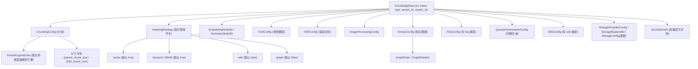
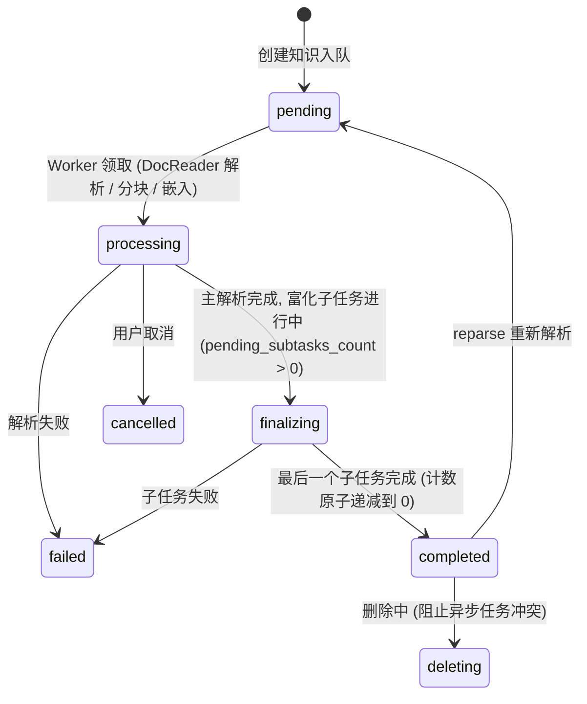

# 知识库与知识管理

知识库（KnowledgeBase，简称 KB）是 WeKnora 内容组织的核心单元：它承载分块（chunking）、嵌入（embedding）、索引策略、图谱提取、Wiki 生成等一整套处理配置；知识（Knowledge）是 KB 内的单条内容（文件 / URL / 手动 Markdown / FAQ 条目集），经异步管线解析为 Chunk 并进入向量与关键词索引。本篇覆盖 KB 的 CRUD 与全部可配置项、知识管理（过滤、标签、批量操作、下载预览安全、复制与移动门禁）、活动流与存储配额。

核心实现分布：

| 层 | 文件 |
| --- | --- |
| KB 模型与配置结构 | `internal/types/knowledgebase.go`、`indexing_strategy.go` |
| 知识 / Chunk / 标签模型 | `internal/types/knowledge.go`、`chunk.go`、`tag.go` |
| 处理配置覆盖 | `internal/types/knowledge_process.go` |
| KB Handler | `internal/handler/knowledgebase.go` |
| 知识 Handler | `internal/handler/knowledge.go` |
| 标签 Handler | `internal/handler/tag.go` |
| KB 服务 | `internal/application/service/knowledgebase.go` |
| 知识创建 / 处理管线 | `internal/application/service/knowledge_create.go`、`knowledge_process.go`、`knowledge_process_config.go` |
| 复制与移动 | `internal/application/service/knowledge_clone_move.go` |
| 活动流 | `internal/application/service/kb_activity.go` |
| 路由与门禁 | `internal/router/router.go`、`internal/router/rbac.go` |
| 关键测试佐证 | `internal/handler/knowledge_preview_security_test.go`、`knowledge_move_gate_test.go`、`knowledgebase_copy_preflight_test.go` |

## 1. 知识库模型与配置项

### 1.1 KB 类型

`internal/types/knowledgebase.go`：

```go
const (
    KnowledgeBaseTypeDocument = "document" // 文档类
    KnowledgeBaseTypeFAQ      = "faq"      // FAQ 类
    KnowledgeBaseTypeWiki     = "wiki"     // Wiki 类
)
```

更新 KB 时会清除与其类型不匹配的配置（如非 FAQ 库的 `FAQConfig`）。`VectorStoreID` 使用 GORM `<-:create` 标签，**创建后不可修改**（防止索引与存储错位）。

### 1.2 配置结构总览



### 1.3 ChunkingConfig（分块配置）

| 字段 | 类型 | 默认 | 说明 |
| --- | --- | --- | --- |
| `chunk_size` | int | 必填 | 分块大小（字符数） |
| `chunk_overlap` | int | - | 相邻分块重叠 |
| `separators` | []string | - | 分隔符列表 |
| `parser_engine_rules` | []ParserEngineRule | - | 按文件类型指定解析引擎：`{file_types, engine}` |
| `enable_parent_child` | bool | false | 启用父子分块策略 |
| `parent_chunk_size` | int | 4096 | 父分块大小（用于返回上下文） |
| `child_chunk_size` | int | 384 | 子分块大小（用于嵌入检索） |
| `strategy` | string | "legacy" | 自适应分块策略 |
| `token_limit` | int | 0 | 令牌上限（0 = 不限） |
| `languages` | []string | 自动检测 | 语言提示 |
| `table_metadata_instructions` | string | - | 表格元数据生成指令 |

### 1.4 IndexingStrategy（索引管线开关）

| 字段 | 默认 | 说明 |
| --- | --- | --- |
| `vector_enabled` | true | 语义向量检索 |
| `keyword_enabled` | true | 关键词（BM25）检索 |
| `wiki_enabled` | false | Wiki 页面生成 |
| `graph_enabled` | false | 知识图谱提取 |

### 1.5 多模态与富化配置

**VLMConfig（视觉语言模型）**：

| 字段 | 说明 |
| --- | --- |
| `enabled` / `model_id` | 新版：启用开关 + 模型 ID |
| `description_language` | 图片描述语言（空 = 跟随文档语言） |
| `custom_instructions` | KB 级图片解释指导 |
| `model_name` / `base_url` / `api_key` / `interface_type` | 旧版兼容字段（ollama / openai） |

启用判定：`Enabled && ModelID != ""`，或旧版 `ModelName != "" && BaseURL != ""`。

**ASRConfig**：`enabled` / `model_id` / `language`（语言提示，可选）。

**ImageProcessingConfig**：`model_id`。

**QuestionGenerationConfig（问题生成）**：`enabled`；`question_count` 每分块生成问题数（默认 3，上限 10）；`custom_instructions` 目标受众 / 风格说明。

**ExtractConfig（知识图谱）**：`enabled`、`text`、`tags`、`nodes []*GraphNode{name, chunks, attributes}`、`relations []*GraphRelation{node1, node2, type}`、`custom_instructions`（领域提取指导）。

**FAQConfig（仅 FAQ 库）**：`index_mode`（`question_only` / `question_answer`，默认后者）、`question_index_mode`（`combined` / `separate`，默认 combined），详见 FAQ 篇。

**WikiConfig（仅 Wiki 库）**：

| 字段 | 默认 | 说明 |
| --- | --- | --- |
| `synthesis_model_id` | - | Wiki 生成 LLM |
| `max_pages_per_ingest` | 0（不限） | 单次摄入最多创建/更新页面数 |
| `extraction_granularity` | `standard` | `focused`（仅主要主题）/ `standard` / `exhaustive`（全部实体概念） |
| `content_instructions` / `extraction_instructions` | - | 生成与提取风格指导 |
| `ingest_batch_size` / `ingest_map_parallel` / `ingest_reduce_parallel` / `ingest_max_inflight` | 5 / 10 / 10 / 4 | 摄入并发参数 |

所有 `custom_instructions` 类字段在更新时经 `validateKnowledgeBasePromptInstructions` 校验长度与合法性（`internal/handler/knowledgebase.go`）。

### 1.6 存储配置

- **StorageProviderConfig**（新）：`provider ∈ {local, minio, cos, tos, s3, oss, ks3, obs}`；
- **StorageBackendID**：绑定具体存储后端实例；
- **StorageConfig**（遗留 `cos_config` 列）：`secret_id / secret_key / region / bucket_name / app_id / path_prefix / provider / endpoint / use_ssl / force_path_style`。

### 1.7 KB 计算字段

列表 / 详情响应附带：`knowledge_count`、`chunk_count`、`is_processing`（FAQ 库）、`processing_count`（文档库处理中知识数）、`share_count`（共享到的组织数）、`creator_name`、`is_pinned` / `pinned_at`（当前用户置顶状态）。

## 2. KB 路由与权限

（门禁语义见《租户、用户与认证授权》篇；`KBAccessRead/Write` 会解析组织共享路径。）

| 方法 | 路径 | Handler | 门禁 |
| --- | --- | --- | --- |
| POST | `/knowledge-bases` | CreateKnowledgeBase | Contributor+ / API Key `manage_kbs` |
| GET | `/knowledge-bases` | ListKnowledgeBases | Viewer+ / `retrieve` |
| GET | `/knowledge-bases/:id` | GetKnowledgeBase | Viewer+ + KBAccessRead |
| PUT | `/knowledge-bases/:id` | UpdateKnowledgeBase | OwnedKBOrAdmin + KBAccessWrite |
| DELETE | `/knowledge-bases/:id` | DeleteKnowledgeBase | OwnedKBOrAdmin + KBAccessWrite |
| PUT | `/knowledge-bases/:id/pin` | TogglePinKnowledgeBase | Viewer+ + KBAccessRead |
| POST/GET | `/knowledge-bases/:id/hybrid-search` | HybridSearch | Viewer+ + KBAccessRead |
| POST | `/knowledge-bases/copy` | CopyKnowledgeBase | Contributor+ / `manage_kbs` |
| POST | `/knowledge-bases/:id/duplicate` | DuplicateKnowledgeBase | Contributor+ / `manage_kbs` + KBAccessRead |
| GET | `/knowledge-bases/copy/progress/:task_id` | GetKBCloneProgress | Viewer+ / `retrieve` 或 `manage_kbs` |
| GET | `/knowledge-bases/:id/move-targets` | ListMoveTargets | Viewer+ + KBAccessRead |
| GET | `/knowledge-bases/:id/activity` | ListKnowledgeBaseActivity | OwnedKBOrAdmin + KBAccessRead（仅 JWT） |

**创建流程**（`internal/handler/knowledgebase.go`）：Contributor 校验 → 租户存储配额检查 → `EmbeddingModelID` 校验 → `VectorStoreID` 绑定校验 → 创建 → 返回 KB + `vector_store_display`。

**删除级联**：删除 KB 下全部 Knowledge → Chunk → 向量索引 → 关键词索引 → Wiki 页面 → 标签 → 存储文件 → 软删除 KB 本身。共享侧的 editor 无法删除源 KB（删除要求 owner 租户 + Admin 侧权限）。

## 3. 知识（Knowledge）管理

### 3.1 模型要点

`internal/types/knowledge.go`。关键字段：`type`（`manual` 手动 Markdown / `faq` / 文件类型）、`source` / `channel`（摄入渠道）、`parse_status`、`summary_status`、`enable_status`、`file_name/type/size/hash/path`、`storage_size`、`metadata`（JSON，手动知识存 `ManualKnowledgeMetadata{content, format, status(draft/publish), version}`）、`last_faq_import_result`。

摄入渠道常量：`web`、`api`、`browser_extension`、`wechat`、`wecom`、`feishu`、`dingtalk`、`slack`、`im`、`notion`、`yuque`、`rss`。

解析状态机：



摘要独立状态：`summary_status ∈ {none, pending, processing, completed, failed}`。

### 3.2 知识路由

| 方法 | 路径 | 说明 | 门禁 |
| --- | --- | --- | --- |
| POST | `/knowledge-bases/:id/knowledge/file` | 上传文件 | OwnedKBOrAdmin + KBAccessWrite |
| POST | `/knowledge-bases/:id/knowledge/url` | URL 导入 | 同上 |
| POST | `/knowledge-bases/:id/knowledge/manual` | 手动 Markdown 知识 | 同上 |
| GET | `/knowledge-bases/:id/knowledge` | 列表（分页 + 过滤） | Viewer+ + KBAccessRead |
| DELETE | `/knowledge-bases/:id/knowledge` | 清空 KB 内容 | Admin + KBAccessWrite |
| GET | `/knowledge/:id`、`/knowledge/batch` | 详情 / 批量获取 | Viewer+ |
| GET | `/knowledge/:id/stages`、`/knowledge/:id/spans` | 处理阶段 / 跨度 | Viewer+ |
| PUT / DELETE | `/knowledge/:id`、`/knowledge/manual/:id` | 更新 / 删除 | OwnedKnowledgeKBOrAdmin + KBAccessWrite |
| POST | `/knowledge/:id/reparse`、`/knowledge/:id/cancel-parse` | 重解析 / 取消解析 | 同上 |
| GET | `/knowledge/:id/download` | 下载原始文件 | Contributor+ + KBAccessWrite |
| GET | `/knowledge/:id/preview` | 预览文件 | Viewer+ + KBAccessRead |
| PUT | `/knowledge/tags` | 批量更新标签 | Contributor+ / `ingest` |
| POST | `/knowledge/batch-reparse`、`/knowledge/batch-delete` | 批量重解析 / 删除 | Contributor+ / `ingest` |
| POST | `/knowledge/move` | 移动知识 | Contributor+ / `ingest` |
| GET | `/knowledge/move/progress/:task_id` | 移动进度 | Viewer+ |

### 3.3 列表过滤参数

`internal/types/knowledge.go` 的 `KnowledgeListFilter` + `internal/handler/knowledge.go`：

| 参数 | 说明 |
| --- | --- |
| `page` / `page_size` | 分页（默认按 `updated_at DESC` 排序） |
| `keyword` | 按文件名 / 标题搜索 |
| `file_type` | 文件类型过滤（`pdf` / `manual` / `url` …） |
| `parse_status` | 解析状态过滤 |
| `source` | 摄入渠道过滤（`api` / `web` / `feishu` …） |
| `tag_id` | 标签过滤，逗号分隔多个（**OR 语义**） |
| `updated_from` / `updated_to` | 更新时间范围（RFC3339） |

### 3.4 标签（KnowledgeTag）

`internal/types/tag.go` + `internal/handler/tag.go`：

```go
type KnowledgeTag struct {
    ID              string // UUID
    SeqID           int64  // 自增整数 ID（API 使用）
    TenantID        uint64
    KnowledgeBaseID string
    Name            string // KB 内唯一
    Color           string
    SortOrder       int
}
type KnowledgeTagRelation struct { KnowledgeID, TagID string } // 多对多
```

路由：`GET /knowledge-bases/:id/tags`（Viewer+）、`POST`（OwnedKBOrAdmin）、`PUT/DELETE /knowledge-bases/:id/tags/:tag_id`（OwnedKBOrAdmin）。批量打标走 `PUT /knowledge/tags`。FAQ 条目复用同一标签体系（chunk 上的 `tag_id` 字段）。

### 3.5 下载与预览安全

`GET /knowledge/:id/preview` 的安全机制由 `internal/handler/knowledge_preview_security_test.go` 固化验证：

| 控制 | 实现 | 目的 |
| --- | --- | --- |
| 强制 `Content-Type: application/octet-stream` | 响应头固定 | 阻止浏览器把 HTML/SVG 当页面执行（防存储型 XSS） |
| `X-Content-Type-Options: nosniff` | 响应头 | 禁止 MIME 嗅探绕过 |
| `Content-Disposition: attachment; filename=...` | 响应头 | 强制下载而非内联渲染 |
| 路径校验 | `ValidateKBScopedStoragePath()` | 文件路径必须落在该 KB 的授权存储范围内（防路径穿越 / 越权读取） |
| 大小限制 | GetFile 响应体限制 | 防止超大文件拖垮预览 |

测试用例明确验证：即使文件内容是 `<script>alert(1)</script>`，也只会作为二进制附件传输。下载端点（`/knowledge/:id/download`）要求更高的 Contributor+ 且走 KBAccessWrite 门禁。

## 4. 知识库复制与知识移动

### 4.1 复制（Copy / Duplicate）与 Preflight

`internal/application/service/knowledge_clone_move.go`，preflight 规则由 `internal/handler/knowledgebase_copy_preflight_test.go` 固化：

- `POST /knowledge-bases/copy`：整库复制（配置 + 内容），body 传 `source_id`；异步任务，进度查 `GET /knowledge-bases/copy/progress/:task_id`（活动流记 `kb.clone_started` / `kb.clone_completed` / `kb.clone_failed`）。
- `POST /knowledge-bases/:id/duplicate`：**仅复制配置**（不复制内容 / 索引 / 共享记录），活动流记 `kb.duplicated`。

Preflight（复制前校验，直接同步拒绝）：

1. 源 / 目标 KB 的租户隔离（跨租户拒绝）；
2. 源 KB 存在性；
3. **VectorStore 兼容性**：`reuse_vectors` 模式不支持跨向量库的 KB（向量不可直接搬移）；
4. **StorageBackend 兼容性**：跨存储后端复制不支持；
5. API Key 调用时源 / 目标 KB 均须在 allow-list 内。

### 4.2 知识移动门禁（move gate）

`POST /knowledge/move` 支持两种模式，约束在 **handler 与 service 双层**校验（`internal/handler/knowledge_move_gate_test.go` 与 `internal/application/service/knowledge_move_gate_test.go` 双重佐证）：

- **`reuse_vectors` 模式**：直接复用既有向量，**要求源 KB 与目标 KB 绑定同一 VectorStore**；
- **`reparse` 模式**：目标库重新解析生成向量，允许跨向量库移动。

同库判定 `SharesStoreWith()` 的规范化语义（空字符串归一化为 nil，nil 表示环境默认 store）：

```text
nil & nil               → true   (同为 env-store)
"" & nil                → true   (空串规范化为 nil)
"store-a" & "store-a"   → true
"store-a" & "store-b"   → false
"store-a" & nil         → false  (显式绑定 vs env-store 不视为同库)
```

`GET /knowledge-bases/:id/move-targets` 返回符合门禁的候选目标库；移动为异步任务，进度查 `GET /knowledge/move/progress/:task_id`。

## 5. 知识处理管线

`internal/application/service/knowledge_create.go` / `knowledge_process.go` / `knowledge_process_config.go`：

```text
上传 (file/url/manual)
  → 创建 Knowledge (parse_status=pending) → Asynq 入队
  → Worker: DocReader 解析 → 分块 (ChunkingConfig)
      → 向量嵌入        (indexing_strategy.vector_enabled)
      → 关键词索引       (keyword_enabled)
      → 图谱提取        (graph_enabled + ExtractConfig)
      → Wiki 生成       (wiki_enabled + WikiConfig)
      → 问题生成        (QuestionGenerationConfig.enabled)
  → parse_status=finalizing, pending_subtasks_count=N
  → 每个富化子任务完成后原子递减；归零 → parse_status=completed
```

**配置合并优先级**（`EffectiveProcessConfig`）：`Knowledge.ProcessOverrides`（单次上传覆盖，存于知识 metadata 的 `KnowledgeProcessOverrides`，可覆盖 parser 规则 / 分块 / VLM / ASR / 问题生成 / 图谱开关等）> KB 配置 > 租户默认。

Chunk 类型（`internal/types/chunk.go`）：`text`、`parent_text`、`image_ocr`、`image_caption`、`summary`、`entity`、`relationship`、`faq`、`web_search`、`table_summary`、`table_column`、`wiki_page`；chunk 支持 `is_enabled` 开关与 `flags` 位标志（bit0 = 可推荐）。

## 6. 知识库活动流（KB Activity）

`internal/application/service/kb_activity.go` 复用审计日志体系（`AuditLog`，scope 为 knowledge_base），通过 `recordKBActivity(ctx, audit, tenantID, kbID, action, targetType, targetID, outcome, details)` 记录：

- **活动动作**（`internal/types/audit_log.go`）：`kb.created` / `kb.updated` / `kb.deleted` / `kb.duplicated` / `kb.clone_started` / `kb.clone_completed` / `kb.clone_failed`、`kb.share_added` / `kb.share_permission_changed` / `kb.share_removed`，以及知识 / chunk 级的增删改动作；
- **触发源**：context 中的 `kbActivityTaskMetadata{TaskID, Trigger}`（`user` 用户操作 / `system` 后台任务）自动并入 details；根据 outcome 自动补 `processing_status`（accepted→pending、success→completed、partial→partial、failed/denied→failed、canceled→canceled）；
- **批量操作样本标题**：`kbActivityAppendSampleTitles` 为批量操作附带最多 5 个去重标题（第一个作为 `title`，其余进 `titles` 数组），保证活动流可读且有界；
- **抑制机制**：`withKBActivitySuppressed(ctx)` 可让内部级联操作不产生重复活动记录。

查询端点：`GET /knowledge-bases/:id/activity`（OwnedKBOrAdmin，仅 JWT 用户，API Key 不可访问）。

## 7. 存储配额与用量

配额挂在租户上（`internal/types/tenant.go`）：

| 字段 | 默认 | 说明 |
| --- | --- | --- |
| `storage_quota` | 10737418240（10GB） | 租户总配额 |
| `storage_used` | 0 | 已用量（涵盖原始文件、文本、向量与索引占用） |

创建 KB 与上传知识前都会执行配额检查（`internal/handler/knowledgebase.go` 创建校验链），超限拒绝写入；每条知识记录自身 `file_size` 与 `storage_size`，删除时回收用量。

## 8. 混合检索（Hybrid Search）

`POST /knowledge-bases/:id/hybrid-search`（`internal/handler/knowledgebase.go` + `internal/application/service/knowledgebase_search*.go`）按 KB 的 `IndexingStrategy` 组合召回：向量（vector_enabled）+ 关键词 BM25（keyword_enabled），经 rank fusion 融合与重排（rerank），可叠加知识图谱增强（graph_enabled）；多 KB 场景由 `knowledgebase_search_fanout.go` 并发扇出、`knowledgebase_search_fusion.go` 融合；共享 KB 检索路径见 `knowledgebase_search_shared.go`。FAQ 库检索有专门的命中策略（负例过滤 / 迭代召回），见 FAQ 篇。
