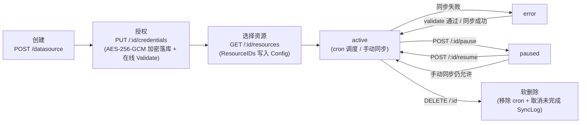
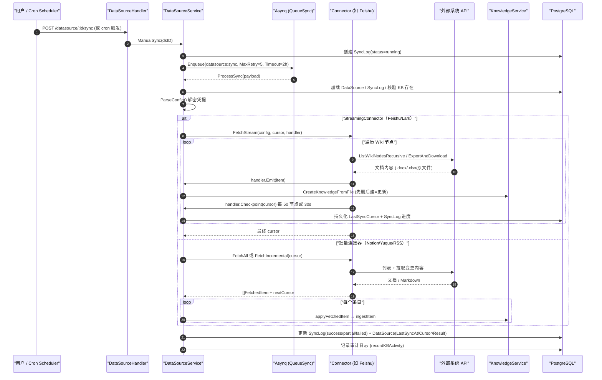

# 数据源导入（Data Source）

团队的知识往往长在飞书、Notion、语雀里，手动导一次很快就过期。数据源要解决的是**持续同步**：绑定一次账号，之后按计划自动把新增和修改同步进知识库，删除的文档也会同步下架。

用法：数据源是**挂在知识库上**的，不在全局设置里——打开目标知识库 → 编辑设置 → 「数据源」页签（仅编辑模式下出现）→ 新建连接 → 填凭据并授权 → 选要同步的空间/目录 → 设定同步周期。首次同步是全量，之后按修改时间增量拉取。

<Screenshot
  src="/screenshots/datasource-sync.png"
  caption="数据源：连接列表与同步状态"
  hint="展示已配置的数据源（类型、目标知识库、上次同步时间、状态）与同步日志入口。" />

它不是一次性导入工具，而是一套完整的"连接器 + 调度器 + 增量同步 + 知识入库"流水线：

- 连接器框架与实现：`internal/datasource/`（`connector.go`、`scheduler.go`、`httpclient.go`、`errors.go`、`connector/` 各实现）
- HTTP 接口层：`internal/handler/datasource.go`、`internal/handler/datasource_credentials.go`
- 业务服务层：`internal/application/service/datasource_service.go`
- 数据模型：`internal/types/datasource.go`

## 核心抽象：Connector 接口

所有连接器必须实现 `internal/datasource/connector.go` 中的 `Connector` 接口：

```go
type Connector interface {
    // Type 返回连接器类型标识（如 "feishu"、"notion"）
    Type() string
    // Validate 通过实际调用外部 API 验证配置与凭据有效性
    Validate(ctx context.Context, config *types.DataSourceConfig) error
    // ListResources 列出可同步的资源（文档、空间、文件夹等）。
    // parentID 支持层级资源的懒加载：""=顶层；非空=该资源的直接子节点
    ListResources(ctx context.Context, config *types.DataSourceConfig, parentID string) ([]types.Resource, error)
    // ResolveResourceAncestors 解析已选资源的祖先链，用于懒加载选择器回显深层选中项
    ResolveResourceAncestors(ctx context.Context, config *types.DataSourceConfig, resourceIDs []string) ([]string, error)
    // FetchAll 全量同步指定资源
    FetchAll(ctx context.Context, config *types.DataSourceConfig, resourceIDs []string) ([]types.FetchedItem, error)
    // FetchIncremental 基于游标增量同步，返回变更项与下一次同步的新游标
    FetchIncremental(ctx context.Context, config *types.DataSourceConfig, cursor *types.SyncCursor) ([]types.FetchedItem, *types.SyncCursor, error)
}
```

### 可选扩展：StreamingConnector（流式可恢复同步）

针对大规模同步（如上千篇文档的飞书 Wiki），`connector.go` 还定义了可选的 `StreamingConnector` 接口。实现了它的连接器不再一次性把所有条目攒在内存里，而是"边抓取、边入库、边落盘游标"：

```go
type StreamHandler interface {
    // Emit 逐条入库一个抓取项；返回错误则中止整个流
    Emit(ctx context.Context, item types.FetchedItem) error
    // Checkpoint 同步持久化游标快照（必须是完整可恢复的快照，而非增量）
    Checkpoint(ctx context.Context, cursor *types.SyncCursor) error
}

type StreamingConnector interface {
    Connector
    FetchStream(ctx context.Context, config *types.DataSourceConfig,
        cursor *types.SyncCursor, h StreamHandler) (*types.SyncCursor, error)
}
```

价值（见源码注释，对应 issue Tencent/WeKnora#2136）：同步任务超时（Asynq 任务超时为 2 小时）后可以从最后一个 checkpoint **续传**，而不是从头重来；同时内存占用被限制在"单个条目"级别。目前实现了 `StreamingConnector` 的连接器：**Feishu/Lark、GitLab、Git Repo**。

### ConnectorRegistry：注册与查找

`ConnectorRegistry` 是简单的 `map[string]Connector` 注册表。实际注册发生在 `internal/container/container.go` 的 `initConnectorRegistry()`：

```go
registry.Register(feishuConnector.NewConnector(feishuConnector.RegionFeishu))  // feishu
registry.Register(feishuConnector.NewConnector(feishuConnector.RegionLark))    // lark（国际版，同一实现不同 Region）
registry.Register(notionConnector.NewConnector())                              // notion
registry.Register(yuqueConnector.NewConnector())                               // yuque
registry.Register(rssConnector.NewConnector())                                 // rss
registry.Register(imaConnector.NewConnector())                                 // ima
registry.Register(gitlabConnector.NewConnector())                              // gitlab
registry.Register(gitRepoConnector.NewConnector())                             // git_repo
```

> 注意：`connector.go` 中的 `ConnectorMetadataRegistry` 为前端展示定义了更多连接器元数据（Confluence、GitHub、Google Drive、OneDrive、DingTalk、Web Crawler、Slack、IMAP 等），但**当前代码库中实际注册可用的连接器有 9 个类型：`feishu`、`lark`、`notion`、`yuque`、`rss`、`ima`、`gitlab`、`git_repo`**（其中 feishu/lark 共用同一份实现，即 8 份实现）。未注册类型在创建数据源时会被 `connectorRegistry.Get()` 以 `ErrConnectorNotFound` 拒绝。以 `internal/container/container.go` 的实际注册为准。

## 数据模型（internal/types/datasource.go）

| 结构 | 说明 |
| --- | --- |
| `DataSource` | 数据源配置实体（表 `data_sources`）。关键字段：`Type`（连接器类型）、`Config`（JSONB，含加密凭据）、`SyncSchedule`（cron 表达式）、`SyncMode`（`incremental`/`full`）、`Status`（`active`/`paused`/`error`/`deleted`）、`ConflictStrategy`、`SyncDeletions`、`LastSyncCursor`（增量游标 JSONB）、`LastSyncAt`、`LastSyncResult`、`SyncLogRetentionDays` |
| `SyncLog` | 单次同步执行记录（表 `sync_logs`）。状态：`running`/`success`/`partial`/`failed`/`canceled`；计数：`ItemsTotal/Created/Updated/Deleted/Skipped/Failed`；`Result` 保存 `SyncResult` JSON |
| `DataSourceConfig` | 解密后的配置结构：`Type` + `Credentials map[string]interface{}` + `ResourceIDs []string`（选中的资源）+ `Settings map[string]interface{}`（非机密配置） |
| `Resource` | 外部系统的可选资源：`ExternalID`、`Name`、`Type`、`URL`、`ParentID`、`HasChildren`、`ModifiedAt`、`Metadata` |
| `FetchedItem` | 单个抓取到的文档：`ExternalID`、`Title`、`Content []byte`、`ContentType`、`FileName`、`URL`、`UpdatedAt`、`Metadata`、`IsDeleted`、`SourceResourceID` |
| `SyncCursor` | 增量游标：`LastSyncTime` + `ConnectorCursor map[string]interface{}`（连接器自定义结构） |
| `SyncResult` | 同步结果汇总 + `Errors []SyncItemError`（失败样本，上限 100 条，见 `maxSyncResultErrors`） |
| `SyncItemError` | 面向用户的失败样本：稳定的 i18n `Code` + 插值 `Params` + 兜底 `Message`；原始 API 状态码/响应体只留在服务端日志 |
| `DataSourceSyncPayload` | Asynq 任务载荷：`DataSourceID`、`TenantID`、`SyncLogID`、`ForceFull`、`Trigger`（`manual`/`schedule`） |

## 凭据加密存储

凭据安全是该模块的重点设计，实现分散在三处：

**1. 写入时加密 —— `DataSourceConfig.ToJSON()`**（`internal/types/datasource.go`）：

```go
// 当配置了 SYSTEM_AES_KEY 时，Credentials 中的每个字符串值在序列化前
// 都会做 AES-256-GCM 加密。这是凭据进入 DB 的唯一写路径（GORM 的 JSON
// 类型本身是字节透传），因此在这里加密即可保证 DataSource.Config 落库全程密文。
if key := utils.GetAESKey(); key != nil && len(out.Credentials) > 0 {
    ...
    if enc, err := utils.EncryptAESGCM(s, key); err == nil { encCreds[k] = enc }
}
```

**2. 读取时解密 —— `DataSource.ParseConfig()`**：透明处理三种情况——空串原样返回；无 `enc:v1:` 前缀的历史明文原样返回（免迁移）；密文用 `SYSTEM_AES_KEY` 解密。解密失败（密钥丢失/轮转）时**不让行加载失败**，而是把该字段置空，UI 显示"凭据未配置"，用户重填即可，不会丢失数据源其他配置。

**3. 独立的凭据子资源 —— `internal/handler/datasource_credentials.go`**：凭据不走普通的 `PUT /datasource/:id`，而是独立的 `/credentials` 子资源，且是**整体原子替换**（不允许按字段 PATCH，因为"配了一半的连接器认证"没有意义）：

- `PUT /api/v1/datasource/:id/credentials` — 整体替换凭据 map，替换后立即调用连接器 `Validate` 做在线校验（错 token 立刻反馈，而不是等到下次调度同步）
- `DELETE /api/v1/datasource/:id/credentials/credentials` — 整体清空
- 响应中**永远不回传密文/明文**，只返回 `{"credentials": {"configured": true/false}}`；列表/详情接口经 `dto.NewDataSourceResponse` 序列化时也从构造上剥离 `Credentials`

普通更新接口 `UpdateDataSource`（`datasource_service.go`）会**强制保留库中已存凭据**，即使请求体里带了 credentials 也被忽略并打警告日志。另外 `StripNonSecretCredentials` 会把误放进 credentials 的非机密字段清出去（目前只有 RSS 的 `feed_urls`，它属于 `Settings`）。

## 数据源生命周期与 REST API

路由注册在 `internal/router/router.go` 的 `RegisterDataSourceRoutes`（读操作 Viewer+，写操作 Admin+）：

| 方法与路径 | 权限 | 说明 |
| --- | --- | --- |
| `GET /api/v1/datasource/types` | Viewer | 可用连接器元数据列表（`ListAvailableConnectors`，按 Priority 排序） |
| `POST /api/v1/datasource/validate-credentials` | Admin | 用裸凭据测试连通性（不落库），供创建向导的"测试连接"按钮 |
| `POST /api/v1/datasource` | Admin | 创建数据源（校验 KB 归属租户 → 校验连接器类型 → 在线 Validate → 落库 → 注册 cron） |
| `GET /api/v1/datasource?kb_id=` | Viewer | 按知识库列出数据源（附带最近一次 SyncLog） |
| `GET /api/v1/datasource/:id` | Viewer | 详情 |
| `PUT /api/v1/datasource/:id` | Admin | 更新（凭据字段被忽略；配置实际变化且已有凭据时才触发在线校验；同步更新 cron） |
| `DELETE /api/v1/datasource/:id` | Admin | 软删除 + 移除 cron + 取消 pending/running 的 SyncLog |
| `PUT /api/v1/datasource/:id/credentials` | Admin | 原子替换凭据（见上节） |
| `DELETE /api/v1/datasource/:id/credentials/:field` | Admin | 清空凭据（field 只接受 `credentials`） |
| `POST /api/v1/datasource/:id/validate` | Admin | 对已存数据源做连接测试；失败置 `status=error`，成功清除 error 状态 |
| `GET /api/v1/datasource/:id/resources?parent_id=` | Viewer | 列出外部系统可选资源（parent_id 支持懒加载展开） |
| `POST /api/v1/datasource/:id/resource-ancestors` | Viewer | 解析选中资源的祖先链（编辑时回显深层勾选） |
| `POST /api/v1/datasource/:id/sync` | Admin | 手动触发同步（创建 SyncLog + 入队 Asynq 任务） |
| `POST /api/v1/datasource/:id/pause` / `resume` | Admin | 暂停/恢复（同时移除/重挂 cron） |
| `GET /api/v1/datasource/:id/logs`、`GET /api/v1/datasource/logs/:log_id` | Viewer | 同步历史 |

所有 `:id` 路径都先经 `getOwnedDataSource` → `getOwnedKnowledgeBase` 做**租户隔离**校验（数据源归属的 KB 必须属于当前租户，且通过 API Key 的 KB 授权检查）。

生命周期状态流转：



## 同步调度（internal/datasource/scheduler.go）

`Scheduler` 基于 `robfig/cron`（`cron.WithSeconds()`，支持秒级 6 段表达式）为每个配置了 `SyncSchedule` 的 active 数据源维护一个 cron entry；服务启动时 `Start()` 从 DB 加载全部 active 数据源批量注册。

由于 robfig/cron 按**绝对墙钟时间**触发（例如 `0 0 * * * *` 总在整点触发），多实例部署时所有实例会同时触发。去重靠两层机制：

1. **DB 层防重叠**：`syncLogRepo.HasRunningSync` —— 上一次同步还在 running 就跳过本次（防止同步耗时超过 cron 间隔时叠加执行）。
2. **Redis 层跨实例去重**：确定性的 `asynq.TaskID = "dssync:<dsID>:<yyyyMMddHHmm>"`（按分钟截断）。同一分钟内所有实例产生相同 TaskID，Redis 保证只有一个入队成功，其余得到 `asynq.ErrTaskIDConflict`，对应 SyncLog 标记为 `canceled`（"deduplicated: another instance enqueued first"）。

入队参数：队列 `types.QueueSync`、`MaxRetry(5)`、`Timeout(2*time.Hour)`。任务类型为 `types.TypeDataSourceSync`（`"datasource:sync"`），由 `internal/router/task.go` 中 `mux.HandleFunc(types.TypeDataSourceSync, params.DataSourceService.ProcessSync)` 消费。

## 同步执行与知识入库（datasource_service.go）

`ProcessSync` 是 Asynq 任务处理器，完整流程见下方时序图。要点：

- **防御性取消**：数据源或知识库已被删除时，把 SyncLog 置为 `canceled` 并返回 nil（不再重试）。
- **两条抓取路径**：连接器实现了 `StreamingConnector` 走 `processSyncStreaming`（流式）；否则按 `ForceFull || SyncMode==full` 走 `FetchAll`，或带上 `ParseSyncCursor()` 的游标走 `FetchIncremental`（批量）。
- **流式路径的游标策略**（`streamStartCursor`）：用户触发的全量同步在**首次尝试**时丢弃游标全量抓取；Asynq **重试**（attempt > 0）以及所有增量同步都从最后一个 checkpoint 续传。
- **入库核心 `applyFetchedItem` → `ingestItem`**：
  - `IsDeleted=true` 的条目只累加 `result.Deleted` 计数——**刻意不真正删除知识库条目**（防止连接器误判或重新配置导致意外数据丢失，用户需在 KB UI 中显式删除）；
  - 有 `Content` 字节 → 包装成 `multipart.FileHeader` 走 `KnowledgeService.CreateKnowledgeFromFile`（完整文档解析流水线）；只有 `URL` → 走 `CreateKnowledgeFromURL` 由 WeKnora 下载解析；
  - **更新 = 先删后建**：按 metadata `external_id` 查到既有知识条目就先 `DeleteKnowledge` 再重建，计为 Updated；
  - 重复文件（`DuplicateKnowledgeError`）计为 Skipped，不算失败；
  - 每个条目自动带上 metadata：`external_id`、`source_resource_id`、`datasource_id` 以及连接器附加的 metadata。
- **自动打标**：`resolveAutoTagIDs` 按数据源名称在目标 KB 中 FindOrCreate 一个标签，所有同步条目自动挂上，便于在 KB 中识别来源；打标失败不阻断同步。
- **结果状态**：全部条目失败 → `failed`（`allFetchedItemsFailedError`）；RSS 部分 feed 失败（`PartialFetchError`）或流式路径存在失败文档 → `partial`；其余 → `success`。失败样本以 `SyncItemError` 形式最多保留 100 条。
- 抓取失败时若连接器返回了新游标（如 RSS），仍会持久化游标，避免瞬时故障后被迫全量重抓。



## 连接器实现详解

### 连接器能力对比

| | Feishu / Lark | Notion | Yuque（语雀） | RSS / Atom | GitLab | Git Repo |
| --- | --- | --- | --- | --- | --- | --- |
| 源码目录 | `internal/datasource/connector/feishu/` | `connector/notion/` | `connector/yuque/` | `connector/rss/` | `connector/gitlab/` | `connector/git_repo/` |
| 类型标识 | `feishu` / `lark` | `notion` | `yuque` | `rss` | `gitlab` | `git_repo` |
| 认证方式 | 企业自建应用 `app_id` + `app_secret`（tenant_access_token） | Internal Integration Token（`api_key`） | 个人/团队 Token（`api_token`，`X-Auth-Token` 头） | 无认证或自定义请求头（`auth_headers`） | 个人访问令牌（`base_url` + `access_token`，私有化 GitLab 可用） | 访问令牌（可选，公开仓库匿名） |
| 凭据字段 | `app_id`、`app_secret`、`base_url`（可选覆盖） | `api_key`（`base_url` 走 Settings） | `api_token`、`base_url`（私有化部署可选） | `auth_headers`（可选，属凭据）；`feed_urls` 属 Settings | `base_url`、`access_token` | `access_token`（可选）；`repos` 属 Settings |
| 资源模型 | Wiki 空间 → 节点树（懒加载，`spaceID:nodeToken` 复合 ID） | 页面/数据库全量树（一次返回带 parent 关系） | 知识库（book/repo）扁平列表 | 每个 feed URL 一个资源（扁平） | settings 驱动（项目 ID/路径 + ref + 目录，表单编辑） | settings 驱动（仓库 URL + 分支 + 目录，表单编辑） |
| 内容格式 | 导出 API → `.docx`/`.xlsx` 文件；drive 文件原样下载 | Block → Markdown；数据库转 Markdown 表格；附件下载 | `body` Markdown 原文（`.md`） | Readability 全文抽取 → HTML→Markdown | Raw API → 原始文件（pdf/docx/md 等 25 种扩展名） | 本地 clone → 原始文件（md/markdown/mdx/html/htm/txt） |
| 增量机制 | 按节点 `obj_edit_time` 比对（cursor: `SpaceNodeTimes`） | 按页面/记录 `last_edited_time` 比对（cursor: `PageEditTimes`） | 按文档 `content_updated_at` 比对（cursor: `BookDocTimes`） | feed 信号指纹 + 内容 SHA-256 指纹双层比对 | 项目 ref head commit 比对 + `compare` API diff（cursor: `Projects`） | 本地 clone 游标 commit 比对 + `git diff --name-status`（cursor: `Repos`） |
| 删除检测 | 支持（游标中有、当前树没有 → `IsDeleted`；部分列举失败时跳过删除检测） | 支持（区分"源端已删"与"用户取消勾选"，后者不报删除） | 支持 | 不支持（feed 天然滚动淘汰旧条目） | 支持（diff 判 D/R 发 `IsDeleted`；compare 不可用/超时全量重枚举） | 支持（diff 判 D/R 发 `IsDeleted`；force-push 后全量重枚举） |
| 流式可恢复同步 | 是（`StreamingConnector`，每 50 节点或 30 秒 checkpoint） | 否 | 否 | 否 | 是（每项目一次 checkpoint） | 是（每仓库一次 checkpoint） |
| 限流应对 | 429 读 `Retry-After` + 指数退避（2s/4s/8s，最多 3 次重试）；5xx 重试 | — | 每次 `GetDocDetail` 间隔 300ms（个人 token 约 100 req/5min） | — | — | —（无 API 调用） |
| 部分失败 | 单文档失败生成带错误 metadata 的占位条目，继续同步 | 单页失败记日志跳过 | 单文档失败生成占位条目 | 单 feed 失败 → `PartialFetchError`；全部失败才算 fail | 单项目失败中止返回错误 | 单仓库失败中止返回错误 |
| 特有能力 | — | — | — | — | 项目路径/命名空间选择 | 任意 git 服务（内网 GitLab/Gitea 等）；Markdown/HTML 相对路径图片自动内联；Push Webhook 触发 |

### Feishu / Lark（`connector/feishu/`）

飞书与 Lark（国际版 open.larksuite.com）是部署在两朵隔离云上的同一产品，Wiki/docx/drive API 完全一致，因此**共用同一份连接器代码**，由 `region.go` 中的 `Region` 结构选择云端（`RegionFeishu` / `RegionLark`，分别对应类型 `feishu` / `lark`、API 域名 `open.feishu.cn` / `open.larksuite.com`）。`base_url` 凭据字段可显式覆盖（兼容历史上把 feishu 连接器指向 larksuite 的存量数据源）。

- **认证**（`client.go`）：`POST /open-apis/auth/v3/tenant_access_token/internal` 换取 tenant_access_token，带互斥锁缓存与过期刷新。
- **资源列举**（`ListResources`）：三级懒加载——`parentID==""` 列 Wiki 空间；`parentID==spaceID` 列空间顶层节点；`parentID=="spaceID:nodeToken"` 列该节点子节点。早期版本会预先递归整棵树，大 Wiki 会超时（issue #1672），现在递归只发生在同步时。`ResolveResourceAncestors` 通过 `GetWikiNode` 的 `parent_node_token` 逐级上溯，O(depth) 回显深层勾选。
- **内容抓取**（`fetchNodeContent`）按 `obj_type` 分派：
  - `docx`/`doc` → 异步导出 API（`POST /drive/v1/export_tasks`）导出 `.docx`；
  - `sheet`/`bitable` → 导出 `.xlsx`；
  - `file` → drive 原文件下载（PDF/Word/图片等）；
  - `mindnote`/`slides` → **跳过**（无内容读取 API），并通过 `fetchTally` 统计输出 `discovered/fetched/failed/skipped_unsupported by_type` 摘要日志，解释"发现 13 篇为何只同步了 3 篇"（issue #2136）。
- **增量逻辑**：游标 `feishuCursor.SpaceNodeTimes`（`resourceID → nodeToken → editTime`）。变更判定用 `obj_edit_time`（文档内容编辑时间），而**不是** `node_edit_time`（只反映改标题/挪位置）。抓取失败的节点**不推进游标**（保留旧 editTime，下次必然 prev != current 而重试），避免瞬时导出失败导致文档被永久跳过。
- **FetchStream**：统一全量/增量路径（cursor==nil 即全量），每处理 `feishuStreamCheckpointInterval = 50` 个节点、或距上次 checkpoint 超过 `feishuStreamCheckpointMaxInterval = 30s` 就落盘一次游标——后者兜底"少量文档但每篇导出都极慢（被限流）"导致 2 小时超时前从未 checkpoint 的场景。
- **错误分类**（`feishuFailure`）：把原始错误归类为稳定 i18n code（`feishu_auth_or_permission` / `feishu_rate_limited` / `feishu_timeout` / `feishu_server_unavailable` / `feishu_api_error`(+code) / `sync_failed`），前端本地化展示；原始 status/body/log_id 只留在服务端日志。

### Notion（`connector/notion/`）

- **认证**：Internal Integration Token（凭据字段 `api_key`），API 版本 `NotionAPIVersion = "2026-03-11"`，默认 `https://api.notion.com`（`Settings.base_url` 可覆盖）。
- **资源列举**：Search API 一次拉取全部可见页面与数据库，返回带 `ParentID` 的完整树（因此 `parentID != ""` 的懒加载请求直接返回空；`ResolveResourceAncestors` 亦无事可做）。`resolveParentID` 处理 2025-09-03+ API 的 `data_source` 对象：其 `parent` 指向数据库容器，真实工作区位置要看 `database_parent`。
- **抓取**：`fetchPage` 递归处理页面——`GetBlockChildrenAll` 拉块 → `BlocksToMarkdown`（`markdown.go`）转 Markdown；`file_upload` 型文件块先 `ResolveBlock` 换临时下载 URL；**附件**（PDF 等，图片除外——图片已以 `` 内联在 Markdown 中）作为独立条目下载入库；`child_page` / `child_database` 块递归下钻。数据库两种形态：整库渲染成一张 Markdown 表格（`buildDatabaseItem`，含每条记录的块内容附录），数据库记录单独出现时按"属性列表 + 块内容"渲染（`buildRecordItem`）。属性提取 `propertyToString` 通用地跟随 `type` 链，覆盖全部 22 种属性类型；属性名按字母序排序保证增量比对的确定性。
- **增量逻辑**：首次同步（游标为空）直接委托 `FetchAll` 并用返回条目的 `UpdatedAt` 构建游标；后续同步 `discoverAllResources` 用 Search API + BFS 圈定选中根下的全部后代，逐页比对 `last_edited_time`。数据库走 `fetchDatabaseIncremental`：任一记录变更就整表重建。
- **删除与取消勾选的区分**：源端消失的页面报 `IsDeleted`；仍可见但因用户取消勾选祖先而不再可达的页面进入 excluded 集合，**不会**被误报为删除。`computeExcludedSet` 同时保证"用户从未见过的新页面"不被排除——选中的父节点仍会自动带上新子页面。

### Yuque 语雀（`connector/yuque/`）

- **认证**：个人 Token（语雀设置 → Token）或团队 Token，凭据字段 `api_token`（请求头 `X-Auth-Token`）+ 可选 `base_url`（企业私有化域名，缺 scheme 自动补 `https://`）。
- **资源列举**：`GET /api/v2/user` 判断 token 身份——`type=="Group"` 为团队 token，直接列团队 repo；否则列个人 repo + 已加入 group 的 repo（用户未加入任何 group 时语雀返回 404，按空处理）。输出扁平的 `book` 资源列表，按 ExternalID 稳定排序。
- **抓取**（`walk`，全量/增量共用）：`ListBookDocs` 列文档 → 过滤 `type != "Doc"`（跳过 Sheet/Thread/Board/Table）与 `status != "1"`（跳过草稿）→ 每次 `GetDocDetail` 之间 sleep 300ms 规避限流 → `format` 为 `markdown`/`lake` 时取 `body` Markdown 原文入库（其他格式如 html 防御性跳过并记 `skip_reason`）。
- **增量逻辑**：游标 `yuqueCursor.BookDocTimes`（`bookID → docID → content_updated_at`），一致则跳过。删除检测：游标里有、当前列表没有 → `IsDeleted`。

### RSS / Atom（`connector/rss/`）

- **配置**：`feed_urls`（换行/逗号分隔，多条去重）存放在 **Settings**（非机密，UI 可直接编辑）；`auth_headers`（`Name: Value` 每行一条，仅附加在 feed 请求上、绝不发给第三方文章页）存放在 **Credentials** 并加密。`HasConfiguredCredentials` 对 RSS 特判：只有 `auth_headers` 才算已配置凭据。
- **抓取**：`gofeed` 解析 RSS/Atom/JSON feed；条目有链接时抓原文页过 readability 抽取器，成功则以全文为准，失败回退 feed 自带内容（`content:encoded`/`description`）；HTML 经 `html-to-markdown/v2` 转 Markdown。条目 ID 取 `GUID > Link > Title` 第一个非空值。
- **增量逻辑**：双层指纹——先比 feed 侧信号指纹（`feedSignalFingerprint`，未变则连原文页都不抓）；再比抓取后内容的 SHA-256 指纹。**不支持删除同步**（feed 会自然淘汰旧条目）。
- **部分失败**：单个 feed 抓取/解析失败时沿用旧游标（`copyFeedCursor`）并继续其余 feed，最终以 `datasource.PartialFetchError` 上报（SyncLog 记 `partial`）；全部 feed 都失败才整体报错。

### GitLab（`connector/gitlab/`）

- **认证**：个人访问令牌（凭据字段 `base_url` + `access_token`），支持私有化部署的 GitLab。`Validate` 先 `ping` 验证连通性，再校验 Settings 中的项目列表。
- **资源模型**：settings 驱动（非资源树）：`projects` 列表（项目 ID 或 `group/project` 命名空间路径 + 可选 `ref` + 可选 `paths` 目录过滤），在表单中直接编辑。
- **抓取**：Raw API 按文件读取仓库内容，支持 25 种扩展名（pdf/docx/md/图片/音频等）。
- **增量逻辑**：游标 `cursor.Projects`（`projectID → head commit SHA`）。同步时取项目 ref 的 head commit，与游标不一致则调 `compare` API 拿两个 commit 之间的 diff，仅发变更文件；一致则跳过。compare 不可用（历史重写）或被 GitLab 截断（`CompareTimeout`）时全量重枚举，保证更新不丢。
- **删除/重命名**：diff 判定 D/R 后发 `IsDeleted` 条目（同 Git Repo）。
- **流式同步**：实现了 `StreamingConnector`，每项目处理完 checkpoint 一次。

### Git Repo（`connector/git_repo/`）

通用 Git 仓库同步器（典型场景：VuePress/VitePress 博客）。与 GitLab 连接器不同，它**不依赖平台 API**：直接 go-git 本地克隆，因此适用于任意 git 服务（内网 GitLab、Gitea、GitHub、cgit 等）。

- **认证**：凭据仅 `access_token`（可选——公开仓库匿名克隆）。认证方式为 `oauth2:<token>` HTTP Basic。
- **配置**：settings 驱动：`repos` 列表（`repo_url` + 可选 `branch`（空=跟随远端默认分支）+ 可选 `paths` 目录过滤）。
- **安全校验**：`repo_url` 与其它连接器的 base_url 一样需通过 SSRF 校验（`utils.ValidateURLForSSRF`）——私网 IP、回环、link-local、云元数据、内网保留域名等会被拒绝；克隆/拉取走同一套 SSRF 安全客户端（`datasource.NewConnectorHTTPClient`，拨号期+重定向二次校验，防 DNS 重绑定）。内网 git 服务器需由运维在 `SSRF_WHITELIST_EXTRA` 放行（精确域名 / `*.suffix` / IP / CIDR，见 `.env.example` J1 节）。
- **本地克隆**：按 `<存储根>/git-repos/<租户ID>/<数据源ID>/<sha1(url+branch)>/` 目录隔离；`GIT_REPO_STORAGE_BASE_DIR` 可覆盖存储根（默认 `LOCAL_STORAGE_BASE_DIR` 即 `/data/files`）。同一数据源的并发同步用互斥锁串行化；改 URL/分支自动重新克隆（目录哈希不同）。
- **抓取**：只同步 6 种纯文本格式（md/markdown/mdx/html/htm/txt）——**故意排除松散图片**：博客场景图片只相对于引用它的 Markdown 有意义，会被内联（见下），独立入库只是噪音文档。
- **图片内联**（`image_inline.go`）：Markdown/HTML 中相对路径图片自动读出并转为 `data:` URI 内联，图片随文档一起入库，无需独立存储。
- **增量逻辑**：游标 `cursor.Repos`（`repoURL → {branch, commit}`）。同步时 fetch 后比 head commit：首次全量枚举；不一致则本地 `git diff --name-status` 只发变更；游标 commit 已不存在（force-push/历史重写）降级全量重枚举。每仓库 checkpoint 一次。
- **删除/重命名**：diff 判 D/R：删除发 `IsDeleted`（`ExternalID = gitrepo:<url>:<branch>:<file>`）；重命名先删旧路径再发新路径。
- **Push Webhook 自动触发**：见下节。

## Push Webhook 自动触发（GitLab / GitHub）

定时同步（cron）与手动同步之外，git_repo 数据源还支持 push 事件驱动的即时同步：在 GitLab/GitHub 仓库上配置 Webhook，提交后自动触发一次增量同步。

### 端点与鉴权

```
POST /api/v1/datasource/webhooks/git/{data_source_id}
```

该端点在认证中间件之前注册（Webhook 发送方无法携带 WeKnora 凭据），使用平台自有鉴权：

| 平台 | 鉴权头 | 验证方式 |
| --- | --- | --- |
| GitLab | `X-Gitlab-Token` | 与共享密钥常量时间比对 |
| GitHub | `X-Hub-Signature-256`（或旧版 `X-Hub-Signature`） | 请求体 HMAC-SHA256/SHA1 验签 |

**共享密钥**两级配置：数据源 `settings.webhook_secret` 优先，否则回退环境变量 `GIT_REPO_WEBHOOK_SECRET`。**两级都未配置时端点 fail-closed（403）**，绝不允许无鉴权触发。

### 匹配与触发规则

- 事件须为分支 push（`refs/heads/*`）；tag 推送、分支删除（全零 after SHA / deleted 标记）返回 200 忽略。
- 载荷中的仓库 URL（`repository.git_http_url` / `clone_url`）与数据源 `repos` 配置做**归一化比对**：容忍 http/https 差异、`.git` 后缀有无、host 大小写；路径不匹配则 200 忽略。
- 配置了 `branch` 过滤时，只匹配该分支；未配置分支（跟随默认分支）则任意 push 均触发（同步本身有游标，无变更即空转，代价一次 fetch）。
- 匹配成功后异步入队增量同步（`trigger=webhook`），立即返回 `200 {"status":"triggered"}`，不同步等待。
- 同步本身是幂等的增量：以游标 commit 为界 diff，只有变更文件入库，重复触发无副作用。

### 配置示例（GitLab）

项目 → Settings → Webhooks：

- URL：`http://<WeKnora 地址>/api/v1/datasource/webhooks/git/<数据源ID>`
- Secret token：与数据源/环境变量一致的密钥
- 触发事件：Push events

前端在数据源编辑抽屉（git_repo、编辑模式）提供回调 URL 复制提示；密钥不回显。

## 安全限制（internal/datasource/httpclient.go 与 errors.go）

`httpclient.go` 提供两个所有连接器共用的 SSRF 防护入口：

```go
// ValidateConnectorBaseURL 对连接器 base_url 做 SSRF 策略校验（空值放行，由调用方套默认值）
func ValidateConnectorBaseURL(rawURL string) error {
    ...
    if err := utils.ValidateURLForSSRF(url); err != nil { ... }
}

// NewConnectorHTTPClient 返回带重定向与拨号期 SSRF 防护的 HTTP 客户端
func NewConnectorHTTPClient(timeout time.Duration) *http.Client {
    cfg := utils.DefaultSSRFSafeHTTPClientConfig()
    cfg.Timeout = timeout
    return utils.NewSSRFSafeHTTPClient(cfg)
}
```

底层 `internal/utils/security.go` 会拒绝私网地址、回环地址、link-local 等目标，并且在**每次重定向和实际拨号时**重新校验（而非只校验初始 URL），防止恶意 feed 或自定义 base_url 把 WeKnora 引向内网服务。各连接器的 `parseXXXConfig` 都会对 base_url 调用 `ValidateConnectorBaseURL`；git_repo 连接器对 `repos[].repo_url` 调用 `utils.ValidateURLForSSRF`，克隆/拉取的 go-git 传输也复用 `NewConnectorHTTPClient` 的防护。

`errors.go` 定义了模块级哨兵错误（`ErrConnectorNotFound`、`ErrDataSourceInvalid`、`ErrInvalidCredentials`、`ErrSyncFailed` 等）与 `PartialFetchError`（部分资源成功、部分失败；调用方应处理已得条目、持久化游标、把 `Details` 以 partial 状态呈现给用户）。

## 参考

- 连接器开发指南（随代码维护）：`internal/datasource/CONNECTOR_IMPLEMENTATION_GUIDE.md`
- 模块说明（随代码维护）：`internal/datasource/README.md`
