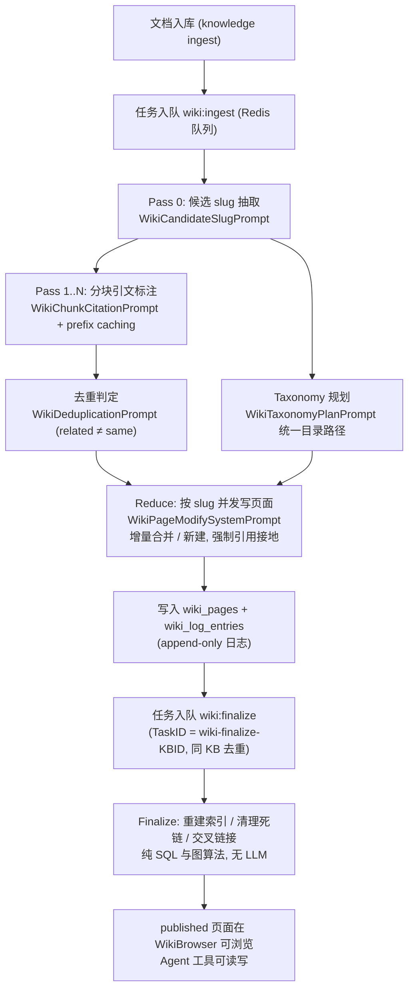

# Wiki 能力

Wiki 是 WeKnora 在知识库（Knowledge Base）之上自动生成的**结构化知识站点**：文档入库后，系统通过 LLM 从原文中抽取实体（entity）与概念（concept），生成互相链接的 Markdown 页面，形成一个持续演进、可被人和 Agent 共同读写的知识图谱。源码中的定义（`internal/types/wiki_page.go`）：

```go
// WikiPage represents a single wiki page in a wiki knowledge base.
// Wiki pages are LLM-generated, interlinked markdown documents that form
// a persistent, compounding knowledge artifact.
type WikiPage struct { ... }
```

核心实现分布：

| 层 | 文件 |
| --- | --- |
| 数据结构 | `internal/types/wiki_page.go`、`internal/types/wiki_log_entry.go` |
| HTTP Handler | `internal/handler/wiki_page.go` |
| 生成管道 | `internal/application/service/wiki_ingest.go`、`wiki_ingest_batch.go`、`wiki_ingest_cite.go`、`wiki_ingest_dedup.go`、`wiki_ingest_taxonomy.go` |
| 页面/日志服务 | `internal/application/service/wiki_page.go`、`wiki_log_entry.go`、`wiki_linkify.go`、`wiki_lint.go`、`wiki_slug_alias.go`、`wiki_slug_handles.go` |
| LLM 提示词 | `internal/agent/prompts_wiki.go` |
| Agent 工具 | `internal/agent/tools/wiki_*.go`（注册于 `internal/agent/tools/definitions.go`） |
| 失败恢复 | `internal/container/recover_pending_wiki_tasks.go` |
| 路由 | `internal/router/router.go`（行为测试见 `internal/router/router_wiki_test.go`） |
| 数据库迁移 | `migrations/versioned/000037_wiki_and_indexing.up.sql`、`000040_wiki_log_entries.up.sql`、`000061_wiki_page_hierarchy.up.sql` |
| 前端 | `frontend/src/views/knowledge/wiki/WikiBrowser.vue`、`frontend/src/api/wiki/`、`frontend/src/utils/wikiToolReferences.ts` |

## 页面模型与层级

### 页面类型（PageType）

`internal/types/wiki_page.go` 定义了 7 种页面类型：

| 类型 | 说明 |
| --- | --- |
| `summary` | 单篇源文档的摘要页（slug 形如 `summary/<knowledge-uuid>`） |
| `entity` | 实体页（人、组织、产品、技术等） |
| `concept` | 概念/主题页 |
| `index` | wiki 级索引页（元数据） |
| `log` | wiki 级操作日志页（元数据） |
| `synthesis` | 综合分析页，**仅由 Agent 通过 `wiki_write_page` 工具创建** |
| `comparison` | 对比页，**仅由 Agent 通过 `wiki_write_page` 工具创建** |

页面状态（`WikiPageStatus`）：`draft` / `published`（默认）/ `archived`。

### 目录树（Folder Hierarchy）

migration `000061_wiki_page_hierarchy.up.sql` 引入独立的 `wiki_folders` 表（邻接表模型）：

- `WikiFolder` 以 `ParentID`（空串代表根）+ 物化 `Path`（`/` 连接的名称链）组织树；空文件夹可独立存在，用户可以先搭好骨架；
- `WikiPage.FolderID` 是页面归属的**唯一事实来源**（FK → `wiki_folders.id`，空串表示 wiki 根）；
- 页面上的 `CategoryPath` / `WikiPath` / `Depth` / `SortOrder` 是从 folder 链派生的**缓存投影**；
- 目录最深 3 级（常量 `WikiCategoryMaxDepth = 3`），`CleanWikiCategoryPath()` 会规范化全角分隔符（`／`、`｜` → `/`）并剔除类型标签。

### 关键字段

- `Slug`：页面在 KB 内的唯一标识（见下节）；
- `SourceRefs`：来源引用，格式 `"<knowledge_id>|<doc_title>"`；`ChunkRefs`：分块级证据引用；
- `InLinks` / `OutLinks`：wiki-link 反向/正向链接，维护图结构，`GET /graph` 可查询全局或 ego 视图；
- `Aliases`：别名（用于搜索与去重合并后的旧名指向）；`Version`：版本号。

## 生成流程

Wiki 生成由**文档摄入（knowledge ingest）触发**，经 Redis 任务队列异步执行。任务类型定义在 `internal/types/task.go`：

```go
TypeWikiIngest   = "wiki:ingest"
TypeWikiFinalize = "wiki:finalize"
```

整个管道分四个阶段（Map-Reduce 结构）：

| 阶段 | 任务 | 做什么 | LLM 提示词（`internal/agent/prompts_wiki.go`） |
| --- | --- | --- | --- |
| Pass 0：候选抽取 | `wiki:ingest` | 从文档抽取候选 slug 骨架（entities + concepts 的 JSON） | `WikiCandidateSlugPrompt` |
| Pass 1..N：分块引文 | `wiki:ingest` | 逐 chunk 为候选 slug 标注引用，输出 `{ citations: {"slug": ["c001", ...]}, new_slugs: [...] }`；长前缀复用 prefix caching | `WikiChunkCitationPrompt` |
| Reduce：页面合并 | `wiki:ingest` | 按 slug 增量更新或合并页面，输出 `SUMMARY: ...` + Markdown 正文；严格接地、禁止幻觉、去重、禁止自链接 | `WikiPageModifySystemPrompt` + `WikiPageModifyUserPrompt` |
| Finalize：收尾 | `wiki:finalize` | 重建索引页、清理死链、补交叉链接、目录修剪——纯 SQL/图算法，**不调用 LLM** | — |

辅助提示词：

- `WikiTaxonomyPlanPrompt`：为同一批次的所有实体/概念统一规划目录路径（最多 2 级、优先复用已有文件夹），保证目录树连贯；
- `WikiDeduplicationPrompt`：判断新抽取项是否与既有页面同指一物，核心原则是 **"related ≠ same"**（相关不等于相同），返回 `{ merges: { "entity/new": "entity/existing" } }`。

### 抽取粒度

`WikiConfig`（存于 `knowledge_bases.wiki_config` JSONB 列）中的 `WikiExtractionGranularity` 控制抽取密度：

| 粒度 | 行为 |
| --- | --- |
| `focused` | 仅 3-7 个主要主题 |
| `standard`（默认） | 主题 + 被实质性讨论（一段/多条/2-3 句以上）的实体概念 |
| `exhaustive` | 穷举所有命名事物与公认概念 |

### 并发与批处理

`WikiConfig` 相关参数（`internal/types/wiki_page.go`）：

| 参数 | 默认 | 说明 |
| --- | --- | --- |
| `IngestBatchSize` | 5 | 单批认领的待处理文档数 |
| `IngestMapParallel` | 10 | Map 阶段（每文档抽取+引文）errgroup 并发数 |
| `IngestReduceParallel` | 10 | Reduce 阶段（每 slug 写页面）并发数 |
| `IngestMaxInflight` | 4 | 同一 KB 最大并发批次（保证跨 KB 公平） |

### 生成流程图



## Slug 机制

- **格式**：`<type>/<name>`，如 `entity/acme-corp`、`concept/rag`、`summary/<knowledge-uuid>`；小写、连字符分隔，非拉丁文名做罗马化/拼音；
- **唯一性**：数据库唯一索引（`000037_wiki_and_indexing.up.sql`）：

  ```sql
  CREATE UNIQUE INDEX idx_kb_slug ON wiki_pages (knowledge_base_id, slug) WHERE deleted_at IS NULL
  ```

  即 slug 在**单个知识库内唯一**，跨 KB 可以重复；
- **稳定性**：文档更新重新抽取时，提示词强制模型复用旧 slug——

  > If an entity or concept from the previous extraction still exists in the current document, **reuse its exact slug** from the previous list. Do NOT generate a new slug for the same thing.

  只有新出现的事物才生成新 slug，消失的项不再输出；
- **Slug Handle（句柄代理）**：ingest 的 LLM 调用中，高熵的真实 slug（尤其含 UUID 的 `summary/...`）会被替换为短句柄（`ref-1`、`ref-2`），模型输出 `[[ref-1|title]]` 后由后端还原为真实 slug，避免模型抄错 UUID（`internal/application/service/wiki_slug_handles.go`）；
- **引用作用**：Agent 回答中的 wiki 引用以 `[[slug|title]]` 形式出现，`InLinks`/`OutLinks` 依 slug 维护页面图；重命名 slug（`wiki_rename_page` 工具）会自动更新所有反向链接。

## 发布与访问

所有 Wiki 路由挂在 `/api/v1/knowledgebase/:kb_id/wiki` 之下（`internal/router/router.go`），**没有免登录的公开访问模式**，读写均受 RBAC 与 KB 访问控制约束：

### 读接口（Viewer + KBAccessRead）

| 方法 | 路径 | 说明 |
| --- | --- | --- |
| GET | `/pages` | 页面列表 |
| GET | `/pages/*slug` | 按 slug 取单页 |
| GET | `/folders` | 目录树 |
| GET | `/index` | 索引页 |
| GET | `/log` | 操作日志（游标分页） |
| GET | `/graph` | 链接图（全局概览 / ego 模式） |
| GET | `/stats` | 统计 |
| GET | `/search?q=...` | 搜索 |
| GET | `/lint` / `/issues` | 质量检查结果 / 问题列表 |

`KBAccessRead` 覆盖：KB 所有者、组织共享、以及通过共享 Agent 获得的访问。

### 写接口（OwnedWikiKBOrAdmin + KBAccessWrite）

| 方法 | 路径 | 说明 |
| --- | --- | --- |
| POST / PUT / DELETE | `/pages`、`/pages/*slug` | 创建 / 更新 / 删除页面 |
| POST / PUT / DELETE | `/folders`、`/folders/:folder_id` | 目录管理 |
| PUT | `/move-page` | 移动页面到目录 |
| POST | `/rebuild-links` | 重建链接图 |
| POST | `/auto-fix` | 触发自动修复 |
| PUT | `/issues/:issue_id/status` | 更新问题状态 |

写权限按 KB 归属判定：贡献者只要拥有该 KB 即可管理其 wiki，否则 403。API Key 场景按 `ingest` / `retrieve` capability 映射。

前端由 `WikiBrowser.vue` 提供浏览界面；文档解析期间 `wikiStatusRefresh.ts` 轮询 `parse_status`（`pending` / `processing` / `finalizing`），解析完成而摘要仍在生成时继续轮询。

## 与 Agent 的关系

Wiki 不只是给人看的——它是 Agent 的一等公民工作区。`internal/agent/tools/definitions.go` 注册了 10 个 wiki 工具：

| 工具 | 作用 | 关键参数 |
| --- | --- | --- |
| `wiki_read_page` | 按 slug 批量读取页面全文 | `slugs: string[]` |
| `wiki_search` | 正则搜索页面 | `queries`、`limit?`、`knowledge_base_id?` |
| `wiki_write_page` | 创建/整页覆盖（`synthesis`、`comparison` 页只能由此创建） | `slug`、`title`、`summary`、`content`、`page_type`、`aliases?`、`source_refs?` |
| `wiki_replace_text` | 页内精确文本替换 | `slug`、`old_text`、`new_text` |
| `wiki_rename_page` | 重命名 slug，自动更新反向链接 | `slug`、`new_slug` |
| `wiki_delete_page` | 删除页面并清理死链 | `slug` |
| `wiki_read_source_doc` | 回读源文档原文（带上下文） | 文档 ID |
| `wiki_flag_issue` | 标记页面问题 | `slug`、`issue_type ∈ {mixed_entities, contradictory_facts, out_of_date, other}`、`description` |
| `wiki_read_issue` | 查看问题详情 | 问题 ID |
| `wiki_update_issue` | 更新问题状态 | 问题 ID、`status ∈ {pending, ignored, resolved}` |

工具输出为 XML-like 结构（`<wiki_page><metadata>...<summary>...<content>...`），前端用 `frontend/src/utils/wikiToolReferences.ts` 的 `parseWikiToolReferences()` 解析成引用卡片渲染在对话中。

配套机制：

- **Wiki Scope**：Agent 会话内维护 wiki KB 白名单，支持通过 `@mention` 把范围收窄到特定文档/标签，工具执行时自动过滤 `source_refs`（`internal/agent/tools/wiki_tools.go`）；
- **Wiki Fixer**：内置 Agent（`types.BuiltinWikiFixerID`），负责自动修复 wiki 问题（死链、实体混淆等）。跨租户访问共享 KB 时要求租户角色 ≥ Editor，并自动提升到源租户上下文（`internal/handler/session/wiki_fixer_scope.go`）；
- **问题闭环**：`wiki_page_issues` 表 + lint 接口 + `auto-fix`，人和 Agent 都可以报告/处理问题。

## 操作日志（Log Entries）

`wiki_log_entries`（migration `000040`）是 **append-only** 事件表，取代早期"整块 TEXT 列重写"方案，消除 O(n²) 写放大：

- 每次 ingest/retract 仅 INSERT 一行；
- 字段：`action`（如 `ingest`、`retract`）、`knowledge_id` + `doc_title`（源文档删除后标题仍可读）、`pages_affected`（JSONB：`[{slug, title}, ...]`）、`summary`（单行变更摘要）；
- `id` 为 BIGSERIAL，按 `(knowledge_base_id, id DESC)` 索引做游标分页。

## 失败恢复

`internal/container/recover_pending_wiki_tasks.go` 在服务启动时闭合 Lite 模式（进程内 `SyncTaskExecutor`）或 Redis 入队中断留下的缺口：

1. 扫描持久化的 `task_pending_ops` 表中 `scope = knowledge_base` 且 `task_type ∈ {wiki:ingest, wiki:finalize}` 的待处理组合；
2. 清理已删除 KB 的残留行（fail-closed）；
3. 对每个活跃 KB 重新入队触发任务：`wiki:ingest` 不带 TaskID（允许多批并发），`wiki:finalize` 使用 `"wiki-finalize-" + KB_ID` 去重（同一 KB 只保留一个 finalize）。重复入队无害——ingest 认领互不相交的行，finalize 在 lane 内合并。
