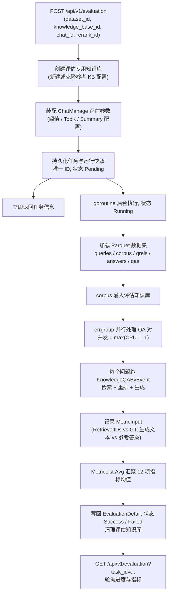

# 评估能力（Evaluation）

评估使用带标准答案的问答数据集，比较分块、模型和检索配置的效果。系统创建评估知识库并导入语料，逐题执行检索与生成，输出 Precision、Recall、NDCG、MRR、MAP、BLEU 和 ROUGE 等指标。

::: tip 界面与 API 都可用
在“设置 → RAG 评测”中可选择数据集、知识库、对话模型和重排模型，查看持久化历史，并同时对比 2–4 次运行。Viewer 可查看，启动评测需要 Admin 权限。也可通过 API 发起和轮询。
:::

比较配置时应固定数据集，每次调整一个变量，并对照同一组指标分析结果。

## 运行一次评估

1. 准备符合下方格式的 Parquet 数据集，或使用内置 `default` 数据集。
2. 选择参考知识库、对话模型和重排模型，通过 `POST /api/v1/evaluation` 创建任务。参考知识库用于复制配置，评估会使用单独的知识库。
3. 记录返回的任务 ID，通过 `GET /api/v1/evaluation?task_id=...` 查询状态和进度。
4. 任务成功后比较检索与生成指标；失败时先检查任务错误，再调整配置并重新运行。

创建任务需要 Admin 权限，查询结果需要 Viewer 权限；API Key 还需评估能力或 full-access。

## 数据集格式

数据集根目录由 `WEKNORA_EVALUATION_DATASET_DIR` 配置（默认 `./dataset`）。内置 `default`
映射到 `samples/`，其他 `dataset_id` 映射到同名子目录。每个目录需要 `manifest.json` 和
5 个 **Parquet** 文件：

| 文件 | Schema | 含义 |
| --- | --- | --- |
| `queries.parquet` | `id: int64, text: string` | 问题集合 |
| `corpus.parquet` | `id: int64, text: string` | 语料段落（评估时灌入知识库） |
| `answers.parquet` | `id: int64, text: string` | 参考答案 |
| `qrels.parquet` | `qid: int64, pid: int64` | 问题 → 相关段落的 ground truth 关联（检索指标依据） |
| `qas.parquet` | `qid: int64, aid: int64` | 问题 → 答案映射（生成指标依据） |

对应的 Go 结构体：

```go
type TextInfo struct {
    ID   int64  `parquet:"id"`
    Text string `parquet:"text"`
}
type RelsInfo struct {
    QID int64 `parquet:"qid"`
    PID int64 `parquet:"pid"`
}
type QaInfo struct {
    QID int64 `parquet:"qid"`
    AID int64 `parquet:"aid"`
}
```

加载后拼装为逐样本的 `QAPair`（`internal/types/dataset.go`）：

```go
type QAPair struct {
    QID      int      // 问题 ID
    Question string   // 问题文本
    PIDs     []int    // 相关段落 ID（ground truth）
    Passages []string // 段落文本
    AID      int      // 答案 ID
    Answer   string   // 参考答案文本
}
```

自定义数据集还需在 manifest 声明 `schema_version`、`id`、名称、语言、场景、来源、
许可证和覆盖维度。加载前会校验字段类型、空文本、重复 ID、悬空 qid/pid/aid，以及每个问题的
答案与 qrel 覆盖；失败的数据集会在界面标记为不可用，不会消耗模型额度。

## 结果查询

使用创建接口返回的唯一任务 ID 请求
`GET /api/v1/evaluation?task_id=<task_id>`，返回 `EvaluationDetail`：

```json
{
  "success": true,
  "data": {
    "task": {
      "id": "evaluation_1_1788792322769_f51acdc7_default",
      "dataset_id": "default",
      "status": 2,
      "total": 100,
      "finished": 100
    },
    "params": { "...": "ChatManage 评估参数快照" },
    "metric": {
      "retrieval_metrics": {
        "precision": 0.85, "recall": 0.92,
        "ndcg3": 0.88, "ndcg10": 0.86,
        "mrr": 0.95, "map": 0.87
      },
      "generation_metrics": {
        "bleu1": 0.72, "bleu2": 0.65, "bleu4": 0.58,
        "rouge1": 0.78, "rouge2": 0.71, "rougel": 0.75
      }
    }
  }
}
```

任务运行期间可轮询该接口获取 `finished / total` 进度；`status = 3` 时 `err_msg` 携带失败原因。

> **持久化与隐私**：任务、指标、聚合用量和无密钥运行快照会按租户保存，服务重启后仍可对比。逐次模型调用只保存模型、用途、Token、缓存、费用、耗时和受保护的指纹，不保存 Prompt 或回答正文，并按保留策略清理。

## 指标清单

指标注册表见 `internal/application/service/metric_hook.go`，共 12 项，分两组。文本先经 `metric/common.go` 分词：中文用 Jieba 分词、英文按空白切分、按 `。` / `.` 切句。

### 检索指标（Retrieval Metrics）

| 指标 | 字段 | 实现文件 | 含义 |
| --- | --- | --- | --- |
| Precision | `precision` | `metric/precision.go` | 检索准确率：命中的相关文档数 / 检索返回总数，按 GT 集合求均值 |
| Recall | `recall` | `metric/recall.go` | 检索召回率：命中的相关文档数 / 相关文档总数 |
| NDCG@3 | `ndcg3` | `metric/ndcg.go` | 归一化折损累计增益（取前 3 位），奖励把相关文档排在前面 |
| NDCG@10 | `ndcg10` | `metric/ndcg.go` | 同上，取前 10 位 |
| MRR | `mrr` | `metric/mrr.go` | 首个相关文档倒数排名的平均：`sum(1/rank) / N` |
| MAP | `map` | `metric/map.go` | 平均精度均值：对每个命中位置累计 `Precision@k` 再归一化 |

NDCG 核心计算（`metric/ndcg.go`）：

```go
// DCG = sum((2^rel_i - 1) / log2(i+2))，rel 为 0/1
dcg += (math.Pow(2, float64(relevance)) - 1) / math.Log2(float64(i+2))
// NDCG = DCG / IDCG（理想排序的 DCG）
```

MRR 核心计算（`metric/mrr.go`）：

```go
for i, predID := range ids {
    if _, ok := gtSet[predID]; ok {
        sumRR += 1.0 / float64(i+1) // 第一个命中位置的倒数
        break
    }
}
```

### 生成指标（Generation Metrics）

| 指标 | 字段 | 实现文件 | 含义 |
| --- | --- | --- | --- |
| BLEU-1 | `bleu1` | `metric/bleu.go` | 1-gram 精度（权重 `[1.0, 0, 0, 0]`） |
| BLEU-2 | `bleu2` | `metric/bleu.go` | 1/2-gram 各 50%（权重 `[0.5, 0.5, 0, 0]`） |
| BLEU-4 | `bleu4` | `metric/bleu.go` | 1~4-gram 均权（`[0.25, 0.25, 0.25, 0.25]`），含 brevity penalty |
| ROUGE-1 | `rouge1` | `metric/rouge.go` | 一元词重叠 F1 |
| ROUGE-2 | `rouge2` | `metric/rouge.go` | 二元词组重叠 F1 |
| ROUGE-L | `rougel` | `metric/rouge.go` | 最长公共子序列（LCS）F1 |

BLEU 核心（`metric/bleu.go`）：修正 n-gram 精度的加权几何平均乘以简短惩罚 `bp * exp(sum(w_i * log(p_i)))`。ROUGE 取 F1：`F1 = 2PR / (P + R + 1e-8)`（`metric/rouge_score.go`）。

## 接口与执行参考

### API

`internal/router/router.go`：

```go
evaluationRoutes := g.apiKeyGroup(r.Group("/evaluation"), apiKeyRunEvaluations(apiKeyFullAccess()))
{
    evaluationRoutes.POST("", g.Admin(), handler.Evaluation)
    evaluationRoutes.GET("", g.Viewer(), handler.GetEvaluationResult)
    evaluationRoutes.GET("/datasets", g.Viewer(), handler.GetEvaluationDatasets)
    evaluationRoutes.GET("/runs", g.Viewer(), handler.GetEvaluationRuns)
    evaluationRoutes.GET("/model-usage", g.Viewer(), handler.GetModelUsage)
}
```

| 方法 | 路径 | 权限 | 说明 |
| --- | --- | --- | --- |
| POST | `/api/v1/evaluation` | Admin（API Key 需 `RunEvaluations` 能力） | 创建评估任务，立即返回任务信息 |
| GET | `/api/v1/evaluation?task_id=...` | Viewer | 查询任务状态、进度与指标结果 |
| GET | `/api/v1/evaluation/datasets` | Viewer | 列出 manifest 数据集及 Schema 就绪状态 |
| GET | `/api/v1/evaluation/runs` | Viewer | 分页查询当前租户的持久化运行历史 |
| GET | `/api/v1/evaluation/model-usage` | Viewer | 按模型、用途和时间范围汇总 Token、缓存、费用与耗时 |

### 可控对比

评测历史会保留数据集内容指纹、样本数、代码版本、分块和 RAG 管线参数，以及不含密钥的模型
配置指纹。界面可选择 2–4 次成功运行，第一项作为基线，并对每个候选项显示质量、耗时、Token、
缓存命中率和分币种费用差值。

比较前会校验数据集、来源知识库、分块、管线、Embedding 和 Rerank 配置是否一致。进行多对话模型
横向对比时，只更换 Chat 模型；进行新旧版本回归时，固定模型和数据集。如果快照缺失或其他控制变量不同，
界面会显示不可比警告，而不是直接解读差值。

#### 创建评估任务

请求参数（`internal/handler/evaluation.go`）：

```go
type EvaluationRequest struct {
    DatasetID       string `json:"dataset_id"`        // 数据集 ID，默认 "default"
    KnowledgeBaseID string `json:"knowledge_base_id"` // 参考知识库（复用其配置）
    ChatModelID     string `json:"chat_id"`           // 聊天模型
    RerankModelID   string `json:"rerank_id"`         // 重排模型
}
```

| 参数 | 必填 | 默认行为 |
| --- | --- | --- |
| `dataset_id` | 否 | 缺省使用内置 `default` 数据集（`dataset/samples/`） |
| `knowledge_base_id` | 否 | 未提供则新建评估专用知识库；提供则复制其配置创建评估 KB |
| `chat_id` | 否 | 缺省自动选择默认 Chat 模型 |
| `rerank_id` | 否 | 缺省自动选择默认 Rerank 模型 |

任务 ID 由任务类型、租户、时间戳、短 UUID 和数据集 ID 组成，因此同一数据集可保留多次运行。任务对象（`internal/types/evaluation.go`）：

```go
type EvaluationTask struct {
    ID        string           `json:"id"`
    TenantID  uint64           `json:"tenant_id"`
    DatasetID string           `json:"dataset_id"`
    StartTime time.Time        `json:"start_time"`
    Status    EvaluationStatue `json:"status"`
    ErrMsg    string           `json:"err_msg,omitempty"`
    Total     int              `json:"total,omitempty"`    // 样本总数
    Finished  int              `json:"finished,omitempty"` // 已完成数
}
```

任务状态枚举（注意源码中拼写为 `EvaluationStatue`）：

```go
const (
    EvaluationStatuePending EvaluationStatue = iota // 0 待启动
    EvaluationStatueRunning                          // 1 运行中
    EvaluationStatueSuccess                          // 2 成功
    EvaluationStatueFailed                           // 3 失败
)
```

### 评估流程

`internal/application/service/evaluation.go` 中，POST 接口**同步完成准备、异步执行评估**：

1. **知识库准备**：新建（或按参考 KB 配置克隆）评估专用知识库，取默认 Embedding 与 LLM 模型；
2. **参数装配**：从系统配置装配 `ChatManage` 评估参数——`VectorThreshold`、`KeywordThreshold`、`EmbeddingTopK`、`RerankTopK`、`RerankThreshold`、`MaxRounds`、`SummaryConfig`（MaxTokens / TopK / TopP / RepeatPenalty / Prompt / ContextTemplate 等）、`FallbackResponse`、改写提示词等；
3. **任务注册**：将任务、无密钥运行快照和状态 `Pending` 写入数据库，立即返回响应；
4. **后台执行**（goroutine）：将数据集 corpus 灌入评估 KB → 并行评估每个 QA 对 → 汇聚指标 → 清理资源。

并发度取 `max(GOMAXPROCS - 1, 1)`（errgroup 限流）：

```go
var g errgroup.Group
metricHook := NewHookMetric(len(dataset))
g.SetLimit(max(runtime.GOMAXPROCS(0)-1, 1))
for i, qaPair := range dataset {
    g.Go(func() error {
        // 1. 克隆 ChatManage 配置
        // 2. 走 KnowledgeQAByEvent 完整管道（检索 + 重排 + 生成）
        // 3. 记录 MetricInput（检索到的 passage ID、生成文本、GT）
        // 4. 加锁更新 finished 进度
    })
}
g.Wait()
```

每个样本产出一个 `MetricInput`（`internal/types/evaluation.go`）：

```go
type MetricInput struct {
    RetrievalGT    [][]int // 检索 ground truth（相关 passage ID 列表）
    RetrievalIDs   []int   // 实际检索返回的 passage ID
    GeneratedTexts string  // 模型生成文本
    GeneratedGT    string  // 参考答案
}
```

`metric_hook.go` 对每个样本遍历所有已注册指标计算器求分，最终 `Avg()` 对全部样本逐指标取均值，写入 `MetricResult`。

::: warning RetrievalIDs 的口径
`RetrievalIDs` 必须是**数据集里的 passage ID**，不能直接用检索结果的 `ChunkIndex`——后者只是分块在知识库里的序号，与 passage ID 没有对应关系，直接使用会让所有检索指标恒为 0。`recordFinish` 因此把每条检索结果的正文与该样本的 ground truth passage 做双向包含匹配，反查出对应的 pid 并去重。重排结果为空时回退用原始检索结果，避免整条样本记成「什么都没召回」。

语料灌入也必须**同步等待索引完成**（`CreateKnowledgeFromPassageSync`）：异步入库时评估查询会跑在索引建好之前，同样表现为指标恒为 0。另外 passage 列表按 `maxPID + 1` 分配长度，pid 是 0-based 且包含末位。
:::

#### 评估流程图



## 实现参考

以下路径均相对仓库根目录：

| 层 | 文件 |
| --- | --- |
| HTTP Handler | `internal/handler/evaluation.go` |
| 评估服务 | `internal/application/service/evaluation.go` |
| 指标注册与汇聚 | `internal/application/service/metric_hook.go` |
| 指标实现 | `internal/application/service/metric/`（`precision.go`、`recall.go`、`ndcg.go`、`mrr.go`、`map.go`、`bleu.go`、`rouge.go`、`rouge_score.go`、`common.go`） |
| 数据集加载 | `internal/application/service/dataset.go`、`internal/handler/evaluation.go` |
| 类型定义 | `internal/types/evaluation.go`、`internal/types/dataset.go` |
| 内置样例数据集 | `dataset/samples/`（Parquet 文件） |
| 路由注册 | `internal/router/router.go` 的 `RegisterEvaluationRoutes` |
