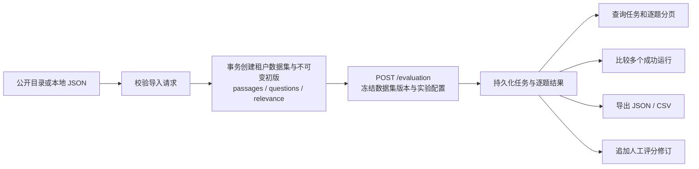

# 评测能力

评测能力使用版本化数据集执行知识库检索与生成流程，并保存任务、逐题事实、指标观测、运行时统计和实验快照。调用方可以查询任务、比较多个成功运行、导出终态结果，并为逐题结果追加人工评分修订。

应用程序编程接口密钥（Application Programming Interface Key，API Key）访问评测接口时需要 `run_evaluations` 能力或 full-access 权限。查看者（Viewer）可以读取评测数据，管理员（Admin）可以创建、取消、标注任务以及写入数据集和人工评分。删除任务仅接受具备 Admin 权限的用户登录令牌。

本文使用标识符（Identifier，ID）关联数据集、版本、任务和模型。导出格式包括 JavaScript 对象表示法（JavaScript Object Notation，JSON）与逗号分隔值（Comma-Separated Values，CSV）。

## 数据与任务模型

评测数据集由数据集身份和不可变版本组成。一个版本包含段落、问题和相关性关系；问题在版本中的顺序确定稳定的 `sample_index`。服务为版本计算内容哈希，并在任务实验快照中记录数据集版本、模型配置、参数、指标计划、代码和运行环境来源。

任务状态使用数值枚举：`0` 为 Pending，`1` 为 Running，`2` 为 Success，`3` 为 Failed，`4` 为 TimedOut，`5` 为 Interrupted，`6` 为 Canceled。任务响应同时提供 `total`、`finished`、`labels`、`dataset_version_id`、`provenance_complete` 和可选的 `cancel_requested_at`、`err_msg`、`cleanup_errors`。

下图展示数据集版本、评测任务和结果消费接口之间的数据流。



图中的不可变版本为一次评测提供固定输入，实验快照为比较和导出提供来源信息。逐题结果、人工评分和聚合指标都通过任务 ID 关联到同一次运行。

## 接口清单

所有路径都以 `/api/v1` 为前缀。

| 方法 | 路径 | 角色 | 用途 |
| --- | --- | --- | --- |
| POST | `/evaluation` | Admin | 创建评测任务 |
| GET | `/evaluation?task_id=...` | Viewer | 查询单个任务详情 |
| GET | `/evaluation/metrics` | Viewer | 列出版本化指标定义 |
| GET | `/evaluation/tasks` | Viewer | 筛选并分页列出任务 |
| PUT | `/evaluation/tasks/:task_id/labels` | Admin | 全量替换任务标签 |
| POST | `/evaluation/comparisons` | Viewer | 比较 2 至 10 个成功任务 |
| GET | `/evaluation/tasks/:task_id/export?format=json|csv` | Viewer | 导出终态任务 |
| POST | `/evaluation/:task_id/cancel` | Admin | 持久化取消请求 |
| DELETE | `/evaluation/:task_id` | Admin 用户令牌 | 软删除终态任务 |
| GET | `/evaluation/tasks/:task_id/questions` | Viewer | 分页读取逐题结果 |
| GET | `/evaluation/tasks/:task_id/questions/:sample_index/ratings` | Viewer | 列出人工评分修订 |
| POST | `/evaluation/tasks/:task_id/questions/:sample_index/ratings` | Admin | 追加人工评分修订 |
| POST | `/evaluation/datasets` | Admin | 创建租户数据集身份 |
| GET | `/evaluation/datasets` | Viewer | 列出可见数据集 |
| POST | `/evaluation/datasets/import` | Admin | 原子导入租户数据集与初版，支持请求重试 |
| GET | `/evaluation/datasets/catalog` | Viewer | 读取公开数据集目录和实际导入限制 |
| GET | `/evaluation/datasets/catalog/:id` | Viewer | 读取公开包内容和来源清单 |
| POST | `/evaluation/datasets/:id/versions` | Admin | 创建不可变数据集版本 |
| GET | `/evaluation/datasets/:id/versions` | Viewer | 列出数据集版本 |

## 创建评测任务

`POST /api/v1/evaluation` 接受 JSON 请求体：

| 字段 | 类型 | 必填 | 作用 |
| --- | --- | --- | --- |
| `dataset_id` | string | 否 | 数据集 ID |
| `dataset_version_id` | string | 否 | 固定到一个不可变数据集版本 |
| `knowledge_base_id` | string | 否 | 源知识库 ID，用于解析评测配置 |
| `chat_id` | string | 否 | 对话模型 ID |
| `rerank_id` | string | 否 | 重排序模型 ID |
| `seed` | integer | 否 | 生成随机种子；省略与显式传入 `0` 含义不同 |
| `configuration.retrieval` | object | 否 | `vector_threshold`、`keyword_threshold`、`embedding_top_k` 覆盖值 |
| `configuration.rerank` | object | 否 | `rerank_top_k`、`rerank_threshold` 覆盖值 |
| `configuration.generation` | object | 否 | `temperature`、`top_p`、`top_k`、`max_tokens` 覆盖值 |

```bash
curl -X POST "$BASE/api/v1/evaluation" \
  -H "X-API-Key: $API_KEY" -H 'Content-Type: application/json' \
  -d '{"dataset_id":"golden","dataset_version_id":"version-1","chat_id":"model-1","seed":0}'
```

服务返回 `{"success":true,"data":EvaluationTask}`。模型提供方无法兑现请求种子时返回 `422`；数据集、版本或源知识库不可见时返回 `404`。

配置参数逐字段应用。仅提交 `configuration.retrieval.embedding_top_k` 时，服务保留向量阈值、关键词阈值和重排序参数的默认值；显式提交的 `0` 作为覆盖值生效。实验快照保存所有已解析参数，因此局部请求和具有相同有效数值的完整请求生成相同配置快照。

## 查询与管理任务

`GET /api/v1/evaluation/tasks` 按 `(start_time DESC, id DESC)` 使用不透明游标分页。支持 `status`、`dataset_id`、`dataset_version_id`、`model_id`、`started_from`、`started_to`、可重复的 `label`、`page_size` 和 `cursor`。时间参数使用 RFC 3339（Request for Comments 3339）格式；`page_size` 默认 20，最大 100。

标签更新请求为 `{"labels":["baseline","embedding-a"]}`。比较请求为 `{"task_ids":["task-a","task-b"],"baseline_task_id":"task-a"}`，其中任务数为 2 至 10，且任务必须具有可比较的成功结果。导出接口要求 `format=json` 或 `format=csv`，并对导出条数和文件大小应用服务配置上限。

导出格式版本为 3。JSON 导出的 `runtime_metrics` 与 CSV 运行记录的 `runtime_metrics_json` 保存任务持久化的运行时快照，包括阶段耗时、样本计数、用量与 `cost` 费用覆盖。费用按币种列出，同时保留未定价、用量未上报及尚未结束的调用数。空快照保留为 `null`，显式零费用保留为 0；导出使用保存的价格和费用事实。

逐题接口按 `sample_index` 升序分页，`page_size` 默认 100，最大 500。响应中的每条记录包含问题、参考答案、检索与重排序结果、生成文本、逐样本指标、指标观测、阶段耗时、Token 用量、状态和结果哈希。

人工评分请求字段如下：

| 字段 | 类型 | 约束 |
| --- | --- | --- |
| `rubric_key` | string | 必填，最长 64 字符 |
| `rubric_version` | string | 必填，最长 32 字符 |
| `rubric_snapshot` | object | 必填，保存评分量表快照 |
| `score` | integer | 必填，1 至 5 |
| `comment` | string | 可选，最长 4000 字符 |

服务保留每次人工评分修订，并通过 `supersedes_id` 连接同一 rubric 的上一修订。

## 数据集版本接口

评测工作台通过公开目录和本地 JSON 导入资料。公开目录提供中文机器阅读理解数据集（Chinese Machine Reading Comprehension，CMRC 2018）与斯坦福问答数据集（Stanford Question Answering Dataset，SQuAD 2.0）的固定开发集子集。每个子集包含 32 个段落和 24 道问题，并附有来源地址、许可证、上游提交、抽样规则、文件摘要及适用限制。目录中的记录数量和导入上限来自服务响应。

CMRC 2018 子集包含 24 道可回答题。SQuAD 2.0 子集包含 16 道可回答题和 8 道原始给定上下文的无答案题。每题只保留原始问题与上下文的标注关系，额外候选段落保持未标注。无答案题的相关性等级 `0` 表示指定原文不相关；该标注范围限定在原始上下文。检索指标表示命中已标注原文的情况，无正例时的检索零分需要结合无答案题类型解释。平台版本保存一个参考答案，完整多答案及字符偏移保存在资料包的 `annotations.json`。

`POST /api/v1/evaluation/datasets/import` 接受 `request_id`、`name`、可选 `description` 与 `content`。`content` 使用下方三个数组的结构。请求标识使用通用唯一标识符（Universally Unique Identifier，UUID），前端在失败重试期间保留同一个标识。服务在一个数据库事务内创建数据集身份、不可变初版与全部内容，成功响应为 `{"success":true,"data":{"dataset":...,"version":...,"replayed":false}}`。相同租户和请求标识重试相同输入时返回同一个初版，并设置 `replayed:true`；不同输入复用该标识时返回 `409`。

服务在写入前检查请求体字节、数组规模、标识长度、引用关系、文本长度和相关性等级，拒绝未知字段、重复字段、尾随 JSON 与截断输入。导入要求段落和问题数组非空，相关性数组可以为空。元数据为 JSON 对象，参考答案可以为空字符串。配置上限通过 `GET /api/v1/evaluation/datasets/catalog` 的 `data.limits` 返回，客户端据此在文件读取和提交前校验。导入过程保存评测输入，模型运行通过单独的任务创建操作启动。

创建数据集身份的请求体为 `{"name":"回归集","description":"核心问答回归"}`。创建版本时提交三个数组：

```json
{
  "passages": [
    {"pid": "p-1", "content": "段落内容", "metadata": {"source": "manual"}}
  ],
  "questions": [
    {"qid": "q-1", "question": "问题文本", "answer": "参考答案"}
  ],
  "relevance": [
    {"qid": "q-1", "pid": "p-1", "grade": 1}
  ]
}
```

版本响应包含 `id`、`dataset_id`、`version_number`、`schema_version`、`artifact_sha256`、`content_sha256`、`manifest` 和三类记录数量。系统数据集对所有租户可见，租户数据集只对所属租户可见。

## 指标目录

`GET /api/v1/evaluation/metrics` 返回 `data.items`。每个指标定义包含 `key`、`version`、`kind`、`description`、`default_config` 和 `config_schema`。任务结果中的 `metric.scores` 使用指标实例 ID 作为键，并通过 `value`、`status` 和可选 `error_code` 区分有效零值、缺失观测和计算错误。

接口由 `internal/router/routes_infra.go` 注册；请求处理位于 `internal/handler/evaluation.go`、`internal/handler/evaluation_dataset.go` 和 `internal/handler/evaluation_question.go`。
