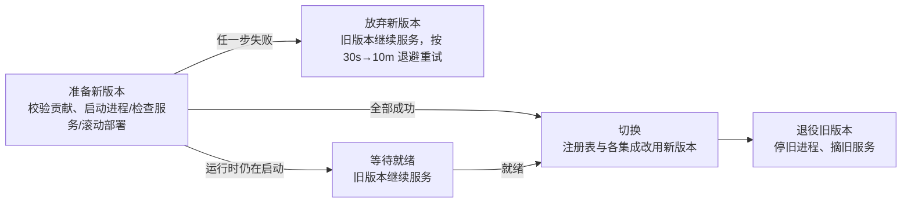

# 插件

插件是 WeKnora 扩展能力的打包与分发单元：模型厂商、数据源、联网搜索、文档解析、技能、MCP 服务等都可以由插件提供。内置能力本身也以内置插件的形式登记，和第三方插件共用一套目录与开关。

两类角色分工如下：

| | 系统管理员 | 空间管理员 |
| --- | --- | --- |
| 做什么 | 安装、升级、回滚、卸载插件，填写平台配置 | 在本空间启用或停用插件，填写空间配置 |
| 入口 | 「设置 → 插件管理」 | 「设置 → 插件」 |

安装后的插件对所有空间可见，但**默认停用**，由各空间管理员自行启用。停用插件后，本空间不再向它发送任何数据：它的集成不再出现在类型列表中、不能新建，已有的数据源同步、联网搜索、IM 渠道等全部暂停并标注「插件已停用」，重新启用后自动恢复（数据源保持原状态，定时同步照常继续）。插件的 Host API 令牌在停用后立即失效。把某空间移出插件的可见范围效果相同。

各类集成在插件停用后的表现：

| 集成 | 停用后 |
|---|---|
| 数据源 | 同步暂停并标注「插件已停用」，数据源状态和定时同步保持不变，重新启用后照常继续 |
| 联网搜索、IM 渠道 | 暂停，标注「插件已停用」 |
| 文档解析 | 指定由该插件解析的文件解析失败并注明插件已停用，重新启用后可重新解析；只有该插件支持的文件类型不能再上传 |
| 分块 | 改用内置的自动策略，入库不受影响 |
| 问答流程钩子 | 不再调用 |
| MCP 工具、技能 | 不再提供给智能体 |
| 模型厂商 | 见下一段 |

判断开关时如果读不到空间的设置（数据库故障），列表和新建表单照常显示集成；实际调用插件、调用插件厂商的模型、向智能体提供 MCP 工具和技能时一律按停用处理，稍后自动重试。

插件提供的模型厂商同样受开关约束：停用后，本空间使用该厂商的模型（对话、Embedding、Rerank、VLM、ASR，以及交给文档解析服务的 VLM）一律拒绝调用并提示插件已停用，也不能把模型新建或改到这个厂商上；重新启用后恢复。平台内置模型按使用它的空间的开关判断，共享知识库的 Embedding 按模型所属空间的开关判断。判断依据是模型实际解析到的厂商，厂商 ID 的大小写写法不影响结果。插件厂商只能在模型配置中显式选择，它声明的 `url_patterns` 不参与按 Base URL 识别厂商，不会接管未填厂商的旧模型。

## 插件的运行方式

插件包是一个 `.wkp` 文件（根目录带 `plugin.yaml` 的 zip）。`runtime.type` 决定插件代码在哪里运行：

| 运行方式 | 说明 | 适用 |
| --- | --- | --- |
| `declarative` | 没有代码，由 WeKnora 解释清单 | 技能、模型厂商定义、远程 MCP |
| `host` | WeKnora 的插件宿主拉起的子进程，`kind` 为 `binary` 或 `python` | 自托管的代码插件 |
| `remote` | 插件作者自行部署的 HTTP 服务，安装时登记地址 | SaaS 类插件、独立团队维护的服务 |

代码插件与 WeKnora 之间走统一的扩展协议 v1（HTTP + JSON，流式同步用 NDJSON）。

## 安装插件

1. 以系统管理员身份打开「设置 → 插件管理」，点击「安装插件」。
2. 上传 `.wkp` 或填写下载地址。WeKnora 先解析插件包，展示它提供的能力、申请的权限（可访问的外部域名、Host API 权限等）和包摘要。
3. 确认后安装。安装请求带着审阅时的摘要，下载地址在此期间换了内容会被拒绝。

同一插件再次安装更高版本即升级，旧版本保留，可在详情中回滚。

卸载插件时，各空间的开关、配置、插件的 KV 数据、OAuth 连接和 MCP 工具授权都会保留，但只留给“同一个插件”：WeKnora 记下卸载时插件的来源（平台，或是哪个空间的自有插件）和受信任的签名密钥。之后用同一 ID 安装时，来源和签名都一致才恢复这些数据；否则（换了签名方、未签名替换已签名、平台与空间之间互换）先清除再安装，新插件从头开始，已有的数据源等处于停用状态。

### 升级与回滚

每个节点升级插件时，先把新版本准备好，再整体切换，切换前旧版本照常服务：



- 准备阶段先检查插件包声明的贡献（模型厂商定义、连接器表单等），再启动代码：内嵌宿主起新进程到就绪、远程插件检查服务健康与清单、Kubernetes 插件滚动部署。任何一步失败，新版本整体放弃，旧版本的进程、服务和各项集成都不受影响。
- 换运行方式（如远程改为内嵌宿主、本机进程改为 Kubernetes）同样如此：新的运行方式接管之后，旧的才停止。
- Kubernetes 滚动更新、或交给独立插件宿主的新版本还没启动时，节点先等它就绪（每 5 秒检查一次）再切换。镜像拉不下来之类的情况会一直等待，旧 Pod 保持运行。
- 「插件管理」列表的状态列会标出未完成的升级：「升级中 · v新版本」表示仍在等待，「升级失败 · v新版本」表示准备失败，悬停可看仍在运行的版本和原因；版本列显示实际运行的版本。插件详情的「节点状态」逐个节点显示同样的信息。升级失败的插件计入「异常」筛选。
- 等待或失败期间在详情中切回旧版本即回滚，节点直接放弃新版本，不重启旧进程；装上更新的版本也会取代正在等待的那个。
- 节点重启时只加载当前选定的版本：该版本加载失败，这个节点上的插件就不可用（不会自动退回旧版本），需要回滚或修复后重新安装。
- 源码见 `internal/plugin/reconcile/reconcile.go`（`Activator.Stage` 与 `Staged` 的提交、放弃、退役）。

插件默认对所有空间可见（仍需各空间自行启用）。在插件详情的「可见范围」中可以改为只对指定空间可见：范围外的空间看不到该插件，也不能使用它的集成；它们原有的开关和配置保留，重新纳入后恢复。

### 插件市场

设置 `WEKNORA_PLUGIN_INDEX_URL` 指向一个插件索引后，「安装插件」中多出「从插件市场」，可按名称、ID 或发布者搜索，显示已安装版本与可升级版本。选中后照常审阅，安装时校验索引中登记的摘要，下载到的包与索引不符会被拒绝。

索引是一个 JSON 文件，任何能提供静态文件的地方都可以托管：

```json
{
  "schemaVersion": 1,
  "plugins": [
    {
      "id": "acme.search",
      "name": { "default": "Acme Search", "zh-CN": "Acme 搜索" },
      "description": { "default": "Search the Acme knowledge graph." },
      "publisher": { "id": "acme", "name": "Acme" },
      "icon": "https://plugins.example.com/acme-search.png",
      "categories": ["search"],
      "versions": [
        {
          "version": "1.1.0",
          "url": "packages/acme-search-1.1.0.wkp",
          "digest": "sha256:…",
          "engines": { "weknora": ">=0.5.0" }
        }
      ]
    }
  ]
}
```

- `url` 可以是相对索引地址的路径；`digest` 是插件包的 SHA-256（签名之后计算）。
- 列表中给出本平台能运行的最新版本；所有版本都不兼容的插件标为不兼容。
- 索引本身不决定可信度。审核插件的市场应该用自己的密钥签名插件包，平台把该密钥以 `verified` 级加入信任列表。

### 插件签名与信任等级

插件包可以带签名（包根目录的 `plugin.sig`）。WeKnora 按签名把插件包分为三级，安装审阅页和版本列表中会标出：

| 等级 | 含义 |
|---|---|
| 官方（official） | 由平台信任列表中 `official` 级的密钥签名，通常是 WeKnora 团队 |
| 已验证（verified） | 由平台信任列表中 `verified` 级的密钥签名，例如审核过插件的市场或平台认可的发布者 |
| 社区（community） | 未签名，或签名密钥不在信任列表中 |

签名覆盖包内除 `plugin.sig` 外的所有文件。签名存在但对不上（文件被改过、签名伪造，或密钥签了它无权签的发布者），安装直接被拒绝。

信任列表是一个 YAML 文件，路径由 `WEKNORA_PLUGIN_TRUSTED_KEYS` 指定：

```yaml
keys:
  - id: weknora-2026            # 签名时使用的密钥 ID
    publicKey: ed25519:BASE64...  # weknora-plugin keygen 输出的公钥
    level: official
  - id: acme-2026
    publicKey: ed25519:BASE64...
    level: verified
    publishers: [acme]          # 可选：只认该发布者的插件
```

`WEKNORA_PLUGIN_MIN_TRUST` 设置平台接受的最低等级，默认 `community`（全部接受）。调高后，低于该等级的插件包不能安装，也不能切换到这类版本；已安装的不再加载，详情中显示原因。

发布者用 SDK 自带的命令行生成密钥并签名：

```bash
go install github.com/Tencent/WeKnora/pluginsdk/cmd/weknora-plugin@latest
weknora-plugin keygen -out acme.key          # 输出公钥，交给平台管理员
weknora-plugin sign -key acme.key -key-id acme-2026 acme-search-1.0.0.wkp
weknora-plugin verify -pubkey ed25519:... acme-search-1.0.0.wkp
```

签名会改变插件包的摘要，请在签名之后再计算或公布摘要。

### 远程插件

`runtime.type: remote` 的插件在安装时还需填写服务地址：

- 服务地址必须是 https：每次调用都带着空间的插件配置（密钥已解密）。只有加入了 `SSRF_WHITELIST` 的主机可以用 http。
- 服务在内网时，需把地址加入 `SSRF_WHITELIST`。
- 安装后 WeKnora 生成一个签名密钥，**只显示这一次**。把它配置为服务的 `WEKNORA_PLUGIN_SECRET` 环境变量，服务据此确认请求来自 WeKnora。
- 插件详情中可以修改服务地址或轮换密钥。轮换后，服务换上新密钥之前的调用都会失败。
- 服务版本必须与安装的插件包一致，否则插件显示为异常、调用被拒绝。
- 升级时，先在 WeKnora 中升级插件包或先升级服务都可以：WeKnora 中的新版本会等服务换上同一版本（每几秒检查一次），这之前旧版本照常服务，服务一换好就切换过去。

### 空间自有插件

系统管理员在「系统设置」中打开「允许空间登记自有插件」（`tenant.plugin_remote_enabled`，也可用环境变量 `WEKNORA_PLUGIN_TENANT_REMOTE`，默认关闭）后，空间管理员可以在「设置 → 插件」中登记本空间自有的插件：

- 只接受 `remote` 插件：代码运行在空间自己的服务器上，WeKnora 按服务地址调用，受 SSRF 白名单约束。
- 不能带页面（页面、编辑页、工具结果页），避免在 WeKnora 里嵌入空间自制的界面冒充平台。
- 只有登记它的空间可见，登记后自动在本空间启用；签名密钥只显示一次，之后可在「管理」中修改服务地址、轮换密钥、更新插件包或删除。
- 插件 ID 与平台插件、其他空间的插件不能重复。平台的最低信任等级同样适用。

关闭开关后不能再登记或升级，已登记的照常运行；系统管理员可在「插件管理」中看到并卸载各空间的自有插件。

## 运行代码插件

### 内嵌宿主（默认）

默认情况下，每个 app 进程自带插件宿主，在本机运行已安装的 `host` 插件：

- 插件进程只拿到 `WEKNORA_PLUGIN_*` 环境变量，看不到数据库密码等 WeKnora 密钥。
- 出网流量经宿主的出口代理，只放行插件在 `permissions.egress` 中声明的域名，内网地址一律拒绝。
- 宿主检查运行的进程与安装的包一致，健康检查失败时按退避重启，并在插件详情中显示为「异常」。
- 插件包解压在本机的缓存目录中。每次启动插件（包括崩溃重启、空闲回收后的再次启动）前，宿主都按插件包核对一遍：被改动或缺失的文件重新写回，包里没有的文件删除，日志中有一条警告列出改动。这样，同一用户下的其他进程在插件目录里改写或植入的文件（例如 Python 会自动加载的 `sitecustomize.py`）不会随插件运行。
- Python 插件使用本机的 `python3`（可用 `WEKNORA_PLUGIN_PYTHON` 指定解释器）。Docker app 镜像已带 Python。
- 空闲回收：设置 `WEKNORA_PLUGIN_IDLE_TIMEOUT`（如 `10m`）后，插件在这段时间内没有任何调用（健康检查不算）就停掉进程，下一次调用时再启动，这次调用会多等一次启动时间（示例插件实测：Go 约 10 ms，Python 约 70 ms，视插件自身的初始化而定）。有调用进行中（包括连接器的流式同步）时不会回收。
  - 默认不回收；桌面端默认 `10m`。
  - 停掉的插件仍在「插件管理」中显示为运行中，路由、独立宿主的通告都不受影响；升级时照常先启动新版本校验，再按空闲时间回收。
  - 插件在两次调用之间要做事（如后台轮询、长连接）时，在 `plugin.yaml` 中声明 `runtime.keepAlive: true`，始终常驻；声明了 `singleton` 的插件同样常驻。
- 单实例：声明了 `runtime.singleton: true` 的插件（例如维持一条机器人长连接）在整个集群只运行一份。
  - 能运行它的节点（app 节点和独立插件宿主）在 Redis 中竞争一个租约，持有者运行插件并每 10 秒续约；其他节点把调用转给持有者。持有者停止或失联后，租约最多 30 秒过期，由其他节点接管。续不上租约的持有者会在租约过期前自行停掉插件，避免出现两份。
  - 升级时先停旧版本、再启动新版本，中间有一段不可用（最长为旧版本处理完进行中调用的时间）。
  - app 节点经 `WEKNORA_PLUGIN_NODE_URL`（默认 `http://<主机名>:<服务端口>`）被其他节点访问，调用用由 `SYSTEM_AES_KEY` 派生的集群密钥签名。Helm chart 已设为 Pod IP；docker compose 的默认值即可用。没有 Redis 的单节点部署只有一份，无需设置。
- 内存占用：「插件管理」列表的「内存」列显示插件各实例的常驻内存（RSS）合计，插件详情的「节点状态」逐个节点显示；被空闲回收的显示「空闲」。统计的是插件进程所在的整个进程组，包括插件派生的子进程。
  - Linux 读 `/proc`，macOS 等系统每次采样运行一次 `ps`；Windows 不统计。采样结果缓存 10 秒，各节点随状态每 30 秒上报一次。
  - 远程插件与 Kubernetes 插件不统计，显示为「—」。
- 在 Linux 上，插件进程按 `runtime.resources` 限制资源：
  - 内存总是受限。插件没有声明时，按 `WEKNORA_PLUGIN_MEMORY_DEFAULT`（如 `1Gi`）限制，未设置则不限。
  - CPU 需要把一个可写的 cgroup v2 目录委托给 WeKnora，并通过 `WEKNORA_PLUGIN_CGROUP` 指定。设置后，每个插件进程进入各自的子 cgroup。
- 在 Linux 上，插件进程默认由 Landlock 做文件隔离。插件与 WeKnora 以同一个系统用户运行，隔离后只能读系统目录（`/usr`、`/lib`、`/etc`、`/sys` 等）、自己的插件包和解释器，只能写自己的临时目录（`HOME`、`TMPDIR`），读不到 WeKnora 的配置和数据、其他插件的文件和其他进程的 `/proc` 信息。插件包目录只读，插件也改不了自己的文件。由 `WEKNORA_PLUGIN_LANDLOCK` 控制：
  - 不设置或 `auto`（默认）：内核支持 Landlock（Linux 5.13+，且 Landlock 在启用的 LSM 中）就隔离；不支持时启动日志中有一条警告，插件能读写 WeKnora 的用户能读写的一切，「插件管理」中标出「文件未隔离」。
  - `1`：必须隔离，条件不满足时插件启动失败。
  - `0`：关闭。
  - Docker 默认的 seccomp 配置放行 Landlock，官方 compose 下无需额外设置；Kubernetes 的 `RuntimeDefault` 通常也放行，以启动日志为准。
  - Landlock 由上面的 `plugin-sandbox` 子命令在变成插件前设置，与网络沙箱共用这一步；只开文件隔离时插件启动同样多出约 0.3 秒。
- 在 Linux 上，插件进程默认运行在独立的网络命名空间（网络沙箱）中，只能经出口代理和 Host API 访问外部，无法绕过代理直连。由 `WEKNORA_PLUGIN_NETNS` 控制：
  - 不设置或 `auto`（默认）：启动第一个插件时探测一次系统是否允许。允许则所有宿主插件都进沙箱；不允许时启动日志中有一条警告说明原因和开启方法，插件经出口代理（`HTTP(S)_PROXY`）出网。这时在 Linux 6.7+ 上，Landlock 还把插件的 TCP 连接限制在出口代理和 Host API 的端口上，忽略代理变量的代码连不到其他端口；更早的内核上，这类代码仍可直连外部。
  - `1`：必须进沙箱。条件不满足时插件启动失败并在详情中说明原因，不会在不受限的情况下运行。
  - `0`：关闭沙箱。
  - 非 Linux 系统只经出口代理出网。
  - 沙箱不额外常驻进程：WeKnora 以 `plugin-sandbox` 子命令进入新的命名空间，建好出口代理和 Host API 的回环监听并交给宿主后，直接变成插件进程本身。代价是插件每次启动多出约 0.3 秒（WeKnora 程序自身的启动时间），空闲回收后的首次调用也包括在内。
  - 独立 plugin-host 同样适用，各自探测：插件经出口代理访问 app 节点的 Host API。
- 网络沙箱需要系统允许非特权用户命名空间：
  - 裸机或虚拟机：Debian 系需 `kernel.unprivileged_userns_clone=1`；Ubuntu 23.10+（含 24.04）需将 `kernel.apparmor_restrict_unprivileged_userns` 设为 0；`user.max_user_namespaces` 不能为 0。
  - Docker / docker compose：Docker 默认的 seccomp 配置会拦截创建用户命名空间。官方 compose 为 app 和 plugin-host 改用仓库中的 `docker/seccomp-plugins.json`：它是 Docker 的默认配置（取自 moby/profiles，文件内注明了版本），只多放行 `clone` 创建用户和网络命名空间，不放行其他命名空间。自己编排容器时，用 `--security-opt seccomp=docker/seccomp-plugins.json` 同样设置。
  - 宿主机的内核设置对容器同样生效：Ubuntu 23.10+（含 24.04）宿主上，`kernel.apparmor_restrict_unprivileged_userns=1` 时，即使换了 seccomp 配置、关掉容器的 AppArmor，网络沙箱仍不可用，插件改由 Landlock 限制 TCP 出口（见上）。要用网络沙箱，需在宿主上把它设为 0。
  - Kubernetes / Helm：Pod 的 `seccompProfile` 为 `RuntimeDefault` 时同样会拦截，Helm chart 默认即是（`global.podSecurityContext`），所以默认不进网络沙箱。需要时，把 `docker/seccomp-plugins.json` 放到节点的 kubelet seccomp 目录，用 `app.podSecurityContext`（和 `pluginHost.podSecurityContext`）改为 `seccompProfile: { type: Localhost, localhostProfile: <文件名> }`；节点内核同样需满足上一条。
  - 插件实际的出网方式和文件隔离显示在「插件管理」的插件详情中，见下文「查看出网方式与文件隔离」。

### 独立插件宿主

插件较多、希望把插件与 app 隔开，或 app 节点不便运行 Python 时，可以单独运行 `WeKnora plugin-host`：

- 它与 app 使用同一镜像，共用数据库、Redis、对象存储和 `SYSTEM_AES_KEY`（或 `JWT_SECRET`）。
- 启动后每 5 秒在 Redis 中通告自己运行的插件。app 按版本挑选最空闲的宿主，用由 `SYSTEM_AES_KEY` 派生的密钥签名调用它。
- 宿主停止时先撤回通告，再等进行中的调用结束。
- 插件详情的「节点状态」中，`plugin-host:` 开头的就是独立宿主。

docker compose 启用方式：在 `.env` 中设置

```bash
WEKNORA_PLUGIN_EMBEDDED_KINDS=none
WEKNORA_PLUGIN_HOST_API_URL=http://app:8080
```

然后执行：

```bash
docker compose --profile plugin-host up -d
```

Helm 设置 `pluginHost.enabled=true` 即可。使用本地存储（`STORAGE_TYPE=local`）时，插件包存放在 data-files 卷中，该卷需支持多 Pod 读写（ReadWriteMany）。

相关环境变量：

| 变量 | 作用于 | 说明 |
| --- | --- | --- |
| `WEKNORA_PLUGIN_EMBEDDED_KINDS` | app | app 自己运行的 kind（`binary`、`python`，逗号分隔）；`none` 表示全部交给独立宿主。默认本机能跑的都跑 |
| `WEKNORA_PLUGIN_HOST_API_URL` | app、plugin-host | 不在 app 本机运行的插件（远程插件、独立宿主上的插件）回调 Host API 的地址 |
| `WEKNORA_PLUGIN_HOST_KINDS` | plugin-host | 宿主运行的 kind，默认本机能跑的都跑 |
| `WEKNORA_PLUGIN_HOST_ADDR` | plugin-host | 监听地址，默认 `:8081` |
| `WEKNORA_PLUGIN_HOST_URL` | plugin-host | app 访问该宿主的地址，默认 `http://<主机名>:<端口>`；Helm 中为 Pod IP |
| `WEKNORA_PLUGIN_PYTHON` | 两者 | Python 插件的解释器，默认 `python3` |

独立宿主需要 Redis，且所有节点的 `SYSTEM_AES_KEY`（或 `JWT_SECRET`）必须一致。app 不运行某个 kind、又没有配置独立宿主时，该 kind 的插件在插件详情中显示为加载失败，并说明原因。

### 查看出网方式与文件隔离

「设置 → 插件管理」的插件详情中，「节点状态」为每个实例标注它的出网方式，悬停可查看说明：

| 标签 | 含义 |
| --- | --- |
| 网络沙箱 | 宿主插件运行在独立的网络命名空间中，出口代理是唯一出路，`permissions.egress` 被强制执行 |
| NetworkPolicy | `kubernetes` 插件的 Pod 受 NetworkPolicy 约束，只能访问 DNS 与 WeKnora，经出口代理出网；需集群网络插件支持 NetworkPolicy |
| 限制 TCP 端口 | 宿主插件不在网络沙箱中，但 Landlock 只允许它连接出口代理和 Host API 的端口：忽略代理变量的代码连不到其他端口，只是这些端口号在其他主机上同样能连，UDP（如 QUIC、DNS）不受限制 |
| 仅代理 | 宿主插件只拿到出口代理，忽略代理变量的代码可以直连外部 |
| 不受管控 | 远程插件运行在 WeKnora 管不到的地方，出网不受约束 |

标签由实际运行插件的节点上报：内嵌宿主的实例是各 app 节点，独立宿主的实例是 `plugin-host:` 开头的节点；把插件交给独立宿主的 app 节点不运行插件代码，不显示标签。声明式插件没有代码，也不显示。

插件声明了 `permissions.egress`，而至少有一个实例是「限制 TCP 端口」「仅代理」或「不受管控」时，插件列表的状态旁和详情中会标出「出网未强制」：这时出网白名单只对遵守代理变量的代码完全有效。

同一处也标注每个实例的文件隔离：「文件隔离」表示插件只能访问系统文件、自己的插件包和临时目录（Landlock，或 `kubernetes` 插件自己的容器）；「文件未隔离」表示插件能读写 WeKnora 的用户能读写的一切，这时插件列表的状态旁也会标出「文件未隔离」。远程插件与声明式插件不显示。

### Kubernetes 部署

`runtime.type: kubernetes` 的插件包里写的是容器镜像，由 WeKnora 自己部署到集群里：

```yaml
runtime:
  type: kubernetes
  image: ghcr.io/acme/search:1.2.0   # 用 SDK 的 Serve 启动，读 WEKNORA_PLUGIN_ADDR / WEKNORA_PLUGIN_SECRET
  port: 8080                         # 默认 8080
  resources: { cpu: 500m, memory: 256Mi }
```

- 设置 `WEKNORA_PLUGIN_K8S_NAMESPACE` 后启用（helm：`pluginKube.enabled`，会给 app 的 ServiceAccount 授予该命名空间内 Deployment、Service、Secret、NetworkPolicy 的权限）；未设置时这类插件包不能安装。
- 安装后 WeKnora 在该命名空间创建签名密钥 Secret、NetworkPolicy（开启出网控制时）、Deployment 和 Service，等滚动完成、校验服务的清单后开始调用；之后按远程插件的方式做健康检查。升级即滚动更新，新 Pod 就绪并通过校验后才开始调用新版本（见[升级与回滚](#升级与回滚)）；轮换密钥会滚动重建 Pod；卸载会删除这些资源。
- 容器以非 root 运行、不挂载 ServiceAccount 令牌。插件要回调 Host API 时，需设置 `WEKNORA_PLUGIN_HOST_API_URL`（helm 自动设置）。
- WeKnora 不在集群内时，可用 `WEKNORA_PLUGIN_K8S_API`、`WEKNORA_PLUGIN_K8S_TOKEN`、`WEKNORA_PLUGIN_K8S_CA` 指定 API 地址与凭证，并用 `WEKNORA_PLUGIN_K8S_SERVICE_TYPE=NodePort` + `WEKNORA_PLUGIN_K8S_NODE_HOST` 经节点端口访问插件。
- 目前每个插件一个副本、所有空间共用。滚动更新期间 Service 后面可能新旧 Pod 并存，少量请求会在切换前落到新版本 Pod 上。

#### 出网控制

NetworkPolicy 只能按 IP 和端口放行，无法按域名放行，因此 `permissions.egress` 由 app 上的出口代理执行，NetworkPolicy 负责让插件绕不过这个代理：

- app 在单独的端口（`WEKNORA_PLUGIN_K8S_EGRESS_PORT`，helm 默认 8090，加在 app Service 上）提供 HTTP(S) 出口代理。插件 Pod 的 `HTTP_PROXY` / `HTTPS_PROXY` 指向它，Host API 的地址列在 `NO_PROXY` 中直连。
- 每个插件用自己的凭证访问代理：用户名是插件 ID，密码由 `SYSTEM_AES_KEY`（或 `JWT_SECRET`）按插件派生，放在插件的 Secret 中，不写进 Deployment。任一 app 副本都能校验，无需共享状态。
- 代理按插件当前已安装版本的清单放行，规则与内嵌宿主相同：只放行 `permissions.egress` 声明的域名（`*.example.com`、`*` 同样适用），内网地址一律拒绝（`SSRF_WHITELIST` 例外）。凭证错误返回 407，插件未安装或域名未声明返回 403。
- 每个插件有一个 NetworkPolicy：出方向只允许访问集群 DNS（UDP/TCP 53）和 app Pod 的 HTTP 端口（Host API）与代理端口；入方向只允许 app Pod 访问插件端口。忽略代理变量、直接连外网的代码会被拦下。
- NetworkPolicy 需要集群的网络插件支持才会生效，例如 Calico、Cilium、k3s 自带的控制器；只装 flannel 时不生效，插件仍可绕过代理直连。
- 插件详情的节点状态中显示出网控制方式：`networkPolicy`（NetworkPolicy + 代理）、`proxy`（只给了代理，不经代理的连接不受限）、`unmanaged`（未控制）。

Helm 默认开启（`pluginKube.networkPolicy.enabled=true`），会自动设置下列变量；设为 `false` 时不创建 NetworkPolicy、也不给插件代理，插件直接访问网络，之前创建的 NetworkPolicy 会在插件下次加载时删除。集群 DNS 不是 `kube-system` 中带 `k8s-app=kube-dns` 标签的 Pod 时，用 `pluginKube.networkPolicy.dnsNamespaceLabels` / `dnsPodLabels` 调整。

| 变量 | 说明 |
| --- | --- |
| `WEKNORA_PLUGIN_K8S_EGRESS_PORT` | app 提供出口代理的端口；设置后插件 Pod 经 `WEKNORA_PLUGIN_HOST_API_URL` 的主机名加该端口访问代理（需要设置 `WEKNORA_PLUGIN_HOST_API_URL`） |
| `WEKNORA_PLUGIN_K8S_NETWORK_POLICY` | 设为 `1` 时为每个插件创建 NetworkPolicy；需要同时设置代理端口，且 WeKnora 运行在集群内（ClusterIP） |
| `WEKNORA_PLUGIN_K8S_APP_LABELS` | app Pod 的标签（`key=value,...`），NetworkPolicy 据此放行 |
| `WEKNORA_PLUGIN_K8S_APP_NAMESPACE` | app 所在的命名空间，默认取 Pod 自己的命名空间 |
| `WEKNORA_PLUGIN_K8S_DNS_NAMESPACE_LABELS` | 集群 DNS 所在命名空间的标签，默认 `kubernetes.io/metadata.name=kube-system` |
| `WEKNORA_PLUGIN_K8S_DNS_POD_LABELS` | 集群 DNS Pod 的标签，默认 `k8s-app=kube-dns`；`-` 表示放行该命名空间内所有 Pod |
- 部署好的插件与远程插件能力相同：可以订阅事件、接收 Webhook、提供页面和表单的动态选项，插件详情中显示各节点的加载状态。

## 插件页面

插件可以在界面上加三种页面：

| 贡献点 | 出现在 | 默认最低角色 |
| --- | --- | --- |
| `pages` | 工具箱的一个标签页 | viewer |
| `settingsSections` | 设置窗口「插件」分组下的一节 | admin |
| `kbTabs` | 每个知识库的一个页签 | viewer |

页面是插件包 `ui/` 目录下的 HTML，WeKnora 通过 `/api/v1/plugin-ui/assets/...` 提供。

- **隔离**：页面在沙箱 iframe 中运行，没有同源权限，读不到 WeKnora 的登录状态和本地存储。严格的 CSP 禁止它访问网络。
- **通信**：页面只能经 [`@weknora/plugin-ui`](https://github.com/Tencent/WeKnora/tree/main/packages/plugin-ui) 桥与 WeKnora 通信，由 WeKnora 代发请求给插件后端，或者弹提示、确认框、跳转页面。
- **鉴权**：每次请求，WeKnora 都校验空间已启用该插件、用户满足页面的最低角色，并把用户角色一并交给插件后端。

数据源连接器和联网搜索还可以带一个**编辑页**，显示在自动生成的配置表单下方，用于表单难以表达的配置。编辑页读取并回填表单中的值，只有管理员可用。

## 事件与 Webhook

**事件**：插件在 `permissions.events` 中声明要订阅的事件，安装时由系统管理员审阅。

| 事件 | 时机 |
| --- | --- |
| `knowledge.ingested` | 文档处理完成、可被检索 |
| `knowledge.failed` | 文档处理最终失败 |
| `knowledge.deleted` | 文档被删除 |
| `chat.answered` | 一次回答完成，含问题与回答内容；网页对话、IM 渠道和 MCP 服务的 `ask` 工具都会产生，取消或失败的回答不产生 |

- 只有启用了该插件的空间才会向它投递事件。
- 删除整个知识库时，其中的每个文档都会产生 `knowledge.deleted`；重启时被中断而置为失败的文档，在插件加载后产生 `knowledge.failed`（多个节点同时重启时也只产生一次）。
- 事件经后台任务队列（有 Redis 时为 asynq 的维护队列，Lite 版在进程内）异步投递，至少一次。
- 插件返回可重试错误时，同一事件会以相同 ID 重新投递，最多 10 次。

**Webhook**：插件在 `contributes.webhooks` 中声明入站地址。

- 每个空间得到各自的秘密地址 `/api/v1/plugin-callbacks/...`，空间管理员可在「设置 → 插件」的「配置」中复制。
- 第三方系统调用该地址时，WeKnora 先校验地址、确认空间已启用插件，再把请求转给插件。
- 插件自行用空间配置里的密钥校验调用方。
- 设置 `APP_EXTERNAL_URL` 后，插件还能拿到完整地址，自动向第三方注册。
- 插件可以在收到 Webhook 后通过 Host API 立即同步自己的数据源，不必等待定时同步。

## 分块器

插件可以提供分块策略（`contributes.chunkers`）。空间启用插件后，知识库「分块设置」的策略下拉里会多出该插件的分块器，值为 `plugin:<插件 ID>/<分块器 ID>`。

- 插件只返回切分位置（按字符计的 `[start, end)` 区间，可附带标题路径 `contextHeader`），分块内容由 WeKnora 从文档中截取，插件无法改写或注入文本。
- 插件出错、超时（默认 2 分钟）、返回越界区间，或空间停用了插件时，自动改用内置的自动策略，入库不会因此失败。
- 开启父子分块时，插件只切父块，子块用内置策略切分，避免对每个父块都调用一次插件。
- 分块设置里的「测试分块」同样会调用插件，可先预览效果。

## 问答流程钩子

插件可以参与知识库问答流程的三个环节（`contributes.pipelineHooks`，在 `stages` 中声明参与哪些）：

| 环节 | 插件看到 | 插件能做 |
|---|---|---|
| `rewriteQuery` | 用户问题、WeKnora 改写后的检索问题 | 返回新的检索问题 |
| `filterResults` | 检索到的段落（ID、标题、内容、分数） | 返回要保留的段落 ID 及顺序：只能删除、调整顺序，不能添加 |
| `answer` | 生成完的回答 | 返回一段 Markdown 追加在回答之后（例如免责声明）；已发出的回答不能改 |

- 只作用于启用了该插件的空间，按插件注册顺序依次调用。
- `rewriteQuery` 紧跟 WeKnora 的问题理解执行，之后的环节（包括知识图谱的实体抽取）都使用改写后的问题。
- `filterResults` 删掉了全部段落时，按检索无结果处理，给出知识库设置的兜底回答。
- 每个插件最多等 5 秒，同一环节的所有插件合计最多 10 秒。
- `rewriteQuery`、`answer` 出错或超时时跳过该插件，问答照常进行。
- `filterResults` 出错或超时时，默认不放出这次检索到的段落，按检索无结果处理：过滤插件可能正承担权限控制，失败时放出未过滤的内容不安全。只做排序、去重这类无关权限的插件，可以在该钩子上声明 `failOpen: true`，失败时段落原样保留。
- 只对知识库问答（检索增强）生效，智能体模式不经过这些环节。

```yaml
contributes:
  pipelineHooks:
    - id: guard
      name: { zh-CN: 敏感内容过滤 }
      stages: [filterResults, answer]
```

## IM 渠道

插件可以接入新的 IM 平台（`contributes.imChannels`），与内置的飞书、Slack 等并列出现在智能体「IM 渠道」的平台列表里，凭证表单由插件的 `instanceSchema` 描述，密钥字段同样加密存储、脱敏显示。

- 目前只支持 Webhook 方式：平台把消息推到渠道的回调地址 `/api/v1/im/callback/<渠道 ID>`，WeKnora 把请求原样转给插件。插件校验签名、应答平台要求的握手或确认，并把其中的用户消息交回 WeKnora。
- WeKnora 用渠道绑定的智能体回答，再请插件把回复发回平台。回复一次性发送，不支持流式卡片。
- 需要长连接（WebSocket、长轮询）的平台暂不能以插件接入。通过 API 创建渠道时不传 `mode` 即为 `webhook`，传其他模式会被拒绝。
- 插件升级后，已有渠道直接调用新版本，无需重建。

## 插件工具

插件可以给 Agent 提供工具。工具统一按 MCP 服务接入：

- 启用了插件的空间，会在 MCP 服务列表中看到插件提供的服务（只读），其中的工具与其他 MCP 工具一样，可在 Agent 中选用，并沿用相同的工具启用与审批设置。
- 按地址接入的 MCP 服务，请求头可以引用空间配置；引用的字段是账号连接时，请求头带的是它的访问令牌，令牌刷新后连接随之重建。
- 代码插件可以自己提供工具，无需单独部署 MCP 服务。WeKnora 调用工具时带上当前空间的插件配置，所以工具使用的是空间管理员在「设置 → 插件」中填写的账号。
- 插件可以为工具结果声明展示方式（表格、卡片、键值、Markdown、插件页面），对话中按此展示结构化结果；模型读取的仍是文本结果。

## 动态选项与账号连接

插件的配置表单可以在填写时向插件取数据：

- **动态选项**：下拉框的选项由插件实时给出，例如用填好的令牌列出项目。
  - 修改选项所依赖的字段后，列表会重新加载。
  - 编辑已保存的配置时，表单上没改动的密钥由服务端补齐，不会发回浏览器。
- **账号连接**：字段显示为「连接账号」按钮，点击后在弹窗中完成第三方的 OAuth 授权。
  - 令牌只保存在 WeKnora 服务端（加密）。每次调用插件时，WeKnora 换上有效的访问令牌，并在过期前自动刷新。
  - 连接只属于发起它的空间。
- 空间配置可以在启用插件之前填写，动态选项和账号连接同样可用，可以先连好账号再启用；数据源、联网搜索等实例的表单需要插件已启用。

使用账号连接前，系统管理员需要：

1. 在第三方平台注册 OAuth 应用，回调地址填 `<WeKnora 地址>/api/v1/plugin-oauth/callback`。
2. 在「设置 → 插件管理」的插件详情中，把应用的 Client ID 和 Secret 填进平台配置。

回调地址取自 `APP_EXTERNAL_URL`；未设置时，使用浏览器访问 WeKnora 所用的地址。

桌面端在系统浏览器中打开授权页，回调地址是本机后端的 `http://127.0.0.1:<端口>/api/v1/plugin-oauth/callback`。端口默认每次启动随机分配；第三方平台要求回调地址完全一致时，先在桌面端设置中固定端口，再用该地址注册 OAuth 应用。授权完成后回到 WeKnora，表单会自动显示已连接。

## 开发插件

- **Go**：[pluginsdk](https://github.com/Tencent/WeKnora/tree/main/pluginsdk)，含协议定义、SDK、客户端和一致性测试工具 `weknora-plugin-conformance`。
- **Python**：[pluginsdk/python](https://github.com/Tencent/WeKnora/tree/main/pluginsdk/python)，Python 3.9+，只依赖标准库。
- **示例**：[examples/plugins](https://github.com/Tencent/WeKnora/tree/main/examples/plugins)：
  - `rss`：数据源连接器，Go；
  - `subtitles`：文档解析器，Go，使用 Host API；
  - `notebooks`：Jupyter 笔记本解析器，Python；
  - `links`：带三种页面的团队链接插件，Python；
  - `activity`：订阅事件、接收 Webhook 的空间动态插件，Python；
  - `jira`：Jira Cloud 问题同步与 Agent 工具（搜索、读取问题），支持 OAuth 授权或 API 令牌，带动态选项、增量同步与问题分诊技能，Go。

同一个插件既可以打包成 `host` 插件由 WeKnora 运行，也可以作为 `remote` 服务独立部署，代码不用改。
