# 数据库与迁移

WeKnora 通过 PostgreSQL 或 SQLite 保存业务数据。官方迁移与课题三迁移使用独立目录和版本表，桥接审计保存来源结构、版本归属和执行进度。

## 支持的数据库 {#_1-支持的数据库}

主应用通过 GORM 连接数据库，驱动由环境变量 `DB_DRIVER` 决定。`internal/container/container.go` 的 `initDatabase()` 中的 switch **只接受两个值**：

| `DB_DRIVER` | 说明 |
| --- | --- |
| `postgres` | 标准模式。既支持原生 PostgreSQL（+pgvector），也支持 **ParadeDB**（PostgreSQL 分支，内置 `pg_search`/BM25，官方 compose 默认镜像 `paradedb/paradedb:v0.22.2-pg17`）。GORM DSN 由 `DB_HOST/DB_PORT/DB_USER/DB_PASSWORD/DB_NAME` 拼装，强制 `sslmode=disable`、`TimeZone=UTC` |
| `sqlite` | Lite 模式。路径取 `DB_PATH`（默认 `./data/weknora.db`），DSN 附加 `_journal_mode=WAL&_busy_timeout=5000&_foreign_keys=on`，并加载 `sqlite-vec` 扩展（`sqlite_vec.Auto()`）做向量检索 |
| 其他值 | 直接报错 `unsupported database driver` |

**MySQL 不是主库选项**：`go.mod` 里的 `go-sql-driver/mysql` 是给 Doris 检索引擎（MySQL 协议、`database/sql`）注册协议驱动用的（见 `container.go` import 注释）。`migrations/mysql/00-init-db.sql` 是一份仅含 7 张核心表（tenants/models/knowledge_bases/knowledges/sessions/messages/chunks）的一次性 MySQL 建表脚本，**没有任何 Go 代码或脚本引用它**，未接入应用启动流程，可视为遗留/外部初始化用途。

检索引擎（向量/关键词索引的存储）与主库解耦，由 `RETRIEVE_DRIVER` 控制（postgres / elasticsearch / qdrant / milvus / sqlite 等，详见《扩展点指南》）。当 `RETRIEVE_DRIVER` 不含 `postgres` 时，迁移 DSN 会带上 `options=-c app.skip_embedding=true`，`embeddings` 表相关迁移通过该 GUC 条件跳过。

## 迁移目录结构 {#_2-迁移目录结构}

以下目录分别定义官方结构与课题三扩展。每个版本包含配对的前向和反向结构化查询语言（Structured Query Language，SQL）文件。

```text
migrations/
├── versioned/        # PostgreSQL 官方链：000000–000093
├── sqlite/           # SQLite 官方链：000000–000014
├── topic3/postgres/  # PostgreSQL 课题链：000001–000016
├── topic3/sqlite/    # SQLite 课题链：000001–000016
├── paradedb/         # 检索引擎初始化和转换脚本
└── mysql/            # 外部检索集成的数据库脚本
```

官方链使用 `schema_migrations`，课题链使用 `topic3_schema_migrations`，桥接记录使用 `migration_bridge_runs`。PostgreSQL 的课题来源版本 90–103 对应课题链 1–14，SQLite 的课题来源版本 13–26 对应同一逻辑顺序。课题版本 15 为价格表增加可空缓存价格配置。

### versioned/ 迁移史概览（按主题） {#_2-1-versioned-迁移史概览-按主题}

| 版本段 | 主题 | 引入的关键表/列 |
| --- | --- | --- |
| 000000 | 核心初始化 | `tenants`、`models`、`knowledge_bases`、`knowledges`、`chunks`、`sessions`、`messages` |
| 000001 | 用户认证 + Agent + MCP | `users`、`auth_tokens`、`custom_agents`、`mcp_services`、`knowledge_tags` |
| 000002-000011 | 向量/检索 | `embeddings`（HNSW + BM25，受 `app.skip_embedding` 门控）、`chunks.flags`、`seq_id`、ParadeDB BM25 索引 |
| 000012-000018 | 跨租户协作 | `organizations`、`organization_members`、`kb_shares`、`agent_shares`、`organization_join_requests` |
| 000019-000028 | 消息/IM 增强 | `messages` 扩列（images、rendered_content、agent_duration_ms）、`im_channels`、`im_channel_sessions` |
| 000029-000036 | 数据源与向量库抽象 | `data_sources`、`sync_logs`、`web_search_providers`、`vector_stores`、KB 的 asr_config/vector_store_id |
| 000037-000041 | Wiki 与任务队列 | `wiki_pages`、`wiki_folders`、`wiki_page_issues`、`wiki_log_entries`（已于 000077 移除）、`task_pending_ops`、`task_dead_letters` |
| 000042-000054 | RBAC / 审计 / 邀请 | `mcp_tool_approvals`、`tenant_members`、`audit_logs`、`organization_tenant_members`、`user_resource_favorites`、`tenant_invitations`、`user_kb_pins`、`invitation_tokens` |
| 000055-000060 | 处理管道与嵌入渠道 | `knowledge_processing_spans`、`knowledge_pending_subtasks`、`embed_channels`、HNSW 1024 维索引 |
| 000061-000067 | Wiki 层级 / OAuth / 文档多标签 / 建议问题 | `wiki_pages` 层级列、`mcp_oauth_clients`、`mcp_oauth_tokens`、`knowledge_tag_relations`、`principals`、`principal_models`、`tenant_api_keys`、`message_suggestion_sets`、`message_suggestion_events` |
| 000068-000074 | 存储/资源/临时文档 | `storage_backends`、`resources`、`resource_bindings`、`resource_access_grants`、`temporary_documents`、平台级 API key、OAuth 刷新租期 |
| 000075-000076 | Wiki 版本历史与索引 | `wiki_page_revisions`、`wiki_pages.last_edit_source`/`last_editor_id`、`knowledges.metadata->>'external_id'` 前缀索引 |
| 000077 | 移除 Wiki 操作日志 | DROP `wiki_log_entries`，并删除历史遗留的 `page_type = 'log'` 页面；Wiki 变更统一记入知识库活动流 |
| 000078 | 分块编辑与自定义元数据 | `chunks` 增加 `source_content`/`content_revision`/`index_status`/`last_editor_id`/`context_header`，新增 `chunk_revisions` 表，`knowledges` 增加 `custom_metadata` |
| 000079 | 知识库文件夹树 | `knowledges` 增加 `folder_path` 列并回填历史目录上传（原先路径塞在 `file_name` 里），新增 `(tenant_id, knowledge_base_id, folder_path)` 索引 |

### 新增迁移（000080–000093） {#_2-2-新增迁移-000080–000091}

| 版本 | 变更 |
| --- | --- |
| 000080 | knowledge_bases.auto_tag_config |
| 000081 | messages.artifacts，持久化生成文件 |
| 000082 | tenant_sandbox_configs，多命名后端与配置变更租期 |
| 000083 | sessions.sandbox_config_id |
| 000084 | 个人记忆六张表、tenants.memory_config、messages.used_memories |
| 000085 | messages.usage |
| 000086 | tenant_skills、tenant_skill_snapshots，安装与快照账本 |
| 000087 | 技能 install_session_id / install_message_id，安装对话日志 |
| 000088 | 快照 planned_name，创建前记录计划名称 |
| 000089 | 技能 envs、tenant_user_env_vars |
| 000090 | tenant_skill_catalog；tenant_skills.catalog_id，回填已有安装 |
| 000091 | mcp_tool_approvals.enabled，默认 true |
| 000092 | mcp_services.metadata，服务元数据 |
| 000093 | browser_profiles、browser_sessions、browser_action_approvals，浏览器授权 |

SQLite 版本号独立演进，不能与 PostgreSQL 数字一一对应：

| SQLite 版本 | 变更 |
| --- | --- |
| 000001–000002 | 移除 Wiki 日志、文件夹路径 |
| 000003–000004 | 自动标签、长期记忆 |
| 000005 | 消息附件与邀请字段 |
| 000006–000008 | 任务/死信、系统管理与设置、处理 spans/待处理子任务 |
| 000009 | 历史 Embed memory 标志列；当前渠道接口不暴露此字段 |
| 000010–000011 | 多标签关联、principal 模型 |
| 000012–000013 | 消息 usage、MCP 工具 enabled |
| 000014 | 浏览器配置、会话与动作审批 |

基线 schema 与后续增量共同决定新建库和已有库的最终结果；不能只看新增迁移文件名判断 Lite 是否有某张表。

## 最终表结构 {#_3-最终表结构}

以下为全部 up 迁移叠加后的**最终生效结构**（后续迁移对早期表的 ALTER 已合并）。所有业务表统一带 `created_at` / `updated_at`，多数带 `deleted_at`（GORM 软删除），不再逐一列出。

### 租户与用户 {#_3-1-租户与用户}

| 表 | 用途 | 关键字段 |
| --- | --- | --- |
| `tenants` | 租户（工作空间），多租户体系根 | `id`（SERIAL，起始 10000）、`name`、`api_key`（唯一索引）、`retriever_engines`（JSONB）、`status`、`storage_quota`/`storage_used`、`agent_config`/`context_config`/`conversation_config`/`web_search_config`/`credentials`（JSONB）、`default_storage_backend_id`、`memory_config` |
| `users` | 登录用户 | `id`（UUID）、`username`（唯一）、`email`（唯一）、`password_hash`、`tenant_id`（FK→tenants，ON DELETE SET NULL）、`is_active`、`can_access_all_tenants`（系统管理员）、`preferences`（JSON） |
| `auth_tokens` | 登录令牌 | `id`、`user_id`（FK→users，CASCADE）、`token`、`token_type`（access/refresh）、`expires_at`（TIMESTAMPTZ，000072 起）、`is_revoked` |
| `tenant_members` | 租户级 RBAC 成员关系 | `user_id`+`tenant_id`（软删除下唯一）、`role`（owner/admin/contributor/viewer）、`status`、`invited_by`、`joined_at` |
| `tenant_invitations` | 站内邀请 | `tenant_id`、`invitee_user_id`、`role`、`status`（pending/accepted/rejected）、`expires_at`；pending 唯一约束 |
| `invitation_tokens` | 邀请链接令牌（000054） | token 与租户/角色绑定 |
| `tenant_api_keys` | 租户/平台 API Key | `tenant_id`（platform 作用域时为 NULL）、`scope_type`（tenant/platform，CHECK 约束）、`key_hash`（唯一）、`full_access`、`knowledge_base_ids`、`capabilities`、`expires_at`/`revoked_at` |
| `user_kb_pins` | 用户级知识库置顶 | PK（`tenant_id`,`user_id`,`kb_id`）+ `pinned_at` |
| `user_resource_favorites` | 用户收藏 | PK（`user_id`,`tenant_id`,`resource_type`,`resource_id`） |
| `audit_logs` | 审计日志（000044） | `tenant_id`、`actor_user_id`/`actor_role`、`action`、`target_type`/`target_id`/`target_user_id`、`request_path`/`request_method`、`outcome`（success/denied）、`scope_type`/`scope_id`、`details`（JSONB） |

### 模型与知识库 {#_3-2-模型与知识库}

| 表 | 用途 | 关键字段 |
| --- | --- | --- |
| `models` | AI 模型配置（LLM/embedding/rerank 等） | `id`、`tenant_id`（FK→tenants，CASCADE）、`name`/`display_name`、`type`（embedding/summary/rerank/llm…）、`source`、`parameters`（JSONB）、`is_default`、`is_builtin`、`managed_by`、`status` |
| `knowledge_bases` | 知识库 | `id`（UUID）、`tenant_id`、`name`、`type`（document/faq）、`chunking_config`/`image_processing_config`/`vlm_config`/`faq_config`/`asr_config`/`wiki_config`/`indexing_strategy`/`auto_tag_config`（JSONB）、`embedding_model_id`/`summary_model_id`（FK→models）、`vector_store_id`（FK→vector_stores）、`storage_backend_id`（FK→storage_backends）、`creator_id`（FK→users）、`is_temporary`、`activity_scope` |
| `knowledges` | 知识条目（文档/网页/FAQ 等） | `id`、`tenant_id`、`knowledge_base_id`（FK）、`type`、`title`、`source`（VARCHAR(2048)）、`parse_status`（unprocessed/processing/completed/failed）、`enable_status`、`file_name`/`file_type`/`file_size`/`file_path`/`file_hash`、`metadata`（内部入库状态）、`custom_metadata`（JSONB，用户自填元数据，000078）、`folder_path`（目录树路径，000079）、`summary_status`、`channel`、`processed_at`/`error_message`。**没有 `tag_id` 列**——000063 起标签走 `knowledge_tag_relations` 关联表 |
| `chunks` | 分块（检索最小单元） | `id`、`tenant_id`、`knowledge_base_id`、`knowledge_id`（FK）、`content`、`source_content`（解析器原始输出，不可变）、`content_revision`、`index_status`（ready/processing/failed）、`last_editor_id`、`context_header`（索引用标题面包屑）、`chunk_index`、`start_at`/`end_at`、`pre_chunk_id`/`next_chunk_id`（链表）、`parent_chunk_id`（父子分块自引用）、`chunk_type`（text/image/…）、`image_info`/`video_info`、`relation_chunks`/`indirect_relation_chunks`（JSONB）、`is_enabled`、`flags`、`status`、`content_hash`、`seq_id`、`tag_id` |
| `chunk_revisions` | 分块历史版本（000078） | `id`、`tenant_id`、`knowledge_base_id`、`knowledge_id`、`chunk_id`+`revision`（唯一索引）、`content`、`is_enabled`、`editor_id`、`edit_source`、`edited_at` |
| `embeddings` | 向量 + BM25 索引（Postgres/ParadeDB 检索引擎专用，受 `app.skip_embedding` 门控） | `id`、`source_id`+`source_type`（唯一，chunk/wiki 页等来源）、`chunk_id`/`knowledge_id`/`knowledge_base_id`、`content`（BM25 全文）、`dimension`、`embedding`（halfvec，HNSW 索引按 768/1024/3584 维分建）、`is_enabled`、`tag_id` |
| `knowledge_tags` | 知识标签（FAQ 分类等） | `id`、`tenant_id`、`knowledge_base_id`、`name`、`seq_id` |
| `knowledge_tag_relations` | 文档 ↔ 标签多对多（000063） | 复合主键（`knowledge_id`,`tag_id`）+ `created_at`；两侧各建索引。**同时删掉了 `knowledges.tag_id` 列**（存量单标签数据已迁入本表）。FAQ 条目的标签不在这里，仍是 `chunks.tag_id` 单标签 |
| `vector_stores` | 外接向量库连接配置（000032） | `id`、`tenant_id`、`name`（租户内唯一）、`engine_type`、`connection_config`/`index_config`（JSONB） |

### 会话与消息 {#_3-3-会话与消息}

| 表 | 用途 | 关键字段 |
| --- | --- | --- |
| `sessions` | 会话（对话上下文与检索参数快照） | `id`、`tenant_id`、`title`、`knowledge_base_id`、`agent_id`（FK→custom_agents）、`user_id`、`max_rounds`、`enable_rewrite`、`fallback_strategy`/`fallback_response`、`keyword_threshold`/`vector_threshold`、`embedding_top_k`/`rerank_top_k`/`rerank_threshold`、`rerank_model_id`/`summary_model_id`、`agent_config`/`context_config`（JSONB）、`sandbox_config_id` |
| `messages` | 消息 | `id`、`request_id`、`session_id`（FK）、`role`、`content`/`rendered_content`、`knowledge_references`（JSONB 引用）、`agent_steps`（JSONB，Agent 推理轨迹）、`mentioned_items`/`images`（JSONB）、`is_completed`/`is_fallback`、`channel`（web/IM 渠道）、`agent_id`+`agent_tenant_id`、`model_id`、`knowledge_id`、`agent_duration_ms`、`execution_context`、`artifacts`/`used_memories`/`usage`（JSONB） |
| `message_suggestion_sets` | 建议问题集（000067） | `tenant_id`、`session_id`、`assistant_message_id`、`placement`（starter/follow_up）、`config_hash`+`locale`（缓存键，唯一）、`status`、`questions`（JSONB）、token/延迟统计、`lease_until` |
| `message_suggestion_events` | 建议问题曝光/点击事件 | `suggestion_set_id`（FK，CASCADE）、`question_id`、`event_type`、`actor_id` |
| `temporary_documents` | 会话内临时文档（000070） | `tenant_id`、`session_id`、`resource_ref`、`file_name`/`file_type`/`file_size`、`status`（uploaded/processing/ready/expired）、`content`、`chunks`（JSONB）、`expires_at` |

### Agent 与 MCP {#_3-4-agent-与-mcp}

| 表 | 用途 | 关键字段 |
| --- | --- | --- |
| `custom_agents` | 自定义 Agent | **复合主键 (`id`,`tenant_id`)**、`name`、`is_builtin`、`created_by`（FK→users）、`runnable_by_viewer`、`config`（JSONB：模式/模型/工具/知识范围） |
| `mcp_services` | MCP 服务配置 | `id`、`tenant_id`、`name`、`enabled`、`transport_type`（stdio/sse/…）、`url`/`headers`/`auth_config`/`stdio_config`/`env_vars`（JSONB）、`is_builtin` |
| `mcp_tool_approvals` | MCP 工具审批策略（000042） | (`tenant_id`,`service_id`,`tool_name`) 唯一、`require_approval`、`enabled`（默认 true） |
| `mcp_oauth_clients` | MCP OAuth 客户端（000062） | (`tenant_id`,`service_id`) 唯一、`client_id`/`client_secret`/`redirect_uri` |
| `mcp_oauth_tokens` | MCP OAuth 令牌 | (`tenant_id`,`user_id`,`service_id`) 唯一、`access_token`/`refresh_token`、`expires_at`、`refresh_lease_id`/`refresh_lease_until`（000074，防并发刷新） |
| `principals` / `principal_models` | 主体—模型授权（000064） | 主体（用户/租户）可用模型映射 |

### 沙箱与技能

| 表 | 用途与关键字段 |
| --- | --- |
| `tenant_sandbox_configs` | id、tenant_id、name、sandbox_type、config（JSONB）、cordoned_at；未删除配置在空间内名称唯一 |
| `tenant_skill_catalog` | 空间技能定义；name/version/description/instructions、bundle_ref/bundle_sha256，空间内名称唯一 |
| `tenant_skills` | catalog_id 与 sandbox_config_id 对应一次安装；enabled/status/error、installed_snapshot_id、installing_since、install_session_id/install_message_id、envs |
| `tenant_skill_snapshots` | sandbox_config_id、skill_id、snapshot_id/parent_snapshot_id、generation、trigger/state、planned_name、superseded_at |
| `tenant_user_env_vars` | tenant_id、principal_type/principal_id、sandbox_config_id、skill_id、name、加密 value；空 skill_id 表示配置级变量 |

目录定义与安装分开；禁用技能只改变可见性。个人变量使用完整 principal 身份，不能按 IM 共享的合成 user_id 合并。空间变量与个人值加密存储，响应不回传个人值明文。

### 长期记忆

| 表 | 用途与关键字段 |
| --- | --- |
| `memory_subjects` | (tenant_id,subject_id) 唯一；个人 enabled、常驻 block_text、item_count、extract_cursor/pending_sessions/extract_scheduled_at、整理时间 |
| `memory_items` | kind/content/topic/normalized_key、importance/origin/status、来源会话/消息、valid_from/invalid_at/expires_at、superseded_by |
| `memory_tombstones` | 删除/拒绝的主题与内容指纹，用于抑制重复抽取，不保存原正文 |
| `memory_topic_stats` | topic/aliases、hits、last_seen_at/promoted_at |
| `memory_doc_affinity` | knowledge_id/knowledge_base_id/title、hits/last_used_at |
| `memory_item_embeddings` | item_id、model_id、dims、vector；与条目分表存储 |

subject_id 使用 Principal.StorageID()，与 tenant_id 共同隔离身份。向量记录不放进条目列表，也不改变原知识库的访问权。

### 跨租户协作（组织） {#_3-5-跨租户协作-组织}

| 表 | 用途 | 关键字段 |
| --- | --- | --- |
| `organizations` | 组织（跨租户协作单元，000012） | `id`、`name`、`owner_id`（FK→users）、`owner_tenant_id`、`invite_code`（唯一）+ 过期控制、`require_approval`、`searchable`、`member_limit` |
| `organization_members` | 组织的用户成员 | `organization_id`（FK，CASCADE）、`user_id`、`tenant_id`、`role` |
| `organization_tenant_members` | 组织的租户成员（000045） | (`organization_id`,`tenant_id`) 唯一、`role`（admin/editor/viewer）、`representative_user_id` |
| `organization_join_requests` | 加入/升级申请 | `organization_id`、`user_id`、`status`（pending 唯一）、`requested_role`、`request_type`（join/upgrade）、审批字段 |
| `kb_shares` | 知识库共享到组织 | (`knowledge_base_id`,`organization_id`) 软删除下唯一、`source_tenant_id`、`permission` |
| `agent_shares` | Agent 共享到组织 | FK (`agent_id`,`source_tenant_id`)→custom_agents 复合主键、`organization_id`、`permission` |
| `tenant_disabled_shared_agents` | 租户禁用某共享 Agent | PK（`tenant_id`,`agent_id`,`source_tenant_id`） |

### Wiki {#_3-6-wiki}

| 表 | 用途 | 关键字段 |
| --- | --- | --- |
| `wiki_pages` | AI 生成的 Wiki 页面（000037） | `id`、`tenant_id`、`knowledge_base_id`、`slug`（KB 内唯一）、`title`、`page_type`（summary/index/…）、`status`、`content`/`summary`、层级列（000061：`parent_slug`、`folder_id`、`category_path`、`wiki_path`、`depth`、`sort_order`）、`source_refs`/`chunk_refs`/`in_links`/`out_links`（JSONB）、`version`；全文 GIN/tsvector + trigram 索引 |
| `wiki_folders` | Wiki 文件夹树 | `knowledge_base_id`、`parent_id`（邻接表）、`name`（同父下唯一）、`path`（物化路径）、`depth`、`sort_order` |
| `wiki_page_issues` | 页面问题上报 | `knowledge_base_id`、`slug`、`issue_type`、`description`、`suspected_knowledge_ids`、`status`、`reported_by` |
| `wiki_page_revisions` | Wiki 页面历史版本（000075） | `page_id`+`version`（唯一索引）、标题/正文/摘要/类型/状态/别名快照、`edit_source`（pipeline/agent/user/revert）、`editor_id`、`edited_at`；两级保留上限：软 50 版（只裁 pipeline 与空来源）/ 硬 200 版 |

### 数据源 / 渠道 / 搜索 {#_3-7-数据源-渠道-搜索}

| 表 | 用途 | 关键字段 |
| --- | --- | --- |
| `data_sources` | 外部数据源连接（Feishu/Lark/GitLab/IMA/Notion/语雀/RSS，000029） | `id`、`tenant_id`、`knowledge_base_id`、`type`、`config`（JSONB 凭证）、`sync_schedule`（cron）、`sync_mode`（incremental/full）、`conflict_strategy`、`sync_deletions`、`last_sync_at`/`last_sync_cursor`/`last_sync_result` |
| `sync_logs` | 每次同步的执行记录 | `data_source_id`（FK，CASCADE）、`status`、`started_at`/`finished_at`、`items_total/created/updated/deleted/skipped/failed`、`error_message` |
| `im_channels` | IM 渠道接入配置（企业微信/飞书/Slack 等） | `tenant_id`、`platform`、`agent_id`、`knowledge_base_id`、凭证配置 |
| `im_channel_sessions` | IM 用户/线程 ↔ session 映射 | `im_channel_id`、`session_id`、`agent_id`、平台用户/会话标识 |
| `embed_channels` | 网页嵌入聊天组件渠道（000060） | `tenant_id`、`agent_id`、公开 token/域名配置 |
| `web_search_providers` | 联网搜索引擎配置（000030） | `id`、`tenant_id`、`name`、`provider`（bing/google/tavily/searxng…）、`parameters`（JSONB API key）、`is_default` |

### 存储 / 资源 / 任务 / 可观测 {#_3-8-存储-资源-任务-可观测}

| 表 | 用途 | 关键字段 |
| --- | --- | --- |
| `storage_backends` | 对象存储后端配置（000068） | `id`、`tenant_id`、`name`（租户内唯一）、`provider`（local/minio/cos/oss/s3/obs/tos/ks3）、`config`（JSONB）、`source`（user/system）、`legacy_alias` |
| `resources` | 统一资源注册表（000069） | `id`、`handle`（22 位短句柄，唯一）、`tenant_id`、`storage_backend_id`、`provider`、`physical_path`、`location_hash`（租户内唯一）、`mime_type`/`original_name`/`size`/`content_hash`、`lifecycle`（persistent/temporary）+`expires_at`、`state` |
| `resource_bindings` | 资源 ↔ 属主（消息/知识/会话）多态绑定 | (`resource_id`,`owner_type`,`owner_id`,`relation`) 唯一 |
| `resource_access_grants` | 资源临时访问令牌 | `token_hash`（唯一）、`resource_id`、`access_scope`、`expires_at`/`revoked_at` |
| `task_pending_ops` | 通用待处理任务队列（000041） | `tenant_id`、`task_type`、`scope`+`scope_id`、`op`、`dedup_key`、`payload`（JSONB）、`fail_count`、`enqueued_at`/`claimed_at`（并发领取） |
| `task_dead_letters` | 失败任务死信归档 | `task_type`、`scope`/`scope_id`/`related_id`、`payload`、`last_error`、`fail_count`、`failed_at` |
| `knowledge_pending_subtasks` | 知识处理子任务队列（000056） | `knowledge_id`、`attempt`、`task_type`、payload |
| `knowledge_processing_spans` | 文档处理管道 trace（000055） | (`knowledge_id`,`attempt`,`span_id`) 唯一、`parent_span_id`、`name`（DocReader/Chunking/Embedding…）、`kind`、`status`、`input`/`output`/`metadata`（JSONB）、`error_code`/`error_message`、`duration_ms` |
| `schema_migrations` | 官方迁移状态 | `version`、`dirty` |
| `topic3_schema_migrations` | 课题三迁移状态 | `version`、`dirty` |
| `migration_bridge_runs` | 来源归属与可恢复执行审计 | 来源版本、结构摘要、输入清单、备份标识、阶段、双链版本 |

## ER 图（核心表） {#_4-er-图-核心表}

```mermaid
erDiagram
    tenants ||--o{ users : "tenant_id (SET NULL)"
    tenants ||--o{ tenant_members : "租户成员"
    users ||--o{ tenant_members : "user_id"
    users ||--o{ auth_tokens : "登录令牌"
    tenants ||--o{ models : "模型配置"
    tenants ||--o{ knowledge_bases : "知识库"
    tenants ||--o{ tenant_api_keys : "API Key"
    tenants ||--o{ audit_logs : "审计"
    users ||--o{ audit_logs : "actor_user_id"

    knowledge_bases ||--o{ knowledges : "文档"
    knowledge_bases }o--|| models : "embedding_model_id"
    knowledge_bases }o--o| vector_stores : "vector_store_id"
    knowledge_bases }o--o| storage_backends : "storage_backend_id"
    knowledge_bases }o--o| users : "creator_id"
    knowledges ||--o{ chunks : "分块"
    chunks ||--o| chunks : "parent_chunk_id (父子分块)"
    chunks ||--o| embeddings : "source_id (向量/BM25)"
    knowledge_bases ||--o{ knowledge_tags : "标签"
    knowledge_tags ||--o{ knowledge_tag_relations : "多标签关联"
    knowledges ||--o{ knowledge_tag_relations : "knowledge_id"

    tenants ||--o{ sessions : "会话"
    sessions ||--o{ messages : "消息"
    sessions }o--o| custom_agents : "agent_id"
    sessions }o--o| knowledge_bases : "knowledge_base_id"
    messages }o--o| knowledges : "knowledge_id"
    messages ||--o{ message_suggestion_sets : "建议问题"
    message_suggestion_sets ||--o{ message_suggestion_events : "事件"
    sessions ||--o{ temporary_documents : "临时文档"

    tenants ||--o{ custom_agents : "自定义 Agent"
    tenants ||--o{ mcp_services : "MCP 服务"
    mcp_services ||--o{ mcp_tool_approvals : "工具审批"
    mcp_services ||--o{ mcp_oauth_clients : "OAuth 客户端"
    mcp_services ||--o{ mcp_oauth_tokens : "OAuth 令牌"

    users ||--o{ organizations : "owner_id"
    organizations ||--o{ organization_tenant_members : "租户成员"
    organizations ||--o{ kb_shares : "知识库共享"
    organizations ||--o{ agent_shares : "Agent 共享"
    organizations ||--o{ organization_join_requests : "加入申请"
    knowledge_bases ||--o{ kb_shares : "被共享"
    custom_agents ||--o{ agent_shares : "被共享 (id, tenant_id)"

    knowledge_bases ||--o{ wiki_pages : "Wiki 页面"
    wiki_pages }o--o| wiki_folders : "folder_id"
    wiki_folders ||--o{ wiki_folders : "parent_id (树)"
    knowledge_bases ||--o{ wiki_page_issues : "问题上报"

    knowledge_bases ||--o{ data_sources : "数据源"
    data_sources ||--o{ sync_logs : "同步日志"
    tenants ||--o{ web_search_providers : "联网搜索配置"
    tenants ||--o{ im_channels : "IM 渠道"
    im_channels ||--o{ im_channel_sessions : "渠道会话映射"
    im_channel_sessions }o--|| sessions : "session_id"
    tenants ||--o{ embed_channels : "嵌入渠道"

    tenants ||--o{ storage_backends : "存储后端"
    tenants ||--o{ resources : "资源"
    resources }o--o| storage_backends : "storage_backend_id"
    resources ||--o{ resource_bindings : "多态绑定 (message/knowledge/session)"
    resources ||--o{ resource_access_grants : "访问授权"

    tenants ||--o{ task_pending_ops : "任务队列"
    tenants ||--o{ task_dead_letters : "死信"
    knowledges ||--o{ knowledge_processing_spans : "处理 trace"
```



## 5. 双迁移链与来源桥接

迁移运行器位于 `internal/database`，通过一个专用数据库连接执行官方和课题三迁移。PostgreSQL 使用覆盖两条链的会话级咨询锁；SQLite 对规范化数据库绝对路径使用跨进程文件锁。每条迁移的完整 SQL、版本行与桥接进度在同一事务中提交，SQL 失败时回滚该事务。

### 5.1 来源校验与可恢复执行

运行器先只读获取版本行、表、列、类型、默认值、约束、索引和触发器，再与嵌入的固定结构画像比较。两种数据库均检查外键孤立行和活动技能安装与同租户目录的对应关系。空库、官方来源、课题三来源和已桥接来源具有独立识别条件；脏版本、未知版本、缺失结构、混合结构和审计不一致均返回错误。

现有数据库首次接纳需要 `MIGRATION_BACKUP_ID`，用于关联已验证备份。接纳事务记录来源结构和版本归属，随后执行缺失官方迁移及课题迁移。桥接记录与两张版本表一致时，中断后从已提交的阶段继续。官方链与课题链均达到目标、结构和数据关系检查通过且完成记录持久化后，数据库才具有就绪状态。

迁移输入按逐文件安全哈希算法 256 位（Secure Hash Algorithm 256-bit，SHA-256）摘要保存。运行器允许在已有链尾部追加配对迁移，并在迁移事务中记录本次验证的清单。既有 SQL 的内容变化、文件缺失或版本插入保持阻断。摘要用于固定输入，结构和数据正确性由独立查询与测试确认。

SQLite 的课题迁移 16 提供技能安装、快照、环境变量和目录四张表，PostgreSQL 同号迁移保持官方技能结构。SQLite 检索器产生的元数据、全文检索 FTS5（Full-Text Search version 5）及向量扩展 vec0 对象使用实际检索器生成的独立结构画像校验。FTS5 的影子表和 vec0 各维度的结构必须完整匹配；缺失索引和未知对象保持阻断。PostgreSQL 索引的 JSON（JavaScript Object Notation，JavaScript 对象表示法）选项按内容比较，列、键字段和分词器配置仍参与校验。

### 5.2 应用启动边界

`internal/container/container.go` 通过 `PrepareDatabaseSchema` 执行迁移或检查双链就绪。`AUTO_MIGRATE=false` 时执行只读检查；任何迁移、结构或就绪错误都会关闭当前应用连接并返回启动错误，后续配置写入和后台任务初始化受到该边界约束。

`AUTO_RECOVER_DIRTY` 默认为关闭，设置为 `true` 会返回不支持自动改写脏版本的错误。已记录的污染状态需要按结构证据修复或恢复备份。`app.skip_embedding` 保留在 PostgreSQL 连接选项中，控制官方向量迁移的条件分支；结构画像分别覆盖普通 PostgreSQL 和 ParadeDB 向量模式。

### 5.3 迁移命令

`scripts/migrate.sh` 调用 `weknora-migrate`，或使用当前项目工具链执行 `cmd/migrate-runner`。目标通过 `MIGRATION_DSN`、`DB_URL` 或显式 SQLite 路径指定；脚本保持连接的传输安全参数，输出不包含连接凭据。

```bash
make migrate-build
./scripts/migrate.sh inspect                 # 来源、双链版本、结构与待执行项
./scripts/migrate.sh plan                    # 同一只读计划
./scripts/migrate.sh version                 # 双链状态
./scripts/migrate.sh apply --backup-id verified-backup-id
./scripts/migrate.sh inspect --sqlite-path '/isolated/path/database.sqlite'
```

命令的 `up` 与 `apply` 使用同一受校验路径。`force`、`goto` 和 `down` 返回错误；数据恢复按已验证备份及配套应用版本执行。反向 SQL 仅用于隔离夹具中的迁移契约验证。

## 6. 新增课题迁移

1. 使用 `make migrate-create name=feature_name` 在 `migrations/topic3/postgres` 和 `migrations/topic3/sqlite` 同时创建下一版本的 `up/down` 文件。
2. 为两个方言定义相同业务契约，保留既有迁移文件。迁移 SQL 在单个事务内执行，事务外语句需要独立设计和验收。
3. 更新 `internal/types` 映射和对应服务契约。在专用、全新测试数据库中通过 `cmd/migration-profile-gen` 使用 `go run -tags sqlite_fts5 ./cmd/migration-profile-gen` 生成结构画像；生成器要求管理数据库名称使用 `weknora_x03_` 前缀并创建独立测试数据库。
4. 执行来源矩阵、既有双链的追加升级、失败恢复、跨进程锁、数据保留和双数据库往返测试。
5. 同步构建产物中的四个迁移目录及预检输入清单，再执行就绪检查。

## 7. 迁移诊断

### 7.1 脏版本或结构不一致

只读 `inspect` 输出结构不一致对象和迁移链位置。任何已记录的 `dirty=true` 均阻断接纳。修复需要核对对应版本的实际结构、数据关系与备份，完成可恢复的结构修复后再执行计划。单独改写版本数字不足以建立结构完整性。

### 7.2 事务失败或执行中断

迁移运行器的每条 SQL 与版本、进度更新保持原子提交。进程中断后，已提交阶段通过结构画像再次验证；未提交事务由数据库回滚。任一链尚未完成时，就绪检查返回失败。普通 PostgreSQL 的向量迁移受 `app.skip_embedding` 控制，其预期结构与 ParadeDB 向量模式分别核对。

### 密码特殊字符导致连接失败 {#_7-3-密码特殊字符导致连接失败}

`weknora-migrate` 接受统一资源定位符（Uniform Resource Locator，URL）形式的 PostgreSQL 数据源名称（Data Source Name，DSN）。连接串的用户名和密码需使用 URL 编码；脚本按输入原样传递连接串及传输安全选项。SQLite 使用显式原始文件路径，运行器负责文件 URI 编码。

### ParadeDB / 原生 Postgres 差异 {#_7-4-paradedb-原生-postgres-差异}

BM25 索引（`USING bm25`、Lindera 中文分词）只在 ParadeDB 可用；原生 Postgres 部署需保证相应迁移的条件分支生效或改用 Elasticsearch 等外部检索引擎。存量原生 Postgres 库切到 ParadeDB 可参考 `migrations/paradedb/01-migrate-to-paradedb.sql`。

### 版本文件冲突 {#_7-5-版本文件冲突}

每个目录使用独立且连续的版本号，课题三 PostgreSQL 和 SQLite 版本保持一致。新增文件需要位于各链尾部并保持 `up/down` 配对。同目录重复编号、缺号、已发布文件改写及画像摘要不一致均阻断迁移。
